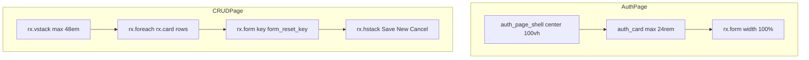

# Design System

> **UI authors:** For branded login/register pages and `RX_AUTH` in real projects, see [Login and sessions](https://web7ai.github.io/reflex-django/authentication/) (section **Make it yours**). This file is internal Radix/Tailwind tokens only.

## Overview

**Reflex-Django Toolkit** is the default visual language for apps built with [reflex-django](https://pypi.org/project/reflex-django/). It targets developers building full-stack Python apps: clean surfaces, an indigo accent, medium corner radius, and layouts that balance **information-dense CRUD** with **calm, centered auth**.

This document is the design counterpart to `llm.txt` and `README.md`. Design agents and UI generators should read it before creating or changing screens so every view feels like part of the same product.

| File | Who reads it | What it defines |
|------|----------------|-----------------|
| `README.md` | Humans | What the project is |
| `llm.txt` | Coding agents | How to build the project |
| `DESIGN.md` | Design agents | How the project should look and feel |

---

## Stack

- **UI layer:** [Reflex](https://reflex.dev) components backed by **Radix Themes** (`rx.card`, `rx.button`, `rx.callout`, `rx.input`, …).
- **Styling approach:** Prefer **component props** (`size`, `spacing`, `color_scheme`, `variant`, `width`) over raw CSS. Do not use `class_name` unless Tailwind or custom CSS is required.
- **Optional CSS:** Consumer apps may add `rx.plugins.TailwindV4Plugin()`. Tailwind is for consumer apps, not the library package itself.
- **Not used:** shadcn, custom hex in library code, or hand-rolled design tokens outside Radix scales.

In code, reference theme colors with `rx.color("indigo", 9)` or semantic props like `color_scheme="red"`. Hex values in the YAML front matter are for agents and external tools; bind to Radix scales in Reflex.

---

## Theme setup

Set the global theme in `rxconfig.py` via `RadixThemesPlugin` (Reflex 0.9+). Example:

```python
rx.plugins.RadixThemesPlugin(
    theme=rx.theme(
        appearance="light",
        accent_color="indigo",
        gray_color="gray",
        radius="medium",
        has_background=True,
    ),
)
```

### Theme props (reference)

| Prop | Default | Values | Role |
|------|---------|--------|------|
| `appearance` | `light` | `light`, `dark`, `inherit` | Light or dark UI |
| `accent_color` | `indigo` | Radix accent scales (`indigo`, `blue`, `teal`, …) | Primary actions, links, focus |
| `gray_color` | `gray` | Radix gray scales (`gray`, `slate`, `mauve`, …) | Surfaces, borders, body text |
| `radius` | `medium` | `none`, `small`, `medium`, `large`, `full` | Cards, buttons, inputs |
| `scaling` | `100%` | `90%`–`110%` | Global size scale |
| `panel_background` | `translucent` | `solid`, `translucent` | Card/panel fill style |
| `has_background` | `true` | bool | Apply theme background to root |

### Dark mode (localStorage or session)

reflex-django does not ship a theme toggle UI. For preferences that must **survive logout**, store them in **`localStorage`** or a non-auth cookie — built-in logout clears auth cookies and the Reflex websocket `token` only, not `localStorage`.

For server-backed prefs (shared across tabs), use `AppState.session`. Keys listed in `RX_LOGOUT_PRESERVE_SESSION_KEYS` (default: `("theme",)`) are copied before `alogout` and restored on the new anonymous session:

```python
from reflex_django.states import AppState

class SiteState(AppState):
    @rx.var
    def theme_appearance(self) -> str:
        return self.session.get("theme", "light")

    @rx.event
    async def set_theme(self, theme: str):
        self.session["theme"] = theme  # auto-saved via Django session
```

Bind `theme_appearance` to `rx.theme(appearance=SiteState.theme_appearance, …)` at the app or layout level when you add a toggle. Use `appearance="dark"` only when the session value is `"dark"`.

---

## Colors

Semantic roles map to Radix color scales. Use **scale + step** in Reflex (`rx.color("indigo", 9)`) or **semantic props** on components (`color_scheme`, `color`).

| Role | Scale / step | Hex (light) | Usage |
|------|----------------|-------------|--------|
| **Primary** | indigo 9 | `#3e63dd` | Primary buttons, key links, active emphasis |
| **Primary hover** | indigo 10 | `#3358d4` | Hover on primary controls |
| **Surface** | gray 1 | `#fcfcfd` | Page background |
| **Surface raised** | gray 2 | `#f9f9fb` | Cards, panels |
| **Border** | gray 6 | `#d9d9e0` | Dividers, input borders (Radix default) |
| **Text** | gray 12 | `#1c2024` | Headings, primary body |
| **Text muted** | gray 11 | `#60646c` | Secondary copy, empty states |
| **Error** | red 9 | `#e5484d` | Validation, auth errors, destructive actions |
| **Success** | green 9 | `#30a46c` | Success callouts, positive status |

### When to use what

- **`color_scheme` on interactive components** — `rx.button`, `rx.callout`, `rx.badge` (e.g. `color_scheme="red"` for delete, `"green"` for success).
- **`color="gray"` on `rx.text`** — Muted helper text, empty states, loading hints.
- **Accent / default button** — Omit `color_scheme` on primary submit buttons; they inherit `accent_color` from `rx.theme`.
- **Do not** hard-code hex in Reflex components when a Radix semantic exists.

---

## Typography

Radix provides a stepped type scale via `size` on `rx.heading` and `rx.text`. Default font stack is system UI (no custom webfont required).

| Token | Component | Size | Usage |
|-------|-----------|------|--------|
| `heading_xl` | `rx.heading` | `9` | Marketing / welcome hero (starter index) |
| `heading_lg` | `rx.heading` | `7` | Auth page titles (login, register, reset) |
| `heading_md` | `rx.heading` | `5` | Section titles on CRUD pages |
| `body` | `rx.text` | `2` | Paragraphs, form hints |
| `label` | `rx.text` | `1`, `weight="bold"` or `500` | Labels, metadata, “Signed in as …” |
| `code` | `rx.code` | — | CLI commands, paths, inline technical strings |

### Examples

```python
rx.heading("Sign in", size="7")
rx.heading("Products", size="5")
rx.text("No products yet.", color="gray", size="2")
rx.text(DjangoAuthState.username, weight="bold")
rx.text("Run ", rx.code("uv run reflex-django migrate"), " first.")
```

---

## Spacing and layout

Reflex layout primitives: `rx.center`, `rx.vstack`, `rx.hstack`, `rx.fragment`, `rx.cond`, `rx.spacer`.

### Spacing scale (Reflex `spacing` prop)

| Token | Value | Typical use |
|-------|-------|-------------|
| `xs` | `"1"` | Tight inline groups (signed-in line + username) |
| `sm` | `"2"` | Nested stacks inside cards |
| `md` | `"3"` | Form field stacks |
| `lg` | `"4"` | Section stacks, card inner padding rhythm |
| `xl` | `"6"` | Major page sections |

### Layout constants

| Token | Value | Usage |
|-------|-------|--------|
| `auth_card_max_width` | `24rem` | Login, register, password reset cards |
| `auth_card_min_width` | `20rem` | Minimum card width on small viewports |
| `auth_card_padding` | `2rem` | Inner card padding |
| `auth_shell_padding_top` | `4rem` | Top offset for vertically centered auth |
| `page_content_max_width` | `48em` | CRUD / dashboard content column |
| `starter_index_max_width` | `42rem` | Welcome / index page content |
| `full_viewport_min_height` | `100vh` | Full-height centered pages |

### Patterns

- **Full-width controls** — `width="100%"` on `rx.form`, `rx.input`, and primary `rx.button` in auth flows.
- **Centered narrow auth** — `rx.center` shell + `rx.card` capped at `24rem`.
- **CRUD column** — `rx.vstack(..., width="100%", max_width="48em", padding="2em")`.



---

## Components

### Buttons

| Variant | Props | Usage |
|---------|--------|--------|
| Primary | default (`solid`) | Form submit, main CTA |
| Secondary | `variant="soft"` | Log out, low-emphasis actions |
| Outline | `variant="outline"` | “New” / secondary create |
| Ghost | `variant="ghost"` | Cancel, reload, tertiary actions |
| Destructive | `color_scheme="red"` | Delete row, irreversible actions |

```python
rx.button("Sign in", width="100%")
rx.button("Log out", variant="soft")
rx.button("Save", on_click=ProductState.save)
rx.button("New", variant="outline", on_click=ProductState.create)
rx.button("Cancel", variant="ghost", on_click=ProductState.cancel_edit)
rx.button("Delete", color_scheme="red", on_click=ProductState.delete(row["id"]))
```

Auth submit buttons are always **full width**. CRUD action rows use `rx.hstack` with `spacing="3"` or `"4"`.

### Inputs and forms

- **Auth:** `rx.form` with `on_submit` handler; fields use `name=` for server-side parsing (`input_100w` helper in `reflex_django.auth.pages.components`).
- **CRUD:** Controlled fields with `value` / `on_change` on state vars; wrap in `rx.form(key=State.form_reset_key)` so the DOM remounts after save, cancel, or `start_edit`.

```python
from reflex_django.auth.pages.components import input_100w

rx.form(
    input_100w("username", placeholder="Username"),
    input_100w("password", type="password"),
    rx.button("Sign in", width="100%"),
    on_submit=state.login,
    width="100%",
)
```

### Cards

- **Auth container** — `auth_card`: `rx.card` with `max_width="24rem"`, `padding="2rem"`, inner `vstack` `spacing="4"`.
- **List rows** — `rx.card` per item in `rx.foreach`; `rx.hstack` with title column + actions (`rx.spacer()` before buttons).

No custom box-shadows; contrast comes from Radix surface levels and borders.

### Callouts

| Type | Props | Usage |
|------|--------|--------|
| Error | `color_scheme="red"`, `icon="triangle_alert"`, `role="alert"` | Validation, login errors |
| Success | `color_scheme="green"`, `icon="circle_check"`, `role="status"` | Reset email sent, password updated |

Use `rx.cond(state.error != "", rx.callout(...), rx.fragment())` — never show an empty callout.

Library helpers (reuse when subclassing auth pages):

```python
from reflex_django.auth.pages.components import error_callout, success_callout
```

### Badges, links, divider, toast

```python
rx.badge("Staff")
rx.badge(rx.cond(row["is_active"], "Active", "Inactive"))
rx.link("Sign in →", href="/login")
rx.divider()
return rx.toast.error("You do not have permission to perform this action.")
```

Toasts are for **transient permission / auth failures** in event handlers, not inline form validation (use callouts for that).

---

## Auth UI kit

reflex-django ships canned auth pages built from shared primitives in `reflex_django.auth.pages`:

| Primitive | Role |
|-----------|------|
| `auth_page_shell` | `rx.center`, `min_height="100vh"`, `padding_top="4rem"` |
| `auth_card` | Centered `rx.card`, max width `24rem` |
| `input_100w` | Full-width `rx.input` with `name=` |
| `error_callout` / `success_callout` | Standard feedback blocks |

Page classes (`LoginPage`, `RegisterPage`, `PasswordResetPage`, …) compose:

`render()` → `shell(card(heading(), form_body()))`

Customize by **subclassing** and overriding hooks (`heading`, `form_fields`, `submit_button`, `render`) or swapping `state_cls`. Override copy via `RX_AUTH["MESSAGES"]` in Django settings — that dict is **strings only**, not visual tokens.

Register pages with `add_auth_pages(app)` or individual `app.add_page(...)` calls.

---

## CRUD and ModelState pages

The library does not ship CRUD components; follow this layout when binding `ModelState` / `ModelCRUDView` (see `docs/reactive_model_state.md`):

1. `rx.heading` — page title (`size="5"` or `"7"`).
2. Conditional `rx.callout` — `State.error` when non-empty.
3. `rx.cond(State.data.length() > 0, rx.foreach(...), empty_state_text)`.
4. Each row: `rx.card` → `rx.hstack` (info `vstack` + `rx.spacer()` + Edit / Delete).
5. `rx.divider()`.
6. Edit form — `rx.cond` for editing vs new; `rx.form` with `key=State.form_reset_key`.
7. Action `rx.hstack` — Save (primary), New (`outline`), Cancel / Reload (`ghost`).

```python
def products_page() -> rx.Component:
    return rx.vstack(
        rx.heading("Products", size="5"),
        rx.cond(
            ProductState.error != "",
            rx.callout(ProductState.error, color_scheme="red"),
        ),
        rx.cond(
            ProductState.data.length() > 0,
            rx.foreach(ProductState.data, product_row),
            rx.text("No products yet.", color="gray"),
        ),
        rx.divider(),
        product_form(),
        rx.hstack(
            rx.button("Save", on_click=ProductState.save),
            rx.button("New", variant="outline", on_click=ProductState.create),
            rx.button("Cancel", variant="ghost", on_click=ProductState.cancel_edit),
        ),
        spacing="4",
        width="100%",
        max_width="48em",
        padding="2em",
        on_mount=ProductState.refresh,
    )
```

Use `.length()` on Reflex lists in `rx.cond`, not Python `len()`.

---

## Feedback and loading states

| Situation | Pattern |
|-----------|---------|
| Form / list error | `rx.callout`, `color_scheme="red"`, message from state var |
| Success message | `success_callout` or green callout |
| Permission denied | `rx.toast.error(...)` from handler or `on_denied` |
| Protected page (not hydrated) | `rx.cond` + `rx.center(rx.text("Loading..."))` via `@login_required` |
| Empty list | `rx.text(..., color="gray")` — not an error callout |

---

## Accessibility

- Use `role="alert"` on error callouts and `role="status"` on success callouts.
- Pair color with **text content** — never indicate failure by color alone.
- Radix scales are designed for readable contrast; prefer `gray` 11–12 for text on light surfaces.
- Full-width tap targets on mobile auth (`width="100%"` buttons and inputs).
- Icon names on callouts (`triangle_alert`, `circle_check`) supplement, not replace, messages.

---

## Do's and don'ts

**Do**

- Set `rx.App(theme=rx.theme(...))` once at startup.
- Use `color_scheme` and Radix `size` / `spacing` props consistently.
- Keep auth cards narrow (`24rem` max); keep CRUD content in a readable column (`48em`).
- Show errors inline with callouts; use toasts for permission/auth denials.
- Authorize mutations in `@rx.event` handlers (`self.user`, `has_perm`), not only by hiding buttons.

**Don't**

- Mix arbitrary hex colors with the theme unless defining a deliberate one-off in Tailwind.
- Use `len()` inside `rx.cond` on reactive lists — use `.length()`.
- Fork auth layout CSS when subclassing `LoginPage` is enough.
- Treat `RX_AUTH["MESSAGES"]` as design tokens.
- Rely on `is_authenticated` snapshot fields alone for authorization.

---

## Customization

| Need | Approach |
|------|----------|
| Global look | `rx.theme` on `rx.App` (`accent_color`, `radius`, `appearance`) |
| Dark mode | Session key + dynamic `appearance` |
| Auth layout / copy | Subclass auth pages; `RX_AUTH` messages |
| CRUD layout | App-level pages using `ModelState` vars and events |
| Custom CSS | Tailwind v4 plugin in consumer `rxconfig.py` |
| One-off color | `rx.color("indigo", 9)` or Tailwind utilities |

Extend this file with project-specific tokens in the YAML front matter under custom keys — unknown sections are allowed.

---

## Versioning

Design system version **1.0** matches the reflex-django starter scaffold and Radix Themes defaults for Reflex `>=0.9.2,<1.0`. When you change global theme or layout constants in your app, bump the `version` in your copy of this file so agents can detect drift.
