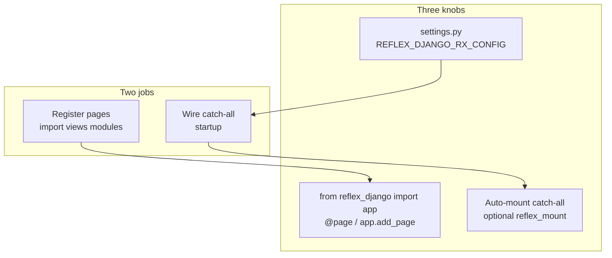

# The three knobs

**What you'll learn:** The three places you touch in almost every reflex-django project, and why page registration and the SPA catch-all are two different jobs.

**When you need this:**

- reflex-django feels confusing and you want a short map before diving into settings reference pages.
- Something works in dev but a route or page is missing, and you need to know which knob controls it.

---

If reflex-django feels confusing, it is usually because two different jobs got mixed up:

1. **Register pages:** make routes like `/` and `/about` exist in the SPA.
2. **Wire the SPA catch-all:** tell Django to serve the Reflex shell for paths that are not `/admin`, `/api`, and so on.

Settings and imports handle pages. Auto-mount handles the catch-all. They run at different moments. That is normal.

---

## Three knobs

Most projects only touch **settings** and **pages**. The URL catch-all is automatic when `REFLEX_DJANGO_AUTO_MOUNT=True` (default).

| Knob | Where | What you control |
|:---|:---|:---|
| **Settings** | `REFLEX_DJANGO_RX_CONFIG`, `REFLEX_DJANGO_PLUGINS`, ... in `settings.py` | `app_name`, ports, `redis_url`, plugins |
| **App** | `from reflex_django import app` | The shared `rx.App()` singleton (`reflex_django.runtime.reflex_app`) |
| **URLs** | automatic (default) or optional `reflex_mount()` | SPA catch-all and `django_prefix`; use `reflex_mount()` when you need prefix overrides |



!!! tip "v3 mount-only"
    Legacy **`django_outer`** / **`reflex_outer`** modes were removed. Dev uses `run_reflex` with Django mounted in the Reflex backend. See [Migrating to mount-only](migration/v3_mount_only.md).

---

## What replaced plain Reflex files?

| Plain Reflex | reflex-django v1 |
|:---|:---|
| `rxconfig.py` | `REFLEX_DJANGO_RX_CONFIG` + `REFLEX_DJANGO_PLUGINS` in `settings.py` |
| `shop/shop.py` (`app = rx.App()`) | `from reflex_django import app` |
| Catch-all in `urls.py` | **Nothing required** when `REFLEX_DJANGO_AUTO_MOUNT=True` (default) |
| Pages with `@rx.page` | `@page` from `reflex_django.pages.decorators` |

---

## Minimal project shape

```python
--8<-- "snippets/minimal_settings.py"
```

```python
--8<-- "snippets/minimal_urls.py"
```

```python
--8<-- "snippets/minimal_views.py"
```

--8<-- "snippets/run_reflex_command.md"

Starts **two** dev servers (Vite `:3000` + backend `:8000`). Open **http://localhost:3000/** for the SPA. Admin and API live on `:8000` and the SPA reaches them via `env.json`. Optional: `--env dev` for compile-only dev on `:8000`. See [Local development](../getting-started/local_development.md).

---

## Override Reflex config

### Level 1: settings (usual)

Put any allowed `rx.Config` field in `REFLEX_DJANGO_RX_CONFIG`:

```python
REFLEX_DJANGO_RX_CONFIG = {
    "app_name": "shop",
    "frontend_port": 3000,
    "backend_port": 8000,
    "redis_url": os.environ.get("REDIS_URL"),
    "show_built_with_reflex": False,
}
```

Add UI and tooling plugins separately:

```python
REFLEX_DJANGO_PLUGINS = [
    "reflex.plugins.RadixThemesPlugin",
    "reflex.plugins.TailwindV4Plugin",
]
```

Tune the built-in Django bridge plugin:

```python
REFLEX_DJANGO_PLUGIN = {
    "django_prefix": ("/admin", "/api"),
}
```

Most teams stop here.

### Level 2: manual `reflex_mount()` (URL overrides)

Only when you need a non-root mount or explicit prefix lists:

```python
from reflex_django.django.urls import reflex_mount

urlpatterns += reflex_mount(
    mount_prefix="/app",
    django_prefix=("/admin", "/api/v2"),
    rx_config={"frontend_port": 3001},
)
```

`reflex_mount()` kwargs **merge over** settings. If auto-mount already appended a catch-all, a manual mount is skipped when it would duplicate.

### Level 3: custom `rx.App` (theme, style)

Replaces a plain Reflex `shop/shop.py`:

```python
# settings.py
REFLEX_DJANGO_CREATE_APP = "myapp.reflex.create_app"
```

```python
# myapp/reflex.py
import reflex as rx

def create_app():
    return rx.App(theme=rx.theme(accent_color="blue"))
```

Then `from reflex_django import app` everywhere. Same object.

See [Configuration](../getting-started/configuration.md) and [Settings reference](../reference/settings.md) for every knob.

---

## Register pages

Pages exist only after Python **imports** the module that defines them (decorators run at import time) or after you call `app.add_page()`.

### Option A: `@page` decorator (most common)

```python
from reflex_django.pages.decorators import page

@page(route="/about", title="About", login_required=True)
def about() -> rx.Component:
    return rx.text("About us")
```

reflex-django's `@page` wraps Reflex's `@rx.page` and adds Django extras (`login_required`, breadcrumbs, and more).

**You must import the module** so the decorator runs:

```python
# urls.py
import shop.views  # noqa: F401
```

### Option B: `app.add_page()` (native Reflex style)

```python
from reflex_django import app
import reflex as rx

def contact() -> rx.Component:
    return rx.text("Contact")

app.add_page(contact, route="/contact")
```

### Option C: explicit package list (settings)

```python
REFLEX_DJANGO_PAGE_PACKAGES = [
    "shop.views",
    "modules.ai.studio.views",
]
```

!!! tip "Recommended"
    Prefer explicit `import myapp.views` in `urls.py` or `REFLEX_DJANGO_PAGE_PACKAGES`. It is obvious, stable, and matches where Django already loads code.

See [Pages in views.py](../guides/pages.md) for layout helpers, auth pages, and troubleshooting.

---

## What is `app_name`?

`app_name` in `REFLEX_DJANGO_RX_CONFIG` is Reflex's **compile label**. It is **not** "all pages must live in `{app_name}/views.py`".

Reflex uses it for grouping decorated pages at compile time and for build metadata. The actual `rx.App()` instance always loads from `reflex_django.runtime.reflex_app`.

### Simple project

`app_name: "shop"` and pages in `shop/views.py`. Names match. Easy to remember.

### Multi-package project

`app_name: "core"` and pages in `modules.ai.studio.views`. **Normal.** The compile label and the Django package that holds pages can differ.

```python
# settings.py
REFLEX_DJANGO_RX_CONFIG = {"app_name": "core", ...}

# urls.py
import modules.ai.studio.views  # noqa: F401
```

!!! tip "Stability"
    Keep `app_name` stable unless you plan a full recompile. Changing it without rebuilding `.web` can cause blank screens or dispatch errors.

---

## When do things run?

| When | What happens |
|:---|:---|
| `django.setup()` | `urls.py` loads; explicit view imports run `@page` |
| `AppConfig.ready()` | Auto-mount may append SPA catch-all |
| `run_reflex` / compile | Page modules import, pages merge onto `app` |
| Request to `/` | Django catch-all serves SPA shell |
| WebSocket `/_event` | Reflex runs your `@rx.event` handlers with Django session |

---

## When things go wrong

**Blank SPA, no errors**

- Page modules never imported? Add `import shop.views` or `REFLEX_DJANGO_PAGE_PACKAGES`.
- Wrong `app_name` after a rename without recompile? Restore the old name, delete `.web`, then run `python manage.py run_reflex` again.

**404 on `/admin` or `/api`**

- Catch-all swallowed Django routes? Put Django `path()` entries above where the SPA catch-all is appended.

**`AppRegistryNotReady` in views**

- You imported a Django model at module top level in `views.py`. Move the import inside the event handler.

More answers in the [FAQ](../reference/faq.md).

---

## What just happened?

You mapped settings, the shared `app`, and URL auto-mount to two separate jobs (register pages vs wire catch-all), and you know the v1 routing modes and page registration options.

**Next up:** [Why reflex-django exists →](../overview/concepts.md)
