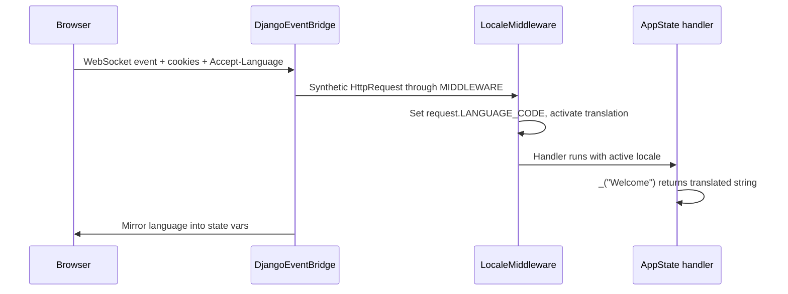

# i18n

<p class="rd-page-lead" markdown="1">
Use Django's translation stack inside Reflex. The event bridge runs <code>LocaleMiddleware</code> on every event, so <code>gettext</code> and <code>translation.get_language()</code> work in handlers the same way they do in Django views.
</p>

## How it works

<div class="rd-mermaid-wrap">



</div>

<div class="rd-flow-strip">
<div class="rd-flow-step"><strong>1. Event</strong>Browser sends cookies and <code>Accept-Language</code> with each Reflex event.</div>
<span class="rd-flow-arrow" aria-hidden="true">&rarr;</span>
<div class="rd-flow-step"><strong>2. Bridge</strong>Synthetic Django request runs your <code>MIDDLEWARE</code> chain.</div>
<span class="rd-flow-arrow" aria-hidden="true">&rarr;</span>
<div class="rd-flow-step"><strong>3. Locale</strong><code>LocaleMiddleware</code> picks the language (cookie beats header).</div>
<span class="rd-flow-arrow" aria-hidden="true">&rarr;</span>
<div class="rd-flow-step"><strong>4. Handler</strong><code>gettext</code> runs with the active locale.</div>
<span class="rd-flow-arrow" aria-hidden="true">&rarr;</span>
<div class="rd-flow-step"><strong>5. UI</strong><code>AppState.language</code> mirrors locale for components.</div>
</div>

Language cookie name defaults to Django's `LANGUAGE_COOKIE_NAME` (usually `django_language`).

## Django setup

Enable i18n in `settings.py` and add **LocaleMiddleware** after `SessionMiddleware`:

```python
--8<-- "snippets/i18n_settings.py"
```

Wire Django's built-in language switcher in `urls.py`:

```python
--8<-- "snippets/i18n_urls.py"
```

Create message files for each locale:

```bash
reflex django makemessages -l de
reflex django makemessages -l ar
# edit locale/de/LC_MESSAGES/django.po, then:
reflex django compilemessages
```

Example `locale/de/LC_MESSAGES/django.po` entry:

```po
msgid "Welcome"
msgstr "Willkommen"
```

## Translate in handlers

Call Django's gettext **inside** `@rx.event` handlers (after the bridge activated the locale):

```python
--8<-- "snippets/i18n_example.py"
```

Register with `app.add_page` in `shop/shop.py` and set `on_load=HomeState.on_load`.

| API | Use in |
|:---|:---|
| `from django.utils.translation import gettext as _` | Handlers (translated string for active language) |
| `gettext_lazy as _` | Module-level model labels only (not reactive UI text) |
| `current_language()` | Any code during an event (`from reflex_django import current_language`) |
| `HomeState.language` | UI (reactive snapshot from middleware) |
| `HomeState.language_bidi` | UI (`True` for Arabic, Hebrew, etc.) |

!!! warning "Do not translate in components"
    Store translated strings in **state vars** (like `welcome_label` above). Do not call `_()` inside component render functions. Those run in the client bundle and cannot read Django `.mo` catalogs.

## Language switcher

Django's [`set_language`](https://docs.djangoproject.com/en/stable/topics/i18n/translation/#the-set-language-view) view expects **POST** with CSRF. Use `HomeState.csrf_token` (mirrored by the bridge):

```python
rx.form(
    rx.input(type_="hidden", name="csrfmiddlewaretoken", value=HomeState.csrf_token),
    rx.input(type_="hidden", name="next", value="/"),
    rx.button("Deutsch", type="submit", name="language", value="de"),
    action="/i18n/setlang/",
    method="POST",
)
```

The full multi-language switcher is in the snippet above. After submit, Django sets the language cookie and redirects to `next`.

## DjangoI18nState

When you need locale without the full auth snapshot tree:

```python
from reflex_django.states import DjangoI18nState

@rx.event
async def on_load(self):
    await DjangoI18nState.sync_from_django()

# In components:
DjangoI18nState.django_language_code
DjangoI18nState.django_language_bidi
```

<div class="rd-instructor">
<strong>When to use which:</strong> Most pages already on <code>AppState</code> should use <code>language</code> and <code>language_bidi</code>. Use <code>DjangoI18nState</code> for locale-only widgets (language bar, footer) without pulling in auth vars.
</div>

## RTL layout

Use `language_bidi` to flip direction:

```python
rx.box(
    page_content(),
    direction=rx.cond(HomeState.language_bidi, "rtl", "ltr"),
)
```

Pair with translated copy from handlers for a full RTL experience.

## AppState vs DjangoI18nState

| Aspect | AppState | DjangoI18nState |
|:---|:---|:---|
| Fields | `language`, `language_bidi` (+ auth, CSRF, messages) | `django_language_code`, `django_language_bidi` |
| When | Most pages already on AppState | Locale-only widgets |
| Refresh | `sync_from_django()` on AppState | `DjangoI18nState.sync_from_django()` |

Both read the same middleware result. Pick one per page to avoid duplication.

## Settings reference

| Setting | Default | Purpose |
|:---|:---|:---|
| `USE_I18N` | ? | Must be `True` |
| `LANGUAGE_CODE` | ? | Fallback locale |
| `LANGUAGES` | ? | Choices for `set_language` |
| `LOCALE_PATHS` | ? | Where `.po` / `.mo` files live |
| `LocaleMiddleware` | ? | Required in `MIDDLEWARE` |
| `RX_MIRROR_LANGUAGE` | `True` | Copy locale into AppState vars |
| `RX_PERFORMANCE_PRESET` | `default` | `lean` sets `RX_MIRROR_LANGUAGE=False` |

See [Bridge utilities](bridge-utilities.md) for `current_language()` and mirror toggles.

!!! tip "Middleware order"
    Run `LocaleMiddleware` before `CommonMiddleware` (Django requirement) and before `AsyncStreamingMiddleware` (must stay last). Re-run `compilemessages` in CI after updating `.po` files.

**Next:** [Uploads and media](uploads.md)
