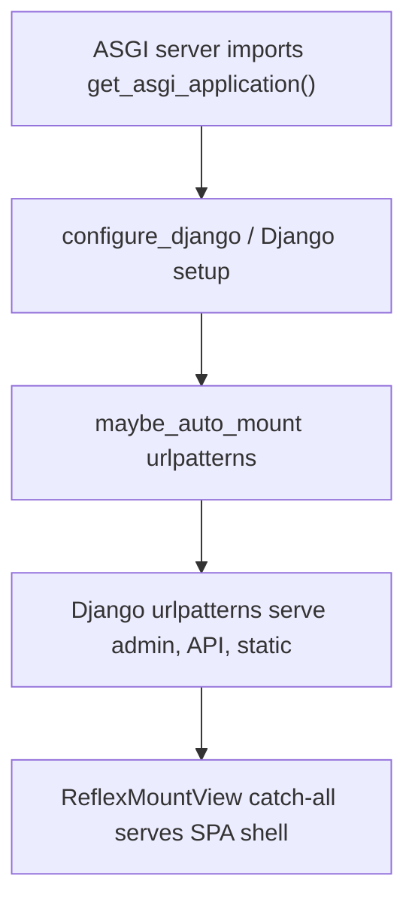
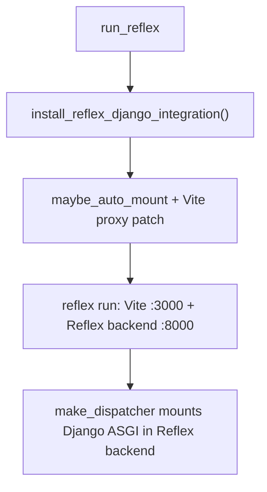

# Architecture

**What you will learn:** How reflex-django boots a Django + Reflex app, how traffic is routed in dev and production, and how the event bridge puts Django middleware in front of every Reflex handler.

**When you need this:**

- You are onboarding senior developers who want the runtime map.
- You are debugging startup, ASGI, or "why is `request.user` empty?" issues.

For a gentler intro, read [How they fit together](how_they_fit.md) first.

---

## Design goals

reflex-django optimizes for four properties:

1. **Django-first config.** `settings.py` and `manage.py run_reflex` are the source of truth, not a standalone `rxconfig.py`.
2. **One origin in the browser.** SPA, admin, API, and WebSocket events share cookies on one host in dev (via Vite proxy) and in production (via your edge proxy).
3. **Real Django requests in handlers.** Every `@rx.event` runs after middleware populated a synthetic `HttpRequest`.
4. **Mount-only production Django.** Plain `get_asgi_application()` plus `reflex_mount()` catch-all — no composed outer ASGI entry.

### Package layout (v2+)

Since v2.0, source modules live in domain subpackages under `src/reflex_django/` (`asgi/`, `runtime/`, `bridge/`, `django/`, `dev/`, `setup/`, `mount/`, …). See [v2 module path migration](migration/v2_module_paths.md) for import updates.

---

## Boot sequence

### Production Django process

When ASGI loads your project's `config.asgi:application`:



### Dev (`manage.py run_reflex`)



Key modules:

| Module | Role |
|:---|:---|
| `reflex_django.bootstrap.app_setup` | Attaches `make_dispatcher`, event bridge, plugin hooks |
| `reflex_django.mount.auto` | Appends SPA catch-all; auto-wires admin URLs when needed |
| `reflex_django.asgi.app` | `build_django_asgi`, `make_dispatcher` |
| `reflex_django.dev.vite_proxy` | Multi-target Vite proxy for two-port dev |
| `reflex_django.bridge.django_event` | Synthetic `HttpRequest` + middleware on events |

---

## Routing

### Dev (default): Django inside the Reflex backend

`manage.py run_reflex` delegates to native `reflex run`. reflex-django attaches an `api_transformer` built by `make_dispatcher()`:

```text
Browser :3000 (Vite)
    │ proxy
    ▼
Reflex backend :8000
    ├── /_event, /_upload, … ──► Reflex inner ASGI
    ├── /admin, /api, /static, … ──► Django ASGI (in-process)
    └── SPA page paths ────────────► Reflex inner ASGI
```

Vite sends **all** backend paths to the Reflex backend when `RXDJANGO_PROXY_SERVER` is unset.

### Dev (optional): separate Django server

Set `RXDJANGO_PROXY_SERVER = "http://127.0.0.1:8000"` and run `runserver` separately. Vite then splits proxies: Django prefixes → external Django, Reflex prefixes → Reflex backend.

### Production

| Process | Role |
|:---|:---|
| **Django ASGI** | Admin, API, static, compiled SPA shell via `ReflexMountView` |
| **Reflex backend** | `/_event`, `/_upload`, … (or skip if static export only) |
| **Edge proxy** | Route Reflex paths to Reflex; everything else to Django |

See [Routing](routing.md) and [Migrating to mount-only](migration/v3_mount_only.md).

---

## Dev orchestration

`manage.py run_reflex` builds a **`RunPlan`** that resolves ports, compile vs `--from-build`, and Vite proxy mode.

Default dev:

1. Compile / refresh `.web/`
2. Patch `vite.config.js` proxy routes
3. Start Vite on `:3000` and Reflex backend on `:backend_port` (default `:8000`)
4. Attach Django ASGI dispatch to the Reflex app
5. Watch Python files for backend reload

See [Local development](local_development.md) and [CLI](cli.md).

---

## Event bridge

Reflex events arrive on `/_event` as WebSocket/Socket.IO frames. Django HTTP middleware does **not** run automatically on that ASGI hop.

**`DjangoEventBridge`** (installed by bootstrap) runs **before** your handler:

1. Build a synthetic `HttpRequest` from cookies, headers, path, and query string.
2. Run `settings.MIDDLEWARE` (skipping classes listed in `REFLEX_DJANGO_EVENT_MIDDLEWARE_SKIP`).
3. Resolve `request.user` asynchronously.
4. Bind `self.request`, `self.user`, `self.session`, `self.messages`, `self.csrf_token` on `AppState`.

Deep trace: [WebSocket event pipeline](websocket_event_pipeline.md), [State management](state_management.md).

---

## State and pages

| Piece | Location | Notes |
|:---|:---|:---|
| `REFLEX_DJANGO_RX_CONFIG` | `settings.py` | Ports, `app_name`, redis, packages |
| `@page` / `app.add_page` | `{app}/views.py` | Registers routes at import time |
| `AppState` | subclass in views | Django context on every event |
| `from reflex_django import app` | singleton | Replaces per-project `{app}/{app}.py` |

---

## Static files and SPA shell

Compiled assets land under `.web/` and, after export, under `STATIC_ROOT` (typically `_reflex/`). `ReflexMountView` serves `index.html` through the template engine when `REFLEX_DJANGO_RENDER_SPA_VIA_TEMPLATE_ENGINE=True`.

---

## Removed in v3

- `reflex_django.asgi.entry:application` and outer dispatchers (`django_outer`, `reflex_outer`)
- `REFLEX_DJANGO_URL_ROUTING`, `REFLEX_DJANGO_HTTP_*` worker settings
- `ReflexDjangoPlugin` (removed in v1.0)

`make_dispatcher` is **restored** for in-process Django on the Reflex dev backend. See [Migrating to mount-only](migration/v3_mount_only.md).

---

## Mental model (one paragraph)

In dev, Vite on `:3000` is the browser's single origin; the Reflex backend on `:8000` serves both Reflex internals and Django admin/API via an in-process path dispatcher. In production, Django ASGI serves the compiled SPA shell and backend routes; your reverse proxy forwards WebSocket traffic to Reflex. Live UI updates travel over `/_event`, where reflex-django replays Django middleware on a synthetic request so handlers see the same user, session, and CSRF context as a normal view.

---

## What just happened?

You traced bootstrap, dev vs production routing, and the event bridge that connects Reflex to Django middleware.

**Next up:** [Routing](routing.md) for URL-level detail, or [Deployment](deployment.md) to ship it.
