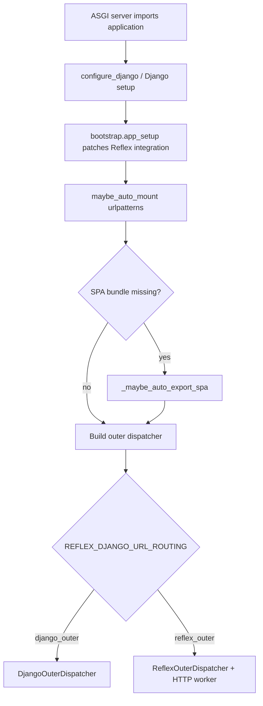
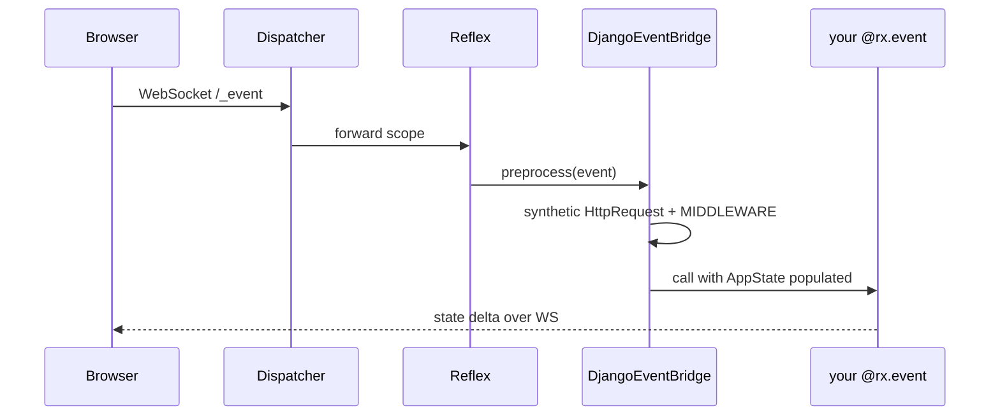

# Architecture

**What you will learn:** How reflex-django boots a Django + Reflex app, how outer dispatchers route traffic, and how the event bridge puts Django middleware in front of every Reflex handler.

**When you need this:**

- You are onboarding senior developers who want the runtime map.
- You are debugging startup, ASGI, or "why is `request.user` empty?" issues.

For a gentler intro, read [How they fit together](how_they_fit.md) first.

---

## Design goals (v1.0)

reflex-django v1.0 optimizes for four properties:

1. **Django-first config.** `settings.py` and `manage.py run_reflex` are the source of truth, not a standalone `rxconfig.py`.
2. **One origin in production.** SPA, admin, API, and WebSocket events share cookies on one host (per mode).
3. **Real Django requests in handlers.** Every `@rx.event` runs after middleware populated a synthetic `HttpRequest`.
4. **Predictable routing.** Two modes only: `django_outer` and `reflex_outer`. No legacy dual-stack aliases.

---

## Boot sequence

When ASGI loads `reflex_django.asgi.entry.application`:



Key modules:

| Module | Role |
|:---|:---|
| `reflex_django.bootstrap` | Registers patches, event bridge, compile hooks |
| `reflex_django.mount.auto` | Appends SPA catch-all from settings |
| `reflex_django.mount.spa_paths` | Finds compiled `index.html` on disk |
| `reflex_django.asgi.entry` | Builds the production ASGI callable |
| `reflex_django.dev` | `RunPlan`, process supervision for `run_reflex` |

Startup may compile the SPA once when `REFLEX_DJANGO_AUTO_EXPORT_ON_START=True` and no bundle exists. Production CI should still pre-export.

---

## Outer dispatch

The outer dispatcher is the **first** ASGI router on the public port.

### `django_outer` (default)

`DjangoOuterDispatcher` wraps:

- **Django ASGI** (optionally `ASGIStaticFilesHandler`) for normal HTTP.
- **Reflex inner ASGI** (`app._api` with context middleware) for reserved prefixes.
- **Lifespan** forwarded to Reflex so the event processor starts with the server.

```text
Port 8000
    │
    ▼
DjangoOuterDispatcher
    ├── lifespan ──────────────────► Reflex lifespan tasks
    ├── /_event, /_upload, … ─────► Reflex inner ASGI
    └── everything else ───────────► Django urlpatterns
                                         ├── /admin, /api → views
                                         └── catch-all → ReflexMountView (index.html)
```

In dev with `REFLEX_DJANGO_DEV_PROXY=1`, the catch-all may reverse-proxy to Vite instead of disk. Default two-port dev keeps Vite separate on `:3000`.

### `reflex_outer`

`ReflexOuterDispatcher` wraps:

- **Reflex inner ASGI** for reserved prefixes and SPA traffic on the public port.
- **HTTP proxy** to the Django worker for prefixes in `REFLEX_DJANGO_DJANGO_PREFIX` (admin, API, static).

The worker runs `reflex_django.asgi.http_entry` (separate uvicorn/granian bind, default `:8001`). ORM access in `@rx.event` handlers still uses the **main** process database connections.

Compare modes: [Routing](routing.md#choosing-a-mode-django_outer-vs-reflex_outer).

---

## Dev orchestration

`manage.py run_reflex` builds a **`RunPlan`** that resolves:

- Routing mode and ports
- Whether to spawn the Django HTTP worker (`reflex_outer`)
- Whether to patch Vite with multi-target proxies
- Compile vs `--from-build` vs `--env dev`

Default dev:

1. Compile / refresh `.web/`
2. Patch `vite.config.js` proxy routes
3. Start Vite on `:3000`
4. Start ASGI on `:8000`
5. Watch Python files for backend reload

See [Local development](local_development.md) and [CLI](cli.md).

---

## Event bridge

Reflex events arrive on `/_event` as WebSocket/Socket.IO frames. Django HTTP middleware does **not** run automatically on that ASGI hop.

**`DjangoEventBridge`** (installed by bootstrap) runs **before** your handler:

1. Build a synthetic `HttpRequest` from cookies, headers, path, and query string.
2. Run `settings.MIDDLEWARE` (skipping classes listed in `REFLEX_DJANGO_EVENT_MIDDLEWARE_SKIP`, default CSRF and `AsyncStreamingMiddleware`).
3. Resolve `request.user` asynchronously.
4. Bind `self.request`, `self.user`, `self.session`, `self.messages`, `self.csrf_token` on `AppState`.

Upload events on `/_upload` receive the same cookie injection so `@login_required` works consistently.

Deep trace: [WebSocket event pipeline](websocket_event_pipeline.md), [State management](state_management.md).



---

## State and pages

| Piece | Location | Notes |
|:---|:---|:---|
| `REFLEX_DJANGO_RX_CONFIG` | `settings.py` | Ports, `app_name`, redis, packages |
| `@page` / `app.add_page` | `{app}/views.py` | Registers routes at import time |
| `AppState` | subclass in views | Django context on every event |
| `from reflex_django import app` | singleton | Replaces per-project `{app}/{app}.py` |

Page preparation merges decorated pages, applies plugins from `REFLEX_DJANGO_PLUGINS`, and syncs auth pages when enabled.

---

## Static files and SPA shell

Compiled assets land under `.web/` and, after export, under `STATIC_ROOT` (typically `_reflex/`). `ReflexMountView` serves `index.html` through the template engine when `REFLEX_DJANGO_RENDER_SPA_VIA_TEMPLATE_ENGINE=True`, so you can inject `` and context processors.

Discovery logic is centralized in `reflex_django.mount.spa_paths`.

---

## v1.0 package layout (selected)

| Package | Purpose |
|:---|:---|
| `reflex_django.core` | Constants, env parsing, shared helpers |
| `reflex_django.bootstrap` | One-time app setup and patch registry |
| `reflex_django.bridge` | Event bridge implementation |
| `reflex_django.dev` | Dev servers, `RunPlan`, subprocess utilities |
| `reflex_django.setup.errors` | Typed configuration exceptions |
| `reflex_django.dev.vite_proxy` | Multi-target Vite proxy injection |

Removed in v1.0: `make_dispatcher`, `ReflexDjangoPlugin`, legacy routing mode names. See [Migrating to v1.0](migration/v1_migration.md).

---

## Mental model (one paragraph)

Django (or Reflex, in `reflex_outer`) sits at the edge and routes traffic. The SPA shell is either a Django view or Reflex static output. Live UI updates travel over `/_event`, where reflex-django replays Django middleware on a synthetic request so your handlers see the same user, session, and CSRF context as a normal view. You write pages and handlers; bootstrap and dispatch wire the rest.

---

## What just happened?

You traced bootstrap, outer dispatch, dev orchestration, and the event bridge that connects Reflex to Django middleware.

**Next up:** [Routing](routing.md) for URL-level detail, or [Deployment](deployment.md) to ship it.
