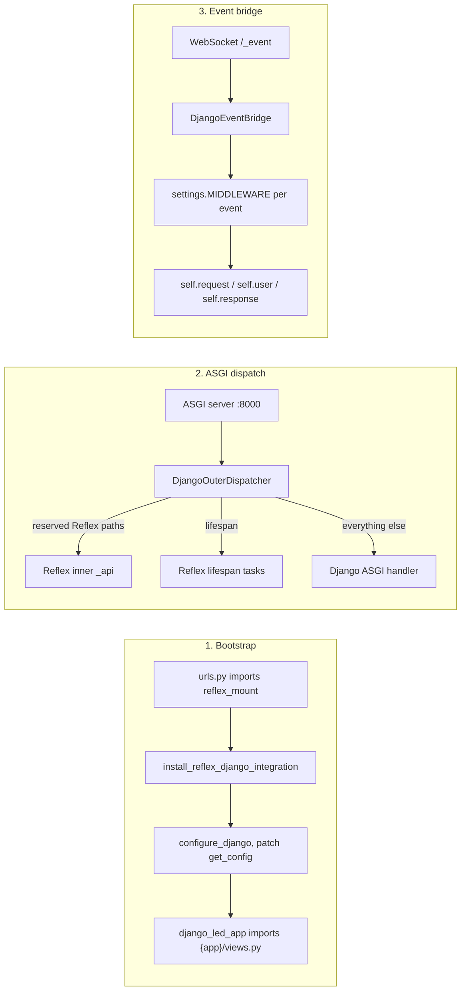
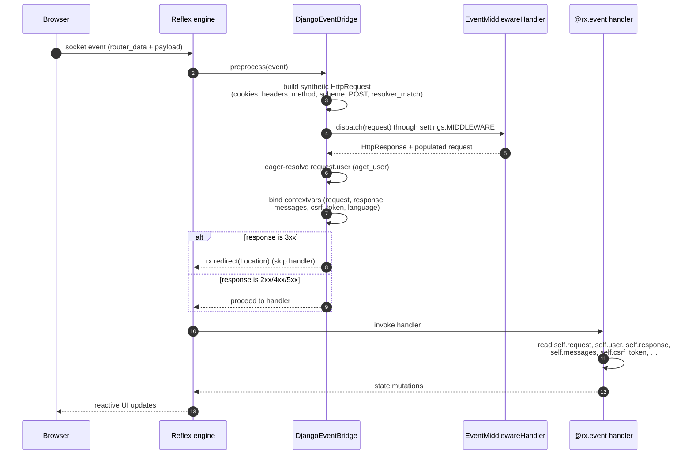
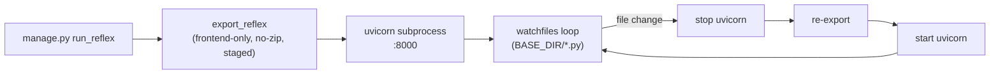

# Architecture

`reflex-django` runs Django and Reflex as **one ASGI application on one port**. Django is the outer server: every browser request — HTTP and WebSocket — first hits Django's middleware stack. Reflex's reactive engine (Socket.IO event channel, upload endpoint, health probes, and SPA shell) is mounted as a set of ASGI sub-applications under Django, and the compiled Reflex bundle is served straight from disk by Django.

This document walks through the runtime topology, the request and event lifecycles, and how the bootstrap stitches the two frameworks together inside a single Python process.

---

## The three pillars



| Pillar | What it does |
|:---|:---|
| **Bootstrap** | Importing `ROOT_URLCONF` runs `reflex_mount()`, which registers the in-memory `rx.Config`. `install_reflex_django_integration()` patches `reflex.config.get_config()`, calls `configure_django()`, discovers pages from `{app}/views.py`, and builds `rx.App` via the built-in `reflex_django.django_led_app` factory. |
| **ASGI dispatch** | A thin outer ASGI app (`DjangoOuterDispatcher`) inspects each incoming scope and routes it to Django, to Reflex's inner ASGI, or to Reflex's lifespan handler. |
| **Event bridge** | Each Reflex event builds a synthetic `HttpRequest`, runs the full `settings.MIDDLEWARE` chain on it, and binds the resulting `request`, `user`, `session`, `messages`, `csrf_token`, and `response` to the active `AppState` handler. |

---

## Runtime topology

```mermaid
flowchart TB
  subgraph Client["Browser :8000"]
    BrowserHTTP["HTTP requests<br/>/, /admin, /api, /static, /_reflex"]
    BrowserWS["WebSockets<br/>/_event (Socket.IO)"]
  end

  subgraph Process["Single ASGI process — reflex_django.asgi_entry:application"]
    Outer["DjangoOuterDispatcher"]

    subgraph DjangoLayer["Django"]
      DjangoMW["settings.MIDDLEWARE chain"]
      DjangoViews["urls.py views"]
      Mount["ReflexMountView<br/>(SPA catch-all)"]
      DjangoORM[("ORM / DB")]
    end

    subgraph ReflexLayer["Reflex (mounted under Django)"]
      ReflexAPI["rx_app._api<br/>(Starlette + Socket.IO)"]
      EventBridge["DjangoEventBridge"]
      Handlers["@rx.event handlers<br/>(AppState subclasses)"]
    end

    SPA[/"STATIC_ROOT/_reflex/<br/>compiled SPA bundle"/]
  end

  BrowserHTTP --> Outer
  BrowserWS --> Outer

  Outer -->|reserved Reflex paths<br/>(HTTP + WebSocket)| ReflexAPI
  Outer -->|lifespan| ReflexAPI
  Outer -->|everything else| DjangoMW

  DjangoMW --> DjangoViews
  DjangoMW --> Mount
  Mount --> SPA

  ReflexAPI --> EventBridge
  EventBridge --> Handlers
  Handlers --> DjangoORM
  DjangoViews --> DjangoORM
```

A single Python process owns the database connection pool, the in-memory state manager, and the compiled Reflex bundle. There is no second process, no second port, no CORS, no token bridge.

---

## The outer dispatcher

`reflex_django.django_outer_dispatcher.DjangoOuterDispatcher` is the ASGI callable returned by `reflex_django.asgi_entry.application`. It owns four routing decisions:

```text
incoming ASGI scope
   │
   ▼
scope["type"] == "lifespan"  ──►  Reflex lifespan (event processor, prerender, background tasks)
scope["type"] == "websocket" ──►  reserved Reflex path?
                                       ├── yes → Reflex inner _api
                                       └── no  → close gracefully (no Channels needed)
scope["type"] == "http"      ──►  reserved Reflex path?
                                       ├── yes → Reflex inner _api
                                       └── no  → Django ASGI handler
```

### Reserved Reflex prefixes

These paths are always sent to Reflex's inner ASGI, regardless of any URL patterns or catch-alls you may have:

| Prefix | Purpose |
|:---|:---|
| `/_event` | Socket.IO state-update channel |
| `/_upload` | Reflex file upload endpoint |
| `/_health`, `/ping` | Liveness probes |
| `/_all_routes` | Internal route enumeration |
| `/auth-codespace` | Reflex auth dev tooling |

Add custom reserved prefixes via `REFLEX_DJANGO_RESERVED_REFLEX_PREFIXES`.

### The SPA catch-all

Every non-reserved, non-Django path falls through Django's `urls.py` and ultimately hits `ReflexMountView`. This view serves the compiled Reflex SPA (`STATIC_ROOT/_reflex/index.html` and its assets) and, when `REFLEX_DJANGO_RENDER_SPA_VIA_TEMPLATE_ENGINE = True`, runs the `index.html` shell through Django's template engine first. That gives the SPA access to `{{ request.user }}`, ``, `{{ messages }}`, ``, and every Django template context processor — rendered server-side, inlined into the HTML the browser receives.

---

## HTTP request lifecycle

```text
Browser request  →  ASGI server  →  DjangoOuterDispatcher
                                          │
                                          ├── /_event, /_upload, /_health, …
                                          │       └─►  Reflex _api  (full Reflex pipeline)
                                          │
                                          └── everything else  →  Django ASGI handler
                                                                      │
                                                                      ▼
                                                            settings.MIDDLEWARE (full chain)
                                                                      │
                                                                      ├── /admin/      → admin views
                                                                      ├── /api/        → your DRF views
                                                                      ├── /static/     → ASGIStaticFilesHandler
                                                                      └── /<anything>  → urls.py → ReflexMountView
                                                                                              │
                                                                                              ▼
                                                                                    STATIC_ROOT/_reflex/index.html
                                                                                    (optionally Django-templated)
```

Django middleware sees every page navigation — same `process_request`, `process_view`, `process_response`, `process_exception` semantics you already use for `/admin` and `/api`. The Reflex SPA shell is just another Django response.

---

## WebSocket event lifecycle

Reflex state mutations travel over Socket.IO on `/_event`. The dispatcher hands those scopes straight to Reflex's inner ASGI, but before the handler runs, the `DjangoEventBridge` wraps the event with a full Django request/response context.



### What gets bound to the handler

Inside any `@rx.event` method on an `AppState` subclass:

| Attribute | Value |
|:---|:---|
| `self.request` | Synthetic `HttpRequest` produced by the middleware chain |
| `self.response` | `HttpResponse` produced by the middleware chain (200 unless a middleware short-circuits) |
| `self.user` | `request.user` (already resolved — no `SynchronousOnlyOperation`) |
| `self.session` | `request.session` (async-safe access via `await session.aget(...)`/`asave()`) |
| `self.messages` | `[{level, level_tag, message, tags, extra_tags}, …]` (JSON-safe snapshot of `django.contrib.messages`) |
| `self.csrf_token` | CSRF token for the current request |
| `self.django_response` | The raw `HttpResponse` (handy for inspecting headers a middleware set) |
| `self.resolver_match` | `ResolverMatch` if the path resolves to a Django view |
| `self.django_context` | Dict of context-processor keys (when `REFLEX_DJANGO_AUTO_LOAD_CONTEXT = True`) |

### Middleware short-circuits become navigations

If any middleware returns a response without calling the next layer — for example a `LoginRequiredMiddleware` returning `HttpResponseRedirect("/login")` — the bridge converts that 3xx into a Reflex `rx.redirect(...)` event. The browser navigates; the handler does not run. Disable with `REFLEX_DJANGO_AUTO_REDIRECT_FROM_MIDDLEWARE = False`.

### Skipped middleware

`CsrfViewMiddleware` and `reflex_django.streaming_middleware.AsyncStreamingMiddleware` are always skipped on Socket.IO events (no CSRF tokens on persistent sockets, no streaming HTTP responses needed). Override the skip list with `REFLEX_DJANGO_EVENT_MIDDLEWARE_SKIP`.

---

## Reactive bridge: Django context inside the UI

The full middleware chain populates the handler's context, but `AppState` also exposes the **reactive** counterparts that the SPA can bind to directly — no extra plumbing:

```python
class HomeState(AppState):
    pass  # AppState already exposes the fields below as reactive vars


def navbar():
    return rx.hstack(
        rx.cond(
            DjangoUserState.is_authenticated,
            rx.text(f"Hi, {DjangoUserState.username}"),
            rx.link("Sign in", href="/login"),
        ),
        rx.spacer(),
        rx.text(f"Locale: {DjangoUserState.language}"),
    )


def message_banner():
    return rx.foreach(
        DjangoUserState.messages,
        lambda m: rx.callout(m.message, color_scheme=m.level_tag),
    )


def hidden_csrf():
    return rx.el.input(
        type="hidden", name="csrfmiddlewaretoken", value=DjangoUserState.csrf_token
    )
```

| Reactive var on `DjangoUserState` | Source |
|:---|:---|
| `is_authenticated`, `username`, `email`, `is_staff`, `is_superuser` | `request.user` |
| `messages` | `django.contrib.messages.get_messages(request)` snapshot |
| `csrf_token` | `django.middleware.csrf.get_token(request)` |
| `language`, `language_bidi` | `django.utils.translation.get_language()` / `get_language_bidi()` |
| `perms` | JSON-safe `request.user.get_all_permissions()` |

Toggle individual mirrors with `REFLEX_DJANGO_MIRROR_MESSAGES`, `REFLEX_DJANGO_MIRROR_CSRF`, `REFLEX_DJANGO_MIRROR_LANGUAGE`.

---

## State serialization

Reflex periodically pickles `BaseState` instances to its state manager (memory, Redis, etc.). Django's `HttpRequest` and `ResolverMatch` are not picklable, so the integration patches `BaseState.__getstate__` to strip the transient `_django_led_request_wrapper` and `_django_led_response` attributes before serialization. The next event rebuilds them from the incoming `router_data`. You never lose `self.request` between events; you just don't pay for shipping it across processes.

---

## Frontend bundle: built once, served from disk

The Reflex SPA is **always** served from a compiled bundle on disk — there is no separate frontend dev server. The bundle lives at:

```text
STATIC_ROOT/_reflex/        # canonical location served by ReflexMountView
.web/build/client/          # build output (SSR layout)
.web/_static/               # build output (legacy layout)
```

`manage.py run_reflex` rebuilds that bundle in-process before starting the ASGI server, then watches the project root for `.py` changes. Each change triggers a clean rebuild + uvicorn restart:



Because the rebuild happens in a parent watcher and the server is a clean subprocess, every restart serves the freshly compiled bundle — no stale assets, no half-reloaded modules.

---

## Environment profiles

| Aspect | Development | Production |
|:---|:---|:---|
| **Processes** | One: ASGI server (uvicorn) | One: ASGI server (uvicorn / granian / hypercorn) |
| **Frontend bundle** | Auto-rebuilt by `run_reflex` on every code change | Built in CI, copied into `STATIC_ROOT/_reflex` |
| **Reload** | Parent-side `watchfiles` loop drives clean uvicorn restarts + rebuilds | None — the container or systemd unit owns lifecycle |
| **Static files** | Served by `ASGIStaticFilesHandler` (Django) | Served by Nginx/Caddy from `STATIC_ROOT` (or by the ASGI process if you prefer) |
| **DEBUG** | `True` (Django default) | `False` (set explicitly) |
| **`REFLEX_DJANGO_DEV_PROXY`** | Off (no upstream needed; everything serves from disk) | Off |
| **Show "Built with Reflex" badge** | Off by default | Off by default |

---

## Bootstrap order

The order in which modules import each other is load-bearing. From the top of any entry point:

```text
1. DJANGO_SETTINGS_MODULE is set (manage.py or asgi.py)
2. reflex_django.asgi_entry is imported
   └── install_reflex_django_integration()
        ├── patches reflex.config.get_config to read reflex_mount() output
        ├── configure_django() — django.setup()
        ├── refresh_get_config_bindings() — re-resolves cached config references
        └── ensure_reflex_cli_layout() — synthesises rxconfig in sys.modules
3. ROOT_URLCONF is imported → reflex_mount() registers the in-memory rx.Config
4. reflex_django.django_led_app imports {app}/views.py for each INSTALLED_APPS entry
5. rx.App() is instantiated; @template / @page decorators register routes
6. DjangoOuterDispatcher wraps Django ASGI + Reflex inner ASGI
7. ASGI server binds the port
```

Once that completes, the process is ready to serve. Every subsequent request flows through the dispatcher described above.

---

## Why a single process

- **Shared sessions out of the box.** Logging in via `/admin/` and reading `request.user` from a Reflex event use the same `SessionMiddleware`, the same session store, and the same database connection.
- **No cross-origin handshake.** The SPA, the API, and the WebSocket all share an origin. Cookies just work.
- **One deploy unit.** One container, one systemd unit, one log stream, one set of env vars.
- **Database connection reuse.** Django ORM connections live in the same process as Reflex event handlers, so a handler can call `await Model.objects.aget(...)` without crossing a process boundary.

---

**Navigation:** [← Project Structure](project_structure.md) | [Routing →](routing.md) | [Single-port reference →](single_port_django_outer.md)
