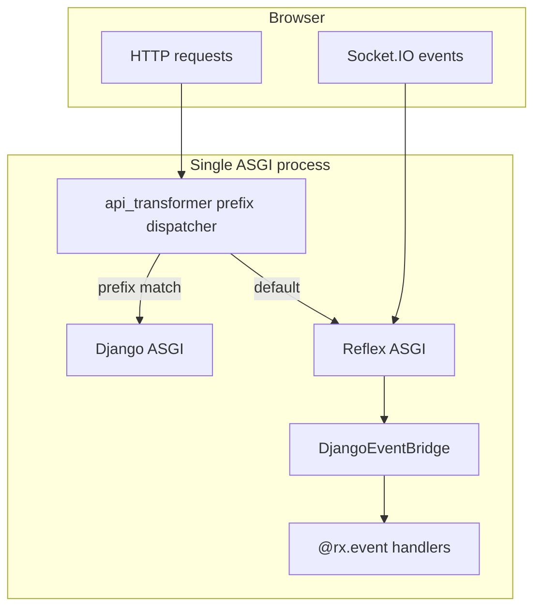
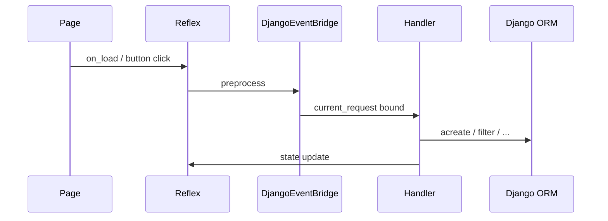

# Architecture

How **reflex-django** composes Django and Reflex in one ASGI process.

---

## Prerequisites

- [Introduction](introduction.md)

---

## Three pillars

| Pillar | When | What |
|--------|------|------|
| **Plugin bootstrap** | `rxconfig.py` import | `ReflexDjangoPlugin.__post_init__` → `configure_django()` |
| **HTTP bridge** | After `App._compile` | `api_transformer` + `make_dispatcher()` |
| **Event bridge** | Each Reflex event | `DjangoEventBridge.preprocess` → contextvars |

---

## System diagram



---

## HTTP request lifecycle

1. Browser sends HTTP (or WebSocket upgrade where applicable).
2. Outermost ASGI app runs Reflex’s stack plus chained `api_transformer`s.
3. `make_dispatcher` checks `scope["type"]` and `scope["path"]`:
   - **`lifespan`** → Reflex only (Django does not own process lifespan).
   - Path matches `admin_prefix`, `backend_prefix`, `STATIC_URL`, or `extra_prefixes` → **Django ASGI** (`build_django_asgi`, optionally `ASGIStaticFilesHandler`).
   - Else → **Reflex ASGI** (UI, `/_event`, assets).
4. On the Django branch, normal Django middleware and views run.

### Reserved Reflex paths

These must not be shadowed by a Django catch-all under a shared prefix (`RESERVED_REFLEX_PREFIXES` in `asgi.py`):

- `/_event`, `/_upload`, `/_health`, `/_all_routes`, `/ping`, `/auth-codespace`

---

## Reflex event lifecycle

1. Socket.IO delivers an event to Reflex.
2. `DjangoEventBridge.preprocess` (if installed):
   - `end_event_request()` (clear stale binding)
   - Build synthetic `HttpRequest` from `event.router_data`
   - Attach session, optional locale, `await aget_user(request)`
   - `begin_event_request(request)`
3. Your `@rx.event` handler runs; call `current_user()`, etc.
4. `postprocess` may call `end_event_request()`; Reflex may only reliably invoke `preprocess` today—the next event clears stale state at preprocess start.

Detail: [Django middleware to Reflex](django_middleware_to_reflex.md).

---

## Model CRUD event lifecycle

For `ModelCRUDView`, each action goes through `DispatchMixin.dispatch`:

```text
bind_request_context → setup → check_permissions → handler → teardown
```

Detail: [CRUD with mixins](crud_with_mixins_and_states.md).



---

## Dev vs production routing

| | Development | Production |
|---|-------------|------------|
| Frontend | Reflex dev server + Vite proxy to Django prefixes | Single `reflex run --env prod` |
| Django HTTP | Proxied `/admin`, `/api`, `/static` | Same-origin dispatcher |
| Config | `inject_vite_dev_proxy` in `pre_compile` | Plugin `api_transformer` only |

---

## Static files and WebSockets

`make_dispatcher` patches Starlette `Mount` to `HttpOnlyMount` so WebSocket upgrades are not swallowed by static file mounts.

---

## Developer notes

- Not a merged URL router—two bridges, two lifecycles.
- `configure_django()` is idempotent and thread-safe (`reflex_django.conf`).

---

## Common mistakes

- Assuming Django `MIDDLEWARE` runs on Reflex events.
- `ROOT_URLCONF` paths not matching plugin prefixes.

---

## Performance tips

- Use `select_related` / `prefetch_related` via `ModelCRUDView` `Meta.queryset_*` options.

---

## Troubleshooting

| Symptom | See |
|---------|-----|
| Admin works, Reflex 404 | Reflex route not registered |
| Reflex works, admin 404 | Prefix / `urlpatterns` mismatch |

---

## See also

- [Django middleware to Reflex](django_middleware_to_reflex.md)  
- [Django context to Reflex](django_context_to_reflex.md)  
- [Routing](routing.md)

---

**Navigation:** [← Project structure](project_structure.md) | [Next: Routing →](routing.md)
