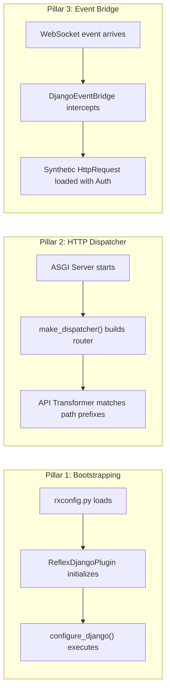
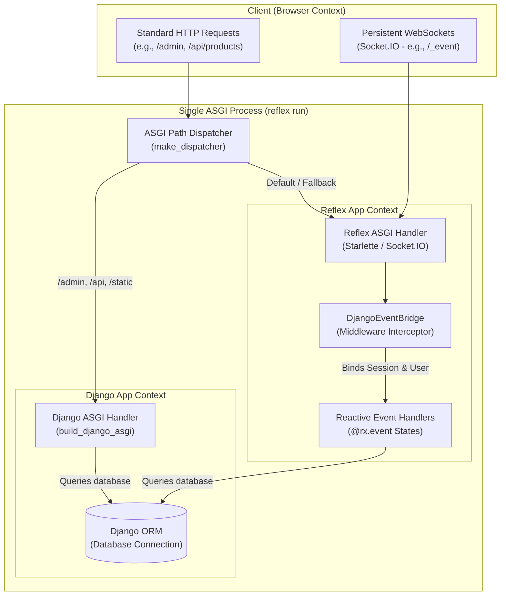
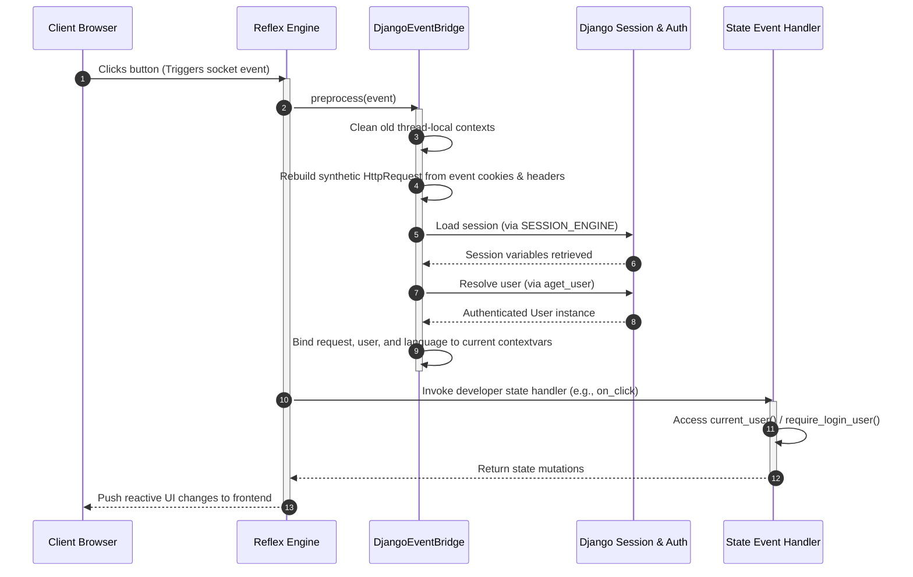

# Architecture

To successfully build and debug high-performance full-stack applications with **reflex-django**, it is helpful to understand the underlying mechanics of how Reflex and Django run in harmony within a single operating system process.

This document details the single-process ASGI dispatch model, the event bridge pipeline, and the runtime request lifecycles.

---

## The Three Architecture Pillars

The integration relies on three core phases to manage your application lifecycle:



1. **Plugin Bootstrap (Initialization)**: When you invoke `reflex run` or `reflex django`, the Reflex compiler evaluates `rxconfig.py` first. The plugin instantly captures this call, sets the `DJANGO_SETTINGS_MODULE` environment variable, and runs `django.setup()`. This ensures all models and app configurations are fully ready *before* any frontend state definitions are imported.
2. **HTTP Dispatch Bridge (Routing)**: The outer ASGI server runs a path-prefix dispatcher. Requests matching your configured prefixes (like `/admin`, `/api`, or `/static`) are routed directly to Django ASGI, while all other paths are routed to Reflex.
3. **Event Bridge (Authentication Context)**: Client-side reactive events are delivered to Reflex over a persistent WebSocket connection. The `DjangoEventBridge` interceptor builds a mock `HttpRequest` out of the socket headers and session cookies, allowing you to access Django authentication context variables inside reactive events.

---

## Unified Process System Topology

Below is the runtime topology of the unified ASGI process during a standard local run or production container deployment:



---

## Detailed HTTP Request Lifecycle

When a client hits an HTTP path served by your server, the outermost ASGI router evaluates the incoming Starlette/ASGI connection scope:

```text
Incoming HTTP Connection
   │
   ▼
Check Connection Scope (scope["type"])
   │
   ├─► "lifespan" ────► Handled exclusively by Reflex (Django is bypassed)
   │
   └─► "http" / "websocket"
         │
         ▼
       Check scope["path"] prefix
         │
         ├──► Matches admin_prefix (e.g., /admin)  ─────────┐
         ├──► Matches backend_prefix (e.g., /api)  ─────────┼─► Routed to Django ASGI
         ├──► Matches STATIC_URL (e.g., /static)   ─────────┤   (Full Django Middleware runs)
         ├──► Matches custom extra_prefixes        ─────────┘
         │
         └──► Default (No Prefix Matches)  ─────────────────► Routed to Reflex ASGI
                                                              (SPA page, dynamic views)
```

### Reserved Paths
To ensure your frontend client can always communicate with the Reflex compiler, certain paths are reserved and will **never** be captured by Django prefixes, regardless of catch-all wildcards:
* `/_event` (WebSocket communication)
* `/_upload` (File upload handlers)
* `/_health` & `/ping` (Process health checks)
* `/auth-codespace` (Authentication tools)

---

## Detailed WebSocket Event Lifecycle

Reflex components trigger interactions using WebSocket event packets. The `DjangoEventBridge` acts as an event pre-processor to link these packets to Django's active session store:



---

## Environment Configuration Alignment

Incoming connections are handled differently depending on the active environment profile:

| Feature / Scope | Development Mode | Production Mode |
|:---|:---|:---|
| **Process Count** | Two sub-processes (Vite + Reflex Server) | **Single Process** |
| **Frontend Assets** | Served dynamically via Vite development server | Served directly by Starlette or an external CDN |
| **API Path Routing** | Vite forwards prefix paths (`/admin`, `/api`) directly to the backend port | Same-origin dispatcher forwards matching paths directly to Django |
| **Static files** | Served dynamically by Django `ASGIStaticFilesHandler` | Served from `STATIC_ROOT` via the ASGI dispatcher |

---

**Navigation:** [← Project Structure](project_structure.md) | [Next: Routing →](routing.md)
