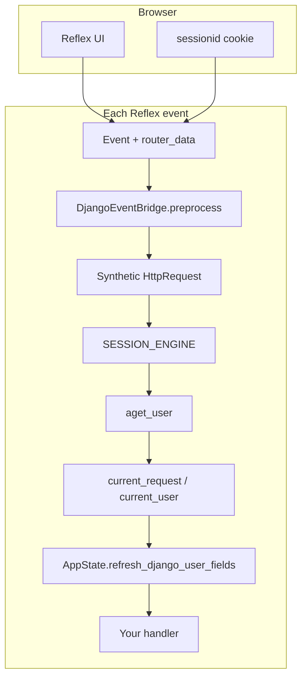

# Authentication

Django **session authentication** in Reflex events, a unified **`AppState`** auth bridge, decorators, and optional canned login/register pages.

---

## Prerequisites

- [Django middleware to Reflex](django_middleware_to_reflex.md) — how `DjangoEventBridge` binds `request.user` per event  
- [State management](state_management.md) — plain `rx.State` vs helper states

---

## How authentication reaches Reflex

Reflex UI actions run over **Socket.IO**, not through Django’s HTTP middleware stack. **`DjangoEventBridge`** (enabled by default on `ReflexDjangoPlugin`) rebuilds a synthetic `HttpRequest` for every event, loads the session from the cookie, and resolves `request.user` with Django’s **`aget_user`**—the same auth backends and session store as normal Django views.



| Path | Middleware | Session | User |
|------|------------|---------|------|
| **HTTP** (`/admin`, `/api`, …) | Full Django `MIDDLEWARE` | `SessionMiddleware` | `AuthenticationMiddleware` |
| **Reflex events** | Bridge only (session + auth + optional i18n) | `SESSION_ENGINE` on synthetic request | `aget_user` in bridge |

There is **no second auth implementation**—handlers use Django’s session row and user model. OAuth, JWT, and multi-tenant auth are not built in yet.

---

## Two layers: live objects vs reactive snapshot

`AppState` (and `DjangoUserState`) expose **two** ways to read auth, on purpose:

| Layer | Where | Use for |
|-------|--------|---------|
| **Live** | `self.user`, `self.session` in `@rx.event` handlers | Authorization, ORM scoping, session writes |
| **Snapshot** | `self.is_authenticated`, `self.username`, `self.email`, … | UI bindings (`rx.cond`, `rx.text`) |

```python
# Live — always current for this event; not sent to the browser as a Reflex var
if self.user.is_authenticated:
    await MyModel.objects.filter(owner=self.user).adelete()

# Snapshot — synced to the client for components
rx.cond(DashboardState.is_authenticated, rx.text(DashboardState.username), ...)
```

**Rule:** Never use snapshot fields alone to allow deletes, admin actions, or private data—always check `self.user` or `require_login_user()` in the handler.

When **`REFLEX_DJANGO_AUTH_AUTO_SYNC`** is `True` (default), the bridge refreshes snapshot fields on every event for **`AppState`** subclasses, so navbars and dashboards update after login/logout without calling `sync_from_django` on every page.

### Django-style `request` in handlers

Any `rx.State` handler can use the module-level proxy (same synthetic request as the bridge):

```python
from reflex_django import request

@rx.event
async def my_handler(self):
    if request.user.is_authenticated:
        request.session["last_view"] = "dashboard"
    role = request.GET.get("role")
```

See [Django middleware to Reflex](django_middleware_to_reflex.md) for `request.headers`, `request.COOKIES`, and query params from `router_data`.

---

## Quick start

**1. Plugin** (in `rxconfig.py`):

```python
from reflex_django import ReflexDjangoPlugin

config = rx.Config(
    app_name="myapp",
    plugins=[
        ReflexDjangoPlugin(
            settings_module="backend.settings",
            install_event_bridge=True,  # default
        )
    ],
)
```

**2. State** — subclass `AppState`:

```python
import reflex as rx
from reflex_django.state import AppState

class AppStateRoot(AppState):
    """Rename to match your app; shown as one Reflex state tree."""

    @rx.event
    async def on_load(self):
        # Optional: auto-sync usually makes this unnecessary for auth fields
        await self.refresh_django_user_fields()
```

**3. Protect handlers and pages:**

```python
from reflex_django.auth import login_required, permission_required

@rx.event
@login_required
async def members_only(self):
    return self.user.get_username()

@rx.event
@permission_required("shop.view_product", redirect="/login")
async def list_products(self):
    ...
```

---

## Complete example: layout, dashboard, and custom login

This pattern fits apps that use **`AppState`** for both navigation and feature state (no separate `DjangoUserState` class required).

**`myapp/state.py`**

```python
import reflex as rx
from reflex_django.state import AppState


class SiteState(AppState):
    login_username: str = ""
    login_password: str = ""
    login_error: str = ""

    @rx.event
    async def submit_login(self):
        self.login_error = ""
        ok = await self.login(self.login_username, self.login_password)
        if not ok:
            self.login_error = "Invalid username or password."
            self.login_password = ""
            return
        # After login, sync browser cookie (see "Session cookie sync" below)
        from reflex_django.context import current_request
        from reflex_django.mixins.session_auth import _sync_session_cookie_then_nav

        request = current_request()
        if request is not None:
            return _sync_session_cookie_then_nav(request, "/")

    @rx.event
    async def sign_out(self):
        await self.logout()
        from reflex_django.context import current_request
        from reflex_django.mixins.session_auth import _sync_session_cookie_then_nav

        request = current_request()
        if request is not None:
            return _sync_session_cookie_then_nav(
                request, "/login", clear_cookie=True
            )


def navbar() -> rx.Component:
    return rx.hstack(
        rx.link("Home", href="/"),
        rx.spacer(),
        rx.cond(
            SiteState.is_authenticated,
            rx.hstack(
                rx.text("Hi, ", SiteState.username),
                rx.button("Log out", on_click=SiteState.sign_out),
            ),
            rx.link("Sign in", href="/login"),
        ),
        width="100%",
        padding="1rem",
    )


def dashboard_page() -> rx.Component:
    return rx.vstack(
        navbar(),
        rx.heading("Dashboard"),
        rx.cond(
            SiteState.is_staff,
            rx.badge("Staff"),
            rx.fragment(),
        ),
        rx.text("Theme from session: ", SiteState.username),  # bind real vars as needed
        padding="2rem",
    )


def login_page() -> rx.Component:
    return rx.center(
        rx.card(
            rx.heading("Sign in"),
            rx.input(
                placeholder="Username",
                value=SiteState.login_username,
                on_change=SiteState.set_login_username,
            ),
            rx.input(
                placeholder="Password",
                type="password",
                value=SiteState.login_password,
                on_change=SiteState.set_login_password,
            ),
            rx.cond(
                SiteState.login_error != "",
                rx.callout(SiteState.login_error, color_scheme="red"),
            ),
            rx.button("Sign in", on_click=SiteState.submit_login, width="100%"),
            padding="1.5rem",
        ),
        min_height="80vh",
    )
```

**`myapp/myapp.py`**

```python
import reflex as rx
from reflex_django.auth import login_required

from myapp.state import dashboard_page, login_page

app = rx.App()
app.add_page(dashboard_page, route="/", title="Dashboard")
app.add_page(login_page, route="/login", title="Sign in")

# Optional: wrap page function for client-side login gate
@rx.page(route="/settings")
@login_required
def settings_page():
    return rx.heading("Settings")
```

Use **`add_auth_pages(app)`** instead of a custom login page when you want batteries-included UI ([Canned auth pages](#canned-auth-pages) below).

---

## `AppState` API reference

Import:

```python
from reflex_django.state import AppState
```

`AppState` extends `DjangoUserState` and is the recommended base for dashboards and **`ModelCRUDView`** CRUD states.

### `self.user` (property)

Returns the live Django user for the current event (`AnonymousUser` when logged out). Supports everything on your user model: `is_authenticated`, `username`, `email`, `is_staff`, `is_superuser`, and `user.groups` (use async ORM or prefetch in handlers).

```python
class OrdersState(AppState):
    @rx.event
    async def ship_order(self, order_id: int):
        if not self.user.is_authenticated:
            return rx.toast.error("Sign in required")
        order = await Order.objects.aget(pk=order_id, customer=self.user)
        ...
```

Equivalent without `AppState`: `from reflex_django import current_user` then `user = current_user()`.

### `self.session` (property)

A **`SessionProxy`** over Django’s session for this event. Reads and writes persist to the session backend; **`__setitem__`** and **`__delitem__`** call `save()` automatically.

```python
class PreferencesState(AppState):
    @rx.event
    async def set_theme(self, theme: str):
        self.session["theme"] = theme  # auto-saved

    @rx.event
    async def clear_theme(self):
        del self.session["theme"]

    @rx.event
    async def load_theme(self) -> str:
        return self.session.get("theme", "light")
```

For bulk updates, you can call `await self.session.asave()` explicitly after several in-memory changes if you bypass the proxy’s setters.

### Snapshot fields (reactive UI)

| Field | Meaning |
|-------|---------|
| `user_id` | Primary key or `None` |
| `username` | `get_username()` |
| `email` | Email address |
| `first_name`, `last_name` | Profile names |
| `is_authenticated` | Logged in |
| `is_staff`, `is_superuser` | Django flags |
| `group_names` | List of group names when loaded |

Refresh manually:

```python
await self.refresh_django_user_fields()
# or
await self.sync_from_django(include_groups=True)
```

Group names are only loaded when `REFLEX_DJANGO_USER_SNAPSHOT_INCLUDE_GROUPS` is `True` or `include_groups=True` is passed.

### `await self.has_perm(perm: str) -> bool`

Async wrapper around Django’s `user.has_perm("app_label.codename")`.

```python
if await self.has_perm("billing.change_invoice"):
    await self._save_invoice()
else:
    return await self.on_permission_denied()
```

### `await self.has_group(name: str) -> bool`

Checks membership by group **name**. Uses `group_names` when already loaded; otherwise one async DB query.

```python
if await self.has_group("editors"):
    self.show_editor_tools = True
```

### `await self.login(username, password, *, login_fields=None) -> bool`

Uses Django’s **`aauthenticate`** (via `aauthenticate_login_fields`) and **`alogin`**. On success, saves the session and refreshes snapshot fields. Returns `False` and calls **`on_auth_failed()`** when credentials fail or no request is bound.

```python
ok = await self.login(email, password, login_fields=("email",))
```

`login_fields` defaults to `REFLEX_DJANGO_AUTH["LOGIN_FIELDS"]` or `("username",)`.

### `await self.logout() -> None`

Calls **`alogout`**, saves the session, and refreshes snapshot fields. Pair with cookie sync JS when you need the browser’s `sessionid` updated ([Session cookie sync](#session-cookie-sync-after-login)).

### Hooks

```python
class BrandedState(AppState):
    async def on_auth_failed(self):
        self.login_error = "We could not sign you in."
        return rx.toast.error("Invalid credentials")

    async def on_permission_denied(self):
        return rx.redirect("/forbidden")
```

Default `on_permission_denied` shows a generic error toast.

---

## Server-side authorization (without decorators)

Use these inside any `rx.State` or `AppState` handler:

```python
from reflex_django import current_user, require_login_user
from reflex_django.auth import auser_has_perm, ReflexDjangoAuthError

@rx.event
async def delete_item(self, item_id: int):
    try:
        user = require_login_user()
    except ReflexDjangoAuthError:
        return rx.toast.error("Sign in required")

    if not await auser_has_perm(user, "shop.delete_product"):
        return rx.toast.error("Permission denied")

  # safe to delete
```

`require_login_user()` raises when the user is anonymous—useful when you want explicit error handling instead of `rx.redirect`.

---

## Decorators

Import from `reflex_django.auth` or `from reflex_django import login_required, permission_required`.

### `@login_required`

Works on **page functions** (no `self`) and **event handlers** (`async def handler(self, ...)`).

```python
from reflex_django.auth import login_required

# Page: UI gate using DjangoAuthState snapshot + redirect on mount
@rx.page(route="/dashboard")
@login_required
def dashboard():
    return rx.heading("Members only")

# Event: server check + rx.redirect when anonymous
class SecretState(AppState):
    @rx.event
    @login_required(login_url="/login")
    async def load_secret(self):
        return {"data": "classified"}
```

| Parameter | Default | Role |
|-----------|---------|------|
| `login_url` | `REFLEX_DJANGO_LOGIN_URL` | Redirect target for anonymous users on **events** |

> **Warning:** Page decorators only affect what the **client** renders first. Always protect events that return or mutate private data.

### `@permission_required`

**Event handlers** enforce the permission with `auser_has_perm`. **Pages** gate on login (and optional `fallback` component); enforce fine-grained permissions in `on_load` events or handler methods.

```python
from reflex_django.auth import permission_required

class CatalogState(AppState):
    @rx.event
    @permission_required("products.view_product", redirect="/login")
    async def load_catalog(self):
        return await Product.objects.all().values_list("name", flat=True)

    @rx.event
    @permission_required(
        "products.delete_product",
        on_denied=lambda self: rx.toast.error("Not allowed"),
    )
    async def delete_product(self, product_id: int):
        await Product.objects.filter(pk=product_id).adelete()
```

| Parameter | Role |
|-----------|------|
| `perm` | Django permission string (`app_label.codename`) |
| `redirect` | `rx.redirect` target when denied (handlers) |
| `login_url` | Used when anonymous (falls back to redirect) |
| `fallback` | Page-only: component factory when not authenticated |
| `on_denied` | Event-only: `callable(state)` return value (e.g. toast, redirect) |

If `on_denied` is omitted and the state defines `on_permission_denied`, that method is awaited.

---

## Settings

| Setting | Default | Meaning |
|---------|---------|---------|
| `REFLEX_DJANGO_AUTH_AUTO_SYNC` | `True` | Refresh `AppState` snapshot vars on each event |
| `REFLEX_DJANGO_USER_SNAPSHOT_INCLUDE_GROUPS` | `False` | Include `group_names` in sync (extra query) |
| `REFLEX_DJANGO_LOGIN_URL` | `/login` | Default redirect for decorators |
| `REFLEX_DJANGO_AUTH` | (see README) | Canned pages, routes, `LOGIN_FIELDS`, messages |

Disable auto-sync if you need to minimize per-event work and will call `sync_from_django` yourself:

```python
# settings.py
REFLEX_DJANGO_AUTH_AUTO_SYNC = False
```

---

## Session cookie sync after login

Reflex events **do not** run `SessionMiddleware`, so `alogin` may not send `Set-Cookie` to the browser. Without syncing, the next full page load can still send an old `sessionid`.

**After `await self.login(...)` or registration**, mirror the cookie and navigate:

```python
from reflex_django.context import current_request
from reflex_django.mixins.session_auth import _sync_session_cookie_then_nav

request = current_request()
if request is not None:
    return _sync_session_cookie_then_nav(request, "/")  # post-login path
```

Logout with cookie clear:

```python
await self.logout()
return _sync_session_cookie_then_nav(request, "/login", clear_cookie=True)
```

Lower-level helpers: `session_cookie_set_js`, `session_cookie_clear_js` from `reflex_django`.

**HttpOnly cookies:** JS cookie mirroring cannot set `HttpOnly`; see Django `SESSION_COOKIE_HTTPONLY` tradeoffs in production.

---

## `AppState` + `ModelCRUDView`

CRUD states should inherit **`AppState`** so list/save/delete handlers can use `self.user` and default `login_required` wrapping:

```python
from reflex_django.state import AppState, ModelCRUDView
from reflex_django.state.mixins.scoping import UserScopedMixin

class NotesState(AppState, ModelCRUDView, UserScopedMixin):
    scope_field = "user_id"

    class Meta:
        serializer = NoteSerializer
        list_var = "notes"

    def get_queryset(self, ctx):
        # self.user is available in hooks
        return super().get_queryset(ctx).filter(user=ctx.user)
```

Generated handlers call `require_login_user()` when the action is listed in `Meta.login_required_actions`.

---

## `DjangoUserState` without `AppState`

`DjangoUserState` is the same auth mixin without `AppStateMeta` / CRUD assembly. Use it for a **navbar-only** state or with **`session_auth_mixin`**:

```python
from reflex_django import DjangoUserState
from reflex_django.mixins import SessionAuthConfig, session_auth_mixin

LoginState = session_auth_mixin(
    SessionAuthConfig(
        post_login_redirect="/",
        post_logout_redirect="/login",
    ),
    base=DjangoUserState,
)
```

`DjangoAuthState` (canned auth pages) is a flat class built from `DjangoUserState` + login/register/reset mixins.

---

## Canned auth pages

**Settings** (`backend/settings.py`):

```python
REFLEX_DJANGO_AUTH = {
    "SIGNUP_ENABLED": True,
    "PASSWORD_RESET_ENABLED": True,
    "LOGIN_URL": "/login",
    "SIGNUP_URL": "/register",
    "LOGIN_REDIRECT_URL": "/",
    "LOGIN_FIELDS": ["username"],  # or ["email"] or ["username", "email"]
}

EMAIL_BACKEND = "django.core.mail.backends.console.EmailBackend"
DEFAULT_FROM_EMAIL = "noreply@localhost"
```

**App module:**

```python
from reflex_django.auth import add_auth_pages, login_required

app = rx.App()
add_auth_pages(app)

app.add_page(index, route="/", on_load=...)  # your pages

@login_required
def dashboard():
    return rx.heading("Members only")
```

Pages: `LoginPage`, `RegisterPage`, `PasswordResetPage`, `PasswordResetConfirmPage`. Customize via `BaseAuthPage` hooks or `REFLEX_DJANGO_AUTH["MESSAGES"]`.

See [README authentication section](../README.md) for the full `REFLEX_DJANGO_AUTH` key table.

---

## Choosing an API

| Goal | Recommended API |
|------|-----------------|
| Navbar / `rx.cond` on login | `AppState` snapshot fields + auto-sync |
| Check permission in handler | `await self.has_perm(...)` or `@permission_required` |
| Scoped queryset | `self.user` in `get_queryset` / `filter(user=self.user)` |
| Custom login form | `await self.login(...)` + `_sync_session_cookie_then_nav` |
| Ready-made auth UI | `add_auth_pages(app)` + `DjangoAuthState` |
| No AppState in this class | `current_user()` in plain `rx.State` |

---

## Troubleshooting

| Symptom | Likely cause | Fix |
|---------|----------------|-----|
| `current_user()` always anonymous | Event bridge off | `install_event_bridge=True` on plugin |
| Login works once, next event anonymous | Browser cookie stale | `_sync_session_cookie_then_nav` after login |
| UI shows logged out while handler sees user | Snapshot not synced | Enable `REFLEX_DJANGO_AUTH_AUTO_SYNC` or `on_load=State.sync_from_django` |
| `RuntimeError: No Django session` | Handler outside event / bridge failed | Ensure bridge runs; check logs for preprocess errors |
| Permission always denied | Wrong codename or user lacks perm | Verify in Django admin; use `user.has_perm` in shell |
| `ImportError: _session_async_save` | Old import path | Use `from reflex_django.state.auth_bridge import session_async_save` |

---

## Security checklist

1. Authorize **mutations** with `self.user`, `require_login_user()`, or `has_perm`—not `is_authenticated` alone on the client.  
2. Use **`@login_required`** / **`@permission_required`** on events that return private data.  
3. Use a stable **`SECRET_KEY`** in production (password reset tokens).  
4. Set **`SIGNUP_ENABLED=False`** if only admins may create users.  
5. Scope querysets to `self.user` (or `UserScopedMixin`) for multi-user data.

---

## See also

- [State management](state_management.md) — plain `rx.State` vs helpers  
- [Django middleware to Reflex](django_middleware_to_reflex.md) — bridge internals  
- [CRUD with mixins](crud_with_mixins_and_states.md) — `ModelCRUDView`  
- [Best practices](best_practices.md)

---

**Navigation:** [← Forms and validation](forms_and_validation.md) | [Next: API integration →](api_integration.md)
