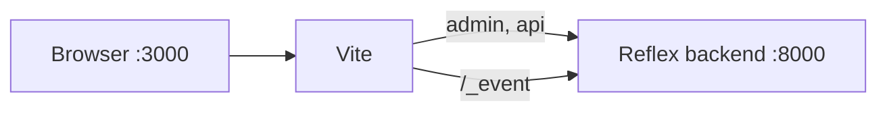

# Local development

**What you will learn:** Which URLs to open in dev and how the two-port layout works with `reflex run`.

---

## The short version

```bash
reflex run
```

| Server | Port (default) | Role |
|:---|:---|:---|
| **Vite** | `3000` | Reflex UI with HMR - open this for frontend work |
| **Reflex backend** | `8000` | Django admin/API, `/_event`, `/_upload` - proxied from Vite |

Browse **`http://localhost:3000/`** for the SPA.

---

## Optional split Django server

Run `python manage.py runserver` in another terminal and set:

```python
--8<-- "snippets/proxy_server_settings.py"
```

Vite proxies Django prefixes to that server instead of the in-process mount.

---

## Two-port dev and Vite proxies

Default dev sets `RX_SEPARATE_DEV_PORTS=True`. Vite on `:3000` proxies backend paths so cookies and CSRF stay on one origin.



When `RX_SEPARATE_DEV_PORTS=False`, browse `:8000` for everything (no Vite proxies).

---

## Configuring ports

Set ports in `rxconfig.py`:

```python
config = rx.Config(
    app_name="shop",
    frontend_port=3000,
    backend_port=8000,
    plugins=[ReflexDjangoPlugin(config={...})],
)
```

Environment overrides: `RX_FRONTEND_PORT`, `RX_BACKEND_PORT`.

---

## Commands to avoid for SPA dev

| Command | Why |
|:---|:---|
| `python manage.py runserver` alone | No Vite, no dev proxies |
| `uvicorn ...:application` alone | No Vite unless you wire it yourself |

Use **`reflex run`** for SPA development.

---

## CSRF and dev middleware

When browsing admin from `:3000`, include both ports in `CSRF_TRUSTED_ORIGINS`. See [Troubleshooting](../operations/troubleshooting.md).

---

**Next up:** [Deployment](../operations/deployment.md)
