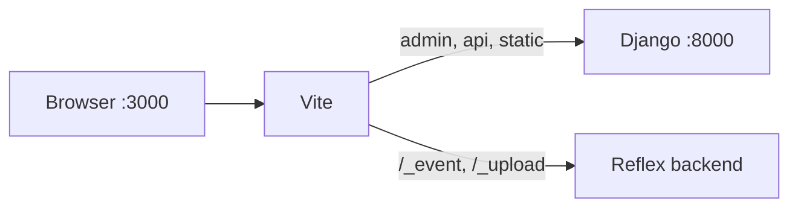

# Local development

**What you will learn:** Which URLs to open in dev, how the two-port layout works, and how Vite proxies backend traffic when `REFLEX_DJANGO_SEPARATE_DEV_PORTS=True`.

**When you need this:**

- You ran `run_reflex` and are unsure whether to browse `:3000` or `:8000`.
- Admin, API, or WebSocket calls fail from the SPA, or CSRF errors appear when you use `:3000`.

---

## The short version

**Default (one terminal):**

```bash
python manage.py run_reflex
```

| Server | Port (default) | Role |
|:---|:---|:---|
| **Vite** | `3000` | Reflex UI with HMR  -  **open this for frontend work** |
| **Reflex backend** | (Reflex default) | Django admin/API, `/_event`, `/_upload`  -  all proxied from Vite |

**Browse `http://localhost:3000/`** for the SPA. Django admin/API and Reflex WebSocket paths are proxied to the Reflex backend (Django is mounted there in-process).

**Optional  -  separate Django server:** run `python manage.py runserver` in another terminal and set:

```python
# settings.py
RXDJANGO_PROXY_SERVER = "http://127.0.0.1:8000"
```

Then Vite proxies Django prefixes to that server instead of the Reflex backend.

---

## Two-port dev and Vite proxies

Default dev sets `REFLEX_DJANGO_SEPARATE_DEV_PORTS=True`. Vite listens on `:3000` and **proxies backend paths** so the browser stays on one origin for cookies and CSRF.

| Path group | Proxied to (default) | With `RXDJANGO_PROXY_SERVER` |
|:---|:---|:---|
| Django prefixes (`/admin`, `/api`, …) | Reflex backend (`config.api_url`) | External Django server |
| Reflex paths (`/_event`, `/_upload`, …) | Reflex backend (`config.api_url`) | Reflex backend |



!!! warning "Single-port dev strips proxies"
    When `REFLEX_DJANGO_SEPARATE_DEV_PORTS=False` (for example `--env dev`), reflex-django **removes** Vite proxy rules to avoid request loops. Browse `:8000` for everything in that mode.

---

## What `run_reflex` does

When you run the default command (no extra flags):

1. **Validates** Vite proxy routes (Django + Reflex → Reflex backend by default)
2. **Patches** `.web/vite.config.js` with proxy rules
3. **Mounts** Django ASGI inside the Reflex backend for configured URL prefixes
4. **Delegates** to `reflex run` (Vite + native Reflex backend on `:backend_port`)

Hot reload watches your Django project tree (`settings.BASE_DIR`), not the installed `reflex-django` package. On first run, reflex-django creates a thin `{app_name}/{app_name}.py` stub (for example `core/core.py`) if missing; it is **not** rewritten on later reloads, so your edits are kept.

That entry module is **executed on startup** (cold start and compile). Register pages there the same way as in `views.py`:

- `app.add_page(..., route="/about")` or `@page` / `@rx.page`
- Dynamic routes use bracket syntax, e.g. `/post/[pid]` ([Reflex dynamic routing](https://reflex.dev/docs/pages/dynamic-routing/)); register dynamic routes before static routes that share the same prefix.

Entry-module pages are applied on the same pre-compile path as `@page` in `views.py`, so new routes work on cold start without an extra save. For larger apps, prefer `views.py` and `@page`.

Set `RXDJANGO_PROXY_SERVER` only when Django runs on a separate HTTP server.

You should see a banner like:

```text
reflex-django: Reflex dev (Vite + Reflex backend)  -  browse http://localhost:3000/
    Django must already be running at http://127.0.0.1:8000 ...
reflex-django patched .web/vite.config.js for backend proxies (1 upstream group(s)).
```

--8<-- "snippets/proxy_server_settings.py"

### Commands to avoid for SPA dev

| Command | Why it breaks the SPA |
|:---|:---|
| `python manage.py runserver` | WSGI only. No Vite, no dev proxies. |
| `uvicorn ...:application` alone | No Vite unless you start and proxy it yourself |

Use `run_reflex` instead.

---

## Dev modes at a glance

| Mode | Command | Browse | Vite proxies |
|:---|:---|:---|:---|
| **Default two-port HMR** | `run_reflex` | `:3000` for UI | Yes (see table above) |
| **Compile dev (one port)** | `run_reflex --env dev` | `:8000` | No (stripped) |
| **From disk, no HMR** | `run_reflex --from-build` | `:8000` | No |
| **Prod-like local test** | `run_reflex --env prod` | `:8000` | No |

Optional advanced layout: set `REFLEX_DJANGO_DEV_PROXY=True` and `REFLEX_DJANGO_SEPARATE_DEV_PORTS=False` in settings if you want Django on `:8000` to reverse-proxy SPA assets to Vite on `:3000`. There is no CLI flag for that today.

---

## Configuring ports

Ports live in `REFLEX_DJANGO_RX_CONFIG` and propagate to Vite, env files, and the backend:

```python
REFLEX_DJANGO_RX_CONFIG = {
    "frontend_port": 3000,
    "backend_port": 8000,
}
```

Environment overrides: `REFLEX_DJANGO_FRONTEND_PORT`, `REFLEX_DJANGO_BACKEND_PORT`.

Wire pages the usual way:

```python
--8<-- "snippets/minimal_urls.py"
```

---

## Django dev middleware and CSRF

When you browse admin from `:3000`, POST requests need trusted origins for both ports:

```python
from reflex_django.dev.django_middleware import DEFAULT_DEV_MIDDLEWARE

USE_X_FORWARDED_HOST = True
CSRF_TRUSTED_ORIGINS = [
    "http://localhost:8000",
    "http://127.0.0.1:8000",
    "http://localhost:3000",
    "http://127.0.0.1:3000",
]

MIDDLEWARE = [
    *DEFAULT_DEV_MIDDLEWARE,
    # ... your middleware ...
    "reflex_django.bridge.streaming.AsyncStreamingMiddleware",
]
```

---

## Troubleshooting

**"Reflex SPA bundle not found" on `:8000`**
In default two-port mode, `:8000` does not serve the SPA shell. Open `:3000`. With `--env dev`, `--from-build`, or `--env prod`, browse `:8000`.

**Port 3000 already in use**
Stop the other Vite or `run_reflex` instance, then start again.

**Django admin returns 403 CSRF**
Include both `:3000` and `:8000` in `CSRF_TRUSTED_ORIGINS`, set `USE_X_FORWARDED_HOST = True`, and prepend `DEFAULT_DEV_MIDDLEWARE`.

**`useContext is not a function` in the browser**
Restart `run_reflex` and hard-refresh. Check the compile log for "frontend stability patches".

**Wrong backend port from `:3000`**
Confirm `REFLEX_DJANGO_SEPARATE_DEV_PORTS=1` (set automatically in default two-port dev). If admin/API 404, check `django_prefix` and that admin is in `urlpatterns`. List custom API roots in `REFLEX_DJANGO_DJANGO_PREFIX` if auto-detection misses them.

---

## What just happened?

Default dev keeps you on `:3000` for the SPA while Vite forwards all backend traffic to the Reflex backend on `:backend_port`. Django admin and API are served from Django ASGI mounted in that process. Set `RXDJANGO_PROXY_SERVER` only when Django runs separately.

---

**Next up:** [Deployment](../operations/deployment.md)
