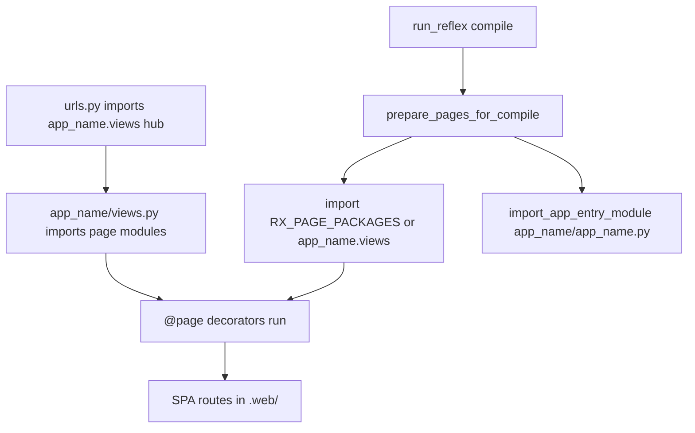

# App entry module and page registration

**What you will learn:** How reflex-django maps to vanilla Reflex, what `{app_name}/{app_name}.py`, `{app_name}/views.py`, and `RX_PAGE_PACKAGES` each do, and the one pattern that avoids blank screens.

**When you need this:**

- You are confused why both `{app_name}/{app_name}.py` and `{app_name}/views.py` exist.
- You added a page but the browser shows a blank screen or `dispatch is not a function`.
- You want a mental model that feels like standalone Reflex inside a Django project.

For day-to-day `@page` syntax and URL split details, see [Pages in views.py](pages.md).

---

## Start here: think like vanilla Reflex

In standalone Reflex, one file (`myapp/myapp.py`) holds the app object and imports your pages. reflex-django splits that across Django conventions, but the jobs are the same.

| Vanilla Reflex | reflex-django | What it does |
|:---|:---|:---|
| `myapp/myapp.py` | `{app_name}/{app_name}.py` | **Entry module** - Reflex's toolchain expects `{app_name}.{app_name}:app` on disk |
| Page imports in `myapp.py` | Imports in `{app_name}/views.py` | **Page registry hub** - import every module that defines `@page` |
| `rxconfig.py` | `RX_CONFIG` in `settings.py` | Ports, plugins, compile label (`app_name`) |
| N/A | `RX_PAGE_PACKAGES` | Optional explicit list of modules to import at **compile time** |

Example with `RX_CONFIG = {"app_name": "shop"}`:

```text
myproject/
├── config/
│   ├── settings.py
│   └── urls.py          ← import shop.views so @page runs at Django startup
├── shop/
│   ├── shop.py          ← entry module ({app_name}/{app_name}.py)
│   └── views.py         ← page registry hub (import all @page modules here)
└── blog/
    └── views.py         ← @page definitions in another app
```

---

## Two jobs (not three)

reflex-django exposes three file names, but only **two jobs** matter:

### Job A - Register routes

Python must **import** every module that defines `@page`. The decorator runs at import time and records the route. If a module is never imported, its route does not exist in the compiled SPA.

You can wire imports through:

- **`urls.py`** - `import shop.views  # noqa: F401` when `app_name` is `"shop"` (required at Django startup)
- **`{app_name}/views.py` hub** - re-imports page modules from other apps (recommended default)
- **`RX_PAGE_PACKAGES`** - settings list of modules reflex-django imports again at compile time

### Job B - Satisfy Reflex

Reflex still expects a file at `{app_name}/{app_name}.py`. On first `run_reflex`, reflex-django creates a thin stub if missing. Keep it small: re-export the shared `app` object. **Do not treat it as your main place for product pages** in larger projects.

!!! tip "Do not mix up entry module and page registry"
    **`{app_name}/{app_name}.py`** = Reflex entry stub (toolchain requirement).

    **`{app_name}/views.py`** = where you import modules so `@page` runs (Django-friendly page hub).

    They are **not** alternatives. Most teams use a thin entry module plus a views hub.

---

## Recommended pattern (default)

Use one **page registry hub** in `{app_name}/views.py`. Keep the entry module as a stub.

**1. Page hub** - import every module that defines `@page`:

```python
# shop/views.py  ({app_name}/views.py when app_name is "shop")
import blog.views  # noqa: F401
import frontend.pages.home  # noqa: F401
```

**2. Entry stub** - satisfy Reflex, do not put product pages here:

```python
# shop/shop.py  ({app_name}/{app_name}.py)
from reflex_django.runtime.reflex_app import app

__all__ = ["app"]
```

**3. Django URLs** - run decorators at startup:

```python
# urls.py
import shop.views  # noqa: F401
```

**4. Optional settings** - documents compile imports (not required if the hub imports everything):

```python
# settings.py
RX_PAGE_PACKAGES = ["shop.views"]
```

When `RX_PAGE_PACKAGES` is empty, compile time imports `{app_name}.views` automatically (from `RX_CONFIG["app_name"]`). When it is non-empty, **only** the listed modules are imported at compile time - so the hub must import all page submodules, or you must list them explicitly.

---

## When pages get registered

Registration happens at **import time** and again at **compile time**, not when the first HTTP request arrives.



At compile time, reflex-django calls `prepare_pages_for_compile()`, which:

1. Imports page packages (`RX_PAGE_PACKAGES` or default `{app_name}.views`)
2. Imports the entry module (`{app_name}/{app_name}.py`)
3. Syncs decorated pages onto the shared `app` and builds `.web/`

Both `urls.py` imports and compile imports matter. If compile never sees a module, the SPA bundle will miss that route even if Django imported it earlier.

---

## When to use each knob

| Knob | Use when |
|:---|:---|
| **`{app_name}/views.py` hub** | Default. Django-familiar. Keeps page imports in one place next to your primary app. |
| **`urls.py` import** | Always import the hub (or page modules) so `@page` runs when Django loads. |
| **`RX_PAGE_PACKAGES`** | Pages live outside `{app_name}.views`, or you want settings to document the compile import list explicitly. |
| **Pages in `{app_name}/{app_name}.py`** | Small apps or quick prototypes only. Entry module runs on cold start; fine for a few `app.add_page` calls. |
| **`RX_PAGE_MODULE`** | Rename the default hub module (e.g. `{app_name}.ui` instead of `{app_name}.views`). Rare. |

---

## Custom `rx.App` configuration

To set `theme`, `head_components`, or other `rx.App(...)` options:

**Option A - factory setting (recommended):**

```python
# settings.py
RX_CREATE_APP = "myproject.reflex.create_app"
```

```python
# myproject/reflex.py
import reflex as rx

def create_app() -> rx.App:
    return rx.App(
        theme=rx.theme(accent_color="blue"),
        head_components=[rx.el.link(rel="stylesheet", href="/static/custom.css")],
    )
```

**Option B - assign before first compile (advanced):**

```python
import reflex as rx
import reflex_django.runtime.reflex_app as reflex_app_module

reflex_app_module._app = rx.App(theme=rx.theme(accent_color="green"))
```

Do **not** write `app._app = rx.App(...)` after `from reflex_django import app`. That sets a random attribute on the existing App instance; Reflex still compiles the default app.

See [Configuration](../getting-started/configuration.md) for other `RX_*` settings.

---

## Anti-patterns

| Do not | Why |
|:---|:---|
| Assign `app._app = rx.App(...)` in `{app_name}/{app_name}.py` | Does not replace the singleton; theme/CSS never reach compile |
| Put all product pages only in `{app_name}/{app_name}.py` without importing other apps | Other apps' `@page` modules never run; routes like `/` may be missing |
| Expect reflex-django to scan every `INSTALLED_APPS` entry for `views.py` | Removed in v3; you must import page modules explicitly |
| Set `RX_PAGE_PACKAGES = ["shop.views"]` but forget to import submodules inside the hub | Compile imports only `shop.views`; nested pages are skipped |
| Register the same route in both entry module and views without understanding compile order | Confusing duplicates; pick one primary location |
| Skip `import {app_name}.views` in `urls.py` | Decorators may not run at Django startup; state and routing can drift |

---

## Blank screen checklist

**Symptoms:** Browser shows a blank page, or the console reports `dispatch is not a function`.

**Likely cause:** The compiled SPA has no routes (often missing `/`) because a `@page` module was never imported before compile.

**Fix checklist:**

1. List routes reflex-django registered - restart `run_reflex` and check compile logs, or inspect `.web/` after build.
2. Is every `@page` module imported from `{app_name}/views.py` (or listed in `RX_PAGE_PACKAGES`)?
3. Does `urls.py` import the hub? (e.g. `import shop.views  # noqa: F401` when `app_name` is `"shop"`)
4. If using `RX_PAGE_PACKAGES`, does each listed module import all page submodules?
5. Restart `run_reflex`. If still broken, delete `.web/` and run again.

**Related:** [Troubleshooting - Blank SPA](../operations/troubleshooting.md#blank-spa-or-missing-home-route), [Pages in views.py](pages.md)

---

## Splitting pages across many files

When one `views.py` grows large, turn it into a package:

```text
shop/
└── views/
    ├── __init__.py      # from .home import *; from .cart import *
    ├── home.py
    └── cart.py
```

As long as `shop/views/__init__.py` imports every page submodule, a single `import shop.views` in `urls.py` (or `RX_PAGE_PACKAGES = ["shop.views"]`) still registers all routes.

---

## What just happened?

You learned that **`{app_name}/{app_name}.py` is the Reflex entry stub**, **`{app_name}/views.py` is your page registry hub**, and **`RX_PAGE_PACKAGES` is an optional compile-time import list**. Use one hub that imports every `@page` module, keep the entry module thin, and import the hub from `urls.py`.

---

**Next up:** [Pages in views.py](pages.md) for `@page` syntax, layouts, and the Django vs Reflex URL split.
