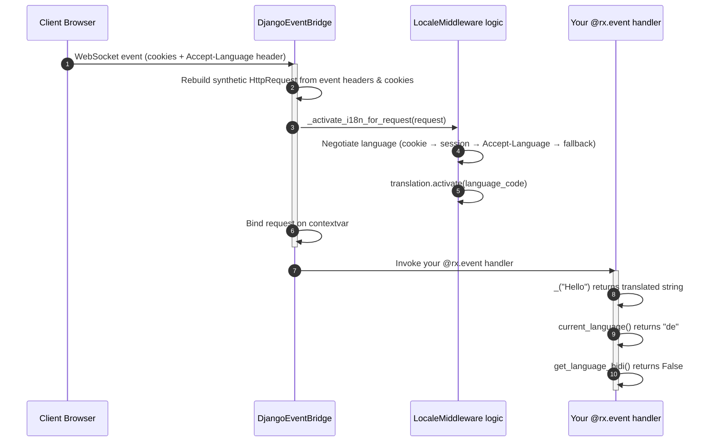

# Internationalization (i18n)

**reflex-django** carries Django's full internationalization machinery — language negotiation, locale activation, RTL detection, and translated strings — seamlessly into Reflex's reactive event flow.

This guide takes you from zero configuration all the way to a production-ready multilingual dashboard, showing every step from Django settings → Reflex state → page UI component.

---

## How It Works

Django's built-in i18n relies on `LocaleMiddleware` running inside the normal HTTP request/response cycle. Reflex events travel over a **persistent WebSocket** connection, bypassing that cycle entirely. The `DjangoEventBridge` closes that gap automatically:



By the time your event handler runs, the translation machinery is already active:

- `translation.get_language()` → negotiated language code (`"de"`, `"ar"`, …)
- `_("string")` / `gettext("string")` → properly translated string
- `translation.get_language_bidi()` → `True` for RTL languages
- `request.LANGUAGE_CODE` → set on the synthetic request

### Language Priority

| Priority | Source | Example |
|:---|:---|:---|
| **1 — highest** | Language cookie (`LANGUAGE_COOKIE_NAME`) | `django_language=de` |
| **2** | Session key (`_language`) | Written by `set_language` view |
| **3** | `Accept-Language` browser header | `de,en;q=0.9` |
| **4 — lowest** | `settings.LANGUAGE_CODE` | `"en-us"` |

---

## Step 1 — Django Settings

```python
# backend/settings.py
from pathlib import Path
from django.utils.translation import gettext_lazy as _

BASE_DIR = Path(__file__).resolve().parent.parent

USE_I18N = True      # required — activates the translation machinery
USE_L10N = True      # optional — localizes numbers and dates
USE_TZ = True        # always recommended

# Fallback when no browser preference matches
LANGUAGE_CODE = "en"

# Only expose the languages you actually support
LANGUAGES = [
    ("en", _("English")),
    ("de", _("Deutsch")),
    ("ar", _("العربية")),
    ("fr", _("Français")),
]

# Where Django finds your compiled .mo files
LOCALE_PATHS = [BASE_DIR / "locale"]

# Cookie name written by Django's set_language view
LANGUAGE_COOKIE_NAME = "django_language"

# LocaleMiddleware must come after SessionMiddleware
MIDDLEWARE = [
    "django.middleware.security.SecurityMiddleware",
    "django.contrib.sessions.middleware.SessionMiddleware",
    "django.middleware.locale.LocaleMiddleware",          # ← required
    "django.middleware.common.CommonMiddleware",
    "django.middleware.csrf.CsrfViewMiddleware",
    "django.contrib.auth.middleware.AuthenticationMiddleware",
    "django.contrib.messages.middleware.MessageMiddleware",
    "django.middleware.clickjacking.XFrameOptionsMiddleware",
]

# Expose language data to Reflex states via context processor
REFLEX_DJANGO_CONTEXT_PROCESSORS = (
    "reflex_django.reflex_context.builtin_i18n_context",
    "reflex_django.reflex_context.builtin_user_context",  # optional
)

# Bridge is True by default — shown here for clarity
REFLEX_DJANGO_I18N_EVENT_BRIDGE = True
```

## Step 2 — Create Translation Files

```bash
# Create the locale directory tree
mkdir locale

# Extract all translatable strings from your Python files
uv run reflex django makemessages --locale de --locale ar --locale fr

# Edit the generated .po files, then compile them into binary .mo files
uv run reflex django compilemessages
```

Your `locale/` directory will look like this after compiling:

```text
locale/
├── de/
│   └── LC_MESSAGES/
│       ├── django.po   ← edit translations here
│       └── django.mo   ← compiled by compilemessages
├── ar/
│   └── LC_MESSAGES/
│       ├── django.po
│       └── django.mo
└── fr/
    └── LC_MESSAGES/
        ├── django.po
        └── django.mo
```

---

## Step 3 — URL Setup for `set_language`

Django's built-in `set_language` view handles the language switch (sets a cookie and redirects). Mount it in your URL config:

```python
# backend/urls.py
from django.contrib import admin
from django.urls import include, path

urlpatterns = [
    path("admin/", admin.site.urls),
    path("i18n/", include("django.conf.urls.i18n")),  # ← /i18n/set_language/
]
```

---

## Example 1 — Simple Bilingual Greeting

The simplest possible example: a greeting that switches language based on the browser's `Accept-Language` header.

### State

```python
# frontend/state.py
import reflex as rx
from django.utils.translation import gettext as _
from reflex_django.state import AppState
from reflex_django.context import current_language


class GreetingState(AppState):
    """Serves a translated greeting using the bridge-activated language."""

    message: str = ""
    language_code: str = ""
    is_rtl: bool = False

    @rx.event
    async def load_greeting(self):
        from django.utils import translation

        # The bridge already called translation.activate() before this runs.
        # Just read the active language directly — no manual setup needed.
        self.language_code = current_language() or "en"
        self.is_rtl = translation.get_language_bidi()

        if self.request.user.is_authenticated:
            name = self.request.user.get_username()
        else:
            name = _("Guest")

        # _() returns the translation for the currently active language.
        self.message = _("Welcome, %(name)s!") % {"name": name}
```

### Page UI

```python
# frontend/pages/home.py
import reflex as rx
from frontend.state import GreetingState


def home_page() -> rx.Component:
    return rx.container(
        rx.vstack(
            # RTL-aware heading
            rx.heading(
                GreetingState.message,
                size="7",
                text_align=rx.cond(GreetingState.is_rtl, "right", "left"),
            ),

            # Language badge
            rx.hstack(
                rx.text("Active language:", color="gray"),
                rx.badge(GreetingState.language_code, color_scheme="indigo"),
                rx.cond(
                    GreetingState.is_rtl,
                    rx.badge("RTL", color_scheme="orange"),
                ),
            ),

            spacing="4",
            width="100%",
            align=rx.cond(GreetingState.is_rtl, "end", "start"),
        ),
        # Flip the entire container direction for RTL
        direction=rx.cond(GreetingState.is_rtl, "rtl", "ltr"),
        max_width="600px",
        padding="6",
        on_mount=GreetingState.load_greeting,
    )


# app.add_page(home_page, route="/", on_load=GreetingState.load_greeting)
```

---

## Example 2 — `DjangoI18nState` for Auto-Synced Language Vars

`DjangoI18nState` is a lightweight base class that automatically exposes the active language as reactive variables. Subclass it instead of manually calling `current_language()` everywhere.

| Variable | Type | Description |
|:---|:---|:---|
| `django_language_code` | `str` | Active language code, e.g. `"de"`, `"ar"` |
| `django_language_bidi` | `bool` | `True` for RTL languages |

### State

```python
# frontend/state.py
import reflex as rx
from django.utils.translation import gettext as _
from reflex_django import DjangoI18nState


class PageState(DjangoI18nState):
    """
    DjangoI18nState.sync_from_django is an @rx.event that reads
    current_language() and get_language_bidi() and stores them on
    self.django_language_code and self.django_language_bidi automatically.
    """

    page_title: str = ""
    subtitle: str = ""

    @rx.event
    async def load_page(self):
        # Sync language vars first
        await self.refresh_django_i18n_fields()

        # Now use the translation API freely
        self.page_title = _("My Dashboard")
        self.subtitle = _("Here is an overview of your account.")
```

### Page UI

```python
# frontend/pages/dashboard.py
import reflex as rx
from frontend.state import PageState


def dashboard_page() -> rx.Component:
    return rx.box(
        rx.container(
            rx.vstack(
                rx.heading(
                    PageState.page_title,
                    size="7",
                    text_align=rx.cond(PageState.django_language_bidi, "right", "left"),
                ),
                rx.text(
                    PageState.subtitle,
                    color="gray",
                    text_align=rx.cond(PageState.django_language_bidi, "right", "left"),
                ),
                rx.hstack(
                    rx.text("Language:", weight="medium"),
                    rx.badge(PageState.django_language_code, color_scheme="indigo"),
                    rx.cond(
                        PageState.django_language_bidi,
                        rx.badge("RTL ←", color_scheme="orange"),
                    ),
                ),
                spacing="4",
                width="100%",
            ),
            max_width="700px",
            padding="6",
        ),
        direction=rx.cond(PageState.django_language_bidi, "rtl", "ltr"),
        on_mount=PageState.load_page,
    )


# app.add_page(dashboard_page, route="/dashboard")
```

---

## Example 3 — Full Language Switcher Dashboard

This is the complete, production-ready pattern. It:

1. Loads the available languages list from Django settings via `builtin_i18n_context`
2. Renders one button per language, each submitting to Django's `set_language` view
3. Highlights the currently active language
4. Refreshes Reflex state after the page reloads with the new cookie
5. Adapts the entire layout direction for RTL languages

### State

```python
# frontend/state.py
import reflex as rx
from django.utils.translation import gettext as _
from reflex_django.state import AppState
from reflex_django.context import current_language, current_request
from reflex_django.reflex_context import collect_reflex_context


class LangSwitcherState(AppState):
    """
    Full language-switcher state:
    - active_lang: currently selected language code
    - is_rtl: True when the active language is right-to-left
    - available_langs: [["en", "English"], ["de", "Deutsch"], ...]
    - page_title: translated string, automatically updated on each load
    """

    active_lang: str = "en"
    is_rtl: bool = False
    available_langs: list[list[str]] = []
    page_title: str = ""
    welcome_text: str = ""

    @rx.event
    async def on_page_load(self):
        """
        Called on every page mount.
        The bridge has already:
          1. Rebuilt the synthetic HttpRequest from WebSocket cookies/headers
          2. Negotiated the language (cookie > session > Accept-Language > default)
          3. Called translation.activate(language_code)
        So all we do is read the results.
        """
        from django.utils import translation

        self.active_lang = current_language() or "en"
        self.is_rtl = translation.get_language_bidi()

        # Collect the full language list from the builtin_i18n_context processor.
        # Returns: {"LANGUAGE_CODE": "de", "LANGUAGE_BIDI": False, "LANGUAGES": [...]}
        ctx = await collect_reflex_context(current_request())
        self.available_langs = ctx.get("LANGUAGES", [])

        # _() uses the bridge-activated language automatically
        self.page_title = _("My Dashboard")

        if self.request.user.is_authenticated:
            name = self.request.user.get_username()
            self.welcome_text = _("Welcome back, %(name)s!") % {"name": name}
        else:
            self.welcome_text = _("Welcome, Guest!")
```

### Page Component

```python
# frontend/pages/dashboard.py
import reflex as rx
from frontend.state import LangSwitcherState


# ── Sub-components ──────────────────────────────────────────────────────────

def language_button(lang: list[str]) -> rx.Component:
    """
    A submit button wrapped in a minimal HTML form.
    Clicking it POSTs to Django's /i18n/set_language/ endpoint,
    which sets the language cookie and redirects back to /dashboard.
    The next page load picks up the new cookie through the bridge.
    """
    code = lang[0]
    label = lang[1]

    flags = {"en": "🇬🇧", "de": "🇩🇪", "ar": "🇸🇦", "fr": "🇫🇷"}
    flag = flags.get(code, "🌐")

    is_active = LangSwitcherState.active_lang == code

    return rx.form(
        # Hidden fields required by Django's set_language view
        rx.input(type="hidden", name="language", value=code),
        rx.input(type="hidden", name="next", value="/dashboard"),
        rx.button(
            f"{flag} {label}",
            type="submit",
            variant=rx.cond(is_active, "solid", "outline"),
            color_scheme=rx.cond(is_active, "indigo", "gray"),
            size="2",
            cursor="pointer",
        ),
        action="/i18n/set_language/",
        method="post",
    )


def language_switcher_bar() -> rx.Component:
    """Horizontal row of language buttons, one per entry in LANGUAGES."""
    return rx.card(
        rx.vstack(
            rx.text("🌍 Choose your language", weight="bold", size="3"),
            rx.flex(
                rx.foreach(LangSwitcherState.available_langs, language_button),
                gap="2",
                wrap="wrap",
            ),
            spacing="3",
        ),
        width="100%",
    )


def language_status_banner() -> rx.Component:
    """Shows the currently active language code and RTL badge."""
    return rx.callout(
        rx.hstack(
            rx.text("Active language:", weight="medium"),
            rx.badge(
                LangSwitcherState.active_lang,
                color_scheme="indigo",
                size="2",
            ),
            rx.cond(
                LangSwitcherState.is_rtl,
                rx.badge("RTL layout", color_scheme="orange", size="2"),
            ),
            spacing="2",
            align="center",
        ),
        color_scheme="blue",
        width="100%",
    )


def welcome_card() -> rx.Component:
    """A translated welcome card that flips alignment for RTL languages."""
    return rx.card(
        rx.vstack(
            rx.heading(
                LangSwitcherState.page_title,
                size="6",
                text_align=rx.cond(LangSwitcherState.is_rtl, "right", "left"),
            ),
            rx.text(
                LangSwitcherState.welcome_text,
                color="gray",
                size="3",
                text_align=rx.cond(LangSwitcherState.is_rtl, "right", "left"),
            ),
            spacing="2",
            width="100%",
            align=rx.cond(LangSwitcherState.is_rtl, "end", "start"),
        ),
        width="100%",
    )


# ── Page root ────────────────────────────────────────────────────────────────

def language_dashboard_page() -> rx.Component:
    """
    Full dashboard page with:
    - RTL-aware layout direction on the outermost box
    - Translated heading and subtitle
    - Language switcher (one button per language from settings.LANGUAGES)
    - Status banner showing the active language code
    """
    return rx.box(
        rx.container(
            rx.vstack(
                welcome_card(),
                language_switcher_bar(),
                language_status_banner(),
                spacing="5",
                width="100%",
            ),
            max_width="750px",
            padding="6",
        ),
        # This single prop flips the entire page layout for RTL users
        direction=rx.cond(LangSwitcherState.is_rtl, "rtl", "ltr"),
        min_height="100vh",
        on_mount=LangSwitcherState.on_page_load,
    )


# In your app module:
# app.add_page(language_dashboard_page, route="/dashboard")
```

---

## RTL Layout Tips

When `is_rtl` is `True`, a single `direction` prop on the outermost container reverses text direction, flex ordering, and padding simultaneously:

```python
rx.container(
    # ... content ...
    direction=rx.cond(MyState.is_rtl, "rtl", "ltr"),
)
```

For fine-grained per-element control:

```python
# Flip text alignment per element
rx.text(
    MyState.some_text,
    text_align=rx.cond(MyState.is_rtl, "right", "left"),
)

# Switch font family for Arabic/Hebrew text
rx.heading(
    MyState.title,
    font_family=rx.cond(
        MyState.is_rtl,
        "'Cairo', 'Noto Kufi Arabic', sans-serif",
        "'Inter', sans-serif",
    ),
)
```

### Loading RTL-friendly fonts

```python
# frontend/frontend.py  (your app module)
app = rx.App(
    stylesheets=[
        # Latin fonts
        "https://fonts.googleapis.com/css2?family=Inter:wght@400;600;700&display=swap",
        # Arabic / RTL fonts
        "https://fonts.googleapis.com/css2?family=Cairo:wght@400;600;700&display=swap",
    ],
)
```

---

## Settings Reference

| Setting | Type | Default | Description |
|:---|:---|:---|:---|
| `USE_I18N` | `bool` | `False` | **Must be `True`** to enable any i18n behavior. |
| `LANGUAGE_CODE` | `str` | `"en-us"` | Fallback when no browser preference matches. |
| `LANGUAGES` | `list[tuple]` | All Django languages | Restrict to only the languages your app supports. |
| `LOCALE_PATHS` | `list[Path]` | `[]` | Where `compilemessages` writes `.mo` files. |
| `LANGUAGE_COOKIE_NAME` | `str` | `"django_language"` | Cookie name set by the `set_language` view. |
| `REFLEX_DJANGO_I18N_EVENT_BRIDGE` | `bool` | `True` | Runs locale negotiation on every WebSocket event. |
| `REFLEX_DJANGO_CONTEXT_PROCESSORS` | `tuple[str]` | `()` | Include `builtin_i18n_context` to expose language list to states. |

---

## Disabling the i18n Bridge

If your app is single-language, you can skip locale negotiation on WebSocket events:

```python
# backend/settings.py
REFLEX_DJANGO_I18N_EVENT_BRIDGE = False
```

> [!WARNING]
> Setting `install_event_bridge=False` on `ReflexDjangoPlugin` disables the **entire** event bridge — both i18n and session/auth. Only use that if your app has no server-side auth logic in Reflex states.

---

## Testing

Simulate the bridge in tests using `begin_event_request` / `end_event_request`:

```python
# tests/test_i18n.py
import pytest
from django.http import HttpRequest
from django.utils import translation
from reflex_django.context import begin_event_request, end_event_request


@pytest.fixture(autouse=True)
def clean_i18n():
    end_event_request()
    yield
    end_event_request()
    translation.deactivate()


def test_bridge_activates_german(db):
    req = HttpRequest()
    req.method = "GET"
    req.META = {}
    req.LANGUAGE_CODE = "de"
    begin_event_request(req)
    translation.activate("de")

    from django.utils.translation import gettext as _
    # With a real .po file: assert _("Welcome") == "Willkommen"
    assert translation.get_language() == "de"


def test_arabic_is_rtl(db):
    req = HttpRequest()
    req.method = "GET"
    req.META = {}
    req.LANGUAGE_CODE = "ar"
    begin_event_request(req)
    translation.activate("ar")

    assert translation.get_language_bidi() is True
    assert translation.get_language() == "ar"
```

---

## Troubleshooting

### Translations always return the original English string

- Run `compilemessages` — `.po` files are source, `.mo` files are what Django loads:
  ```bash
  uv run reflex django compilemessages
  ```
- Restart the server — `.mo` files are loaded once at startup.
- Confirm `LOCALE_PATHS` contains the directory with `<lang>/LC_MESSAGES/django.po`.

### Language doesn't change after clicking the switcher button

- The `set_language` view sets a **cookie**. The browser must reload so the next WebSocket handshake sends the new cookie.
- Open browser DevTools → Application → Cookies and verify `django_language` is set.
- Confirm `LANGUAGE_COOKIE_NAME` in settings matches what `set_language` writes (default: `"django_language"`).

### `current_language()` returns `None` or `"en"` unexpectedly

- Check `USE_I18N = True` in settings — the bridge is a no-op when this is `False`.
- Confirm `LocaleMiddleware` is in `MIDDLEWARE`, placed after `SessionMiddleware`.
- Confirm `REFLEX_DJANGO_I18N_EVENT_BRIDGE = True` (it is by default).
- The Accept-Language header must include a language that is in your `LANGUAGES` list.

### RTL layout is not flipping

- Verify `translation.get_language_bidi()` returns `True` for your language code.
- Make sure `is_rtl` is set from `get_language_bidi()` inside an event handler (after the bridge activates the language), not as a static default.

---

**Navigation:** [← Session Authentication](authentication.md) | [Next: Database Integration →](database_integration.md)
