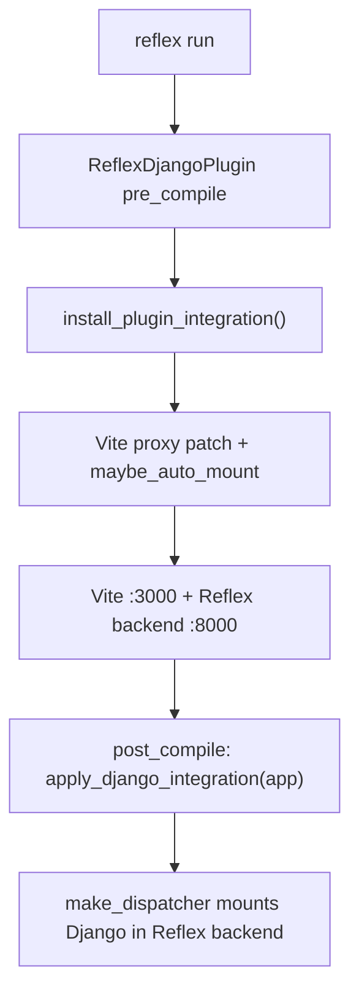
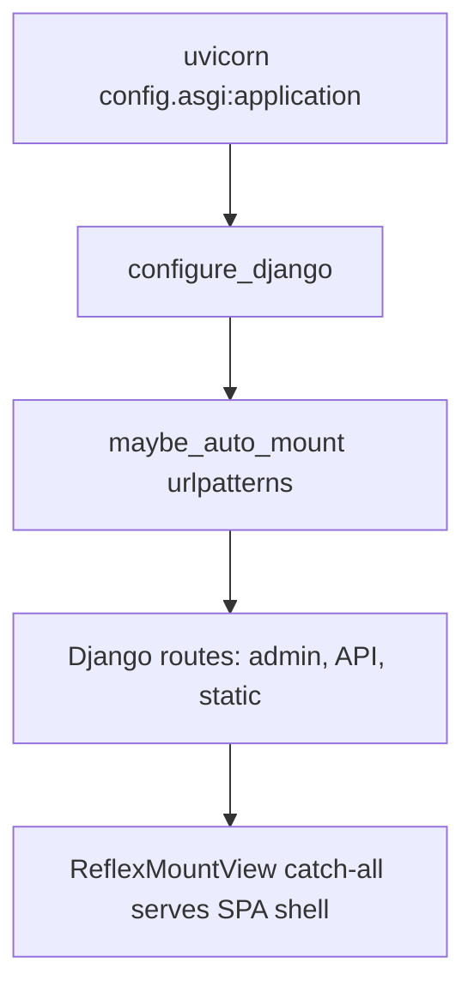

# Architecture

**What you will learn:** How reflex-django boots via `ReflexDjangoPlugin`, how traffic is routed in dev and production, and how the event bridge puts Django middleware in front of every Reflex handler.

For a gentler intro, read [How it fits together](../overview/concepts.md) first.

---

## Design goals

reflex-django optimizes for four properties:

1. **Plugin-only integration.** `rxconfig.py` with `ReflexDjangoPlugin` is the integration entry; Django `settings.py` holds ORM, middleware, and optional `RX_*` tuning.
2. **One origin in the browser.** SPA, admin, API, and WebSocket events share cookies on one host in dev (via Vite proxy) and in production (via your edge proxy).
3. **Real Django requests in handlers.** Every `@rx.event` runs after middleware populated a synthetic `HttpRequest`.
4. **Mount-only production Django.** Plain `get_asgi_application()` plus `reflex_mount()` catch-all.

---

## Boot sequence

### Early hook (`.pth`)

When the Reflex CLI starts, `reflex_django_reflex_cli.pth` imports `bootstrap.cli_patch`, which patches `get_config`. On first `get_config()` call, reflex-django detects `ReflexDjangoPlugin` in `rx.Config` and calls `install_plugin_integration()`.

### Dev (`reflex run`)



### Production Django process



Key modules:

| Module | Role |
|:---|:---|
| `reflex_django.bootstrap.cli_patch` | Early `get_config` patch via `.pth` |
| `reflex_django.runtime.get_config_patch` | Wraps `get_config` to bootstrap plugin |
| `reflex_django.plugins.reflex_django` | `ReflexDjangoPlugin` compile hooks |
| `reflex_django.runtime.integration` | `install_plugin_integration()`, patches |
| `reflex_django.bootstrap.app_setup` | `apply_django_integration`, event bridge |
| `reflex_django.mount.auto` | SPA catch-all; auto-wires admin URLs |
| `reflex_django.asgi.app` | `make_dispatcher`, `build_django_asgi` |
| `reflex_django.dev.vite_proxy` | Multi-target Vite proxy for two-port dev |
| `reflex_django.bridge.event` | `DjangoEventBridge` orchestration |

---

## Routing (dev)

`reflex run` starts Vite on `:3000` and the Reflex backend on `:backend_port`. `make_dispatcher()` attaches Django ASGI for configured prefixes:

```text
Browser :3000 (Vite)
    | proxy
    v
Reflex backend :8000
    |-- /_event, /_upload --> Reflex inner ASGI
    |-- /admin, /api, /static --> Django ASGI (in-process)
    +-- SPA page paths --> Reflex inner ASGI
```

Set `RX_PROXY_SERVER` to proxy Django prefixes to a separate `runserver` instead.

See [Routing](routing.md) and [Local development](../getting-started/local_development.md).

---

## Event bridge

Reflex events arrive on `/_event`. **`DjangoEventBridge`** runs before your handler:

1. Resolve bridge tier (`full`, `auth_only`, or `none`).
2. Build a synthetic `HttpRequest` from router data.
3. Run the tier middleware pipeline.
4. Bind `self.request`, `self.user`, `self.session` on `AppState`.

Deep trace: [Event pipeline](event_pipeline.md).

---

## State and pages

| Piece | Location | Notes |
|:---|:---|:---|
| `rx.Config` + plugin | `rxconfig.py` | Ports, plugins, `ReflexDjangoPlugin` config |
| `app` | `{app}/{app}.py` | User-owned `app = rx.App()` |
| `@page` | `{app}/views.py` | Registers routes at import time |
| `AppState` | subclass in views | Django context on every event |

Compile loads the app via `import_app_entry_module()` and `prepare_pages_for_compile()`.

---

## Mental model

In dev, Vite on `:3000` is the browser single origin; the Reflex backend serves both Reflex internals and Django admin/API via `make_dispatcher`. In production, Django ASGI serves the compiled SPA shell; your proxy forwards `/_event` to Reflex. Live UI updates use `/_event`, where reflex-django replays Django middleware on a synthetic request.

**Next up:** [Routing](routing.md) or [Deployment](../operations/deployment.md).
