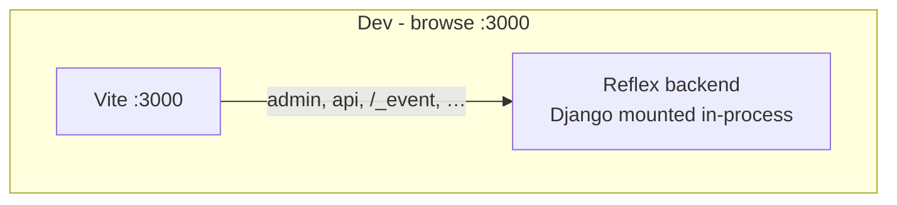

# Routing

**What you will learn:** How Django URLs, the Reflex SPA catch-all, and the dev proxy split traffic between Django and Reflex.

## Mount-only model

reflex-django no longer composes a single outer ASGI dispatcher. Instead:

1. **Django** runs plain ASGI (`get_asgi_application()`) with `reflex_mount()` catch-all for the SPA shell.
2. **Reflex** runs its native backend for `/_event`, `/_upload`, and related paths.
3. **Dev:** Vite on `:3000` proxies Django and Reflex paths to the Reflex backend by default. Set `RXDJANGO_PROXY_SERVER` to proxy Django prefixes to a separate server instead.



## Optional setting: `RXDJANGO_PROXY_SERVER`

Use this only when Django runs on a **separate** HTTP server (for example `runserver` on `:8000`):

```python
RXDJANGO_PROXY_SERVER = "http://127.0.0.1:8000"
```

When unset, Django admin/API prefixes are served from the Reflex backend (default for `manage.py run_reflex`).

Legacy `REFLEX_DJANGO_HTTP_UPSTREAM` still works with a deprecation warning.

## Django URL split

| Traffic | Handler |
|:---|:---|
| `/admin`, `/api`, custom Django views | Django `urlpatterns` |
| SPA routes (`/`, `/about`, …) | `ReflexMountView` catch-all |
| `/_event`, `/_upload`, … (dev) | Vite → Reflex backend |
| `/_event`, … (production) | Reverse proxy → Reflex process |

Configure which paths are Django-owned with `REFLEX_DJANGO_DJANGO_PREFIX` (auto-detected from `urlpatterns` by default). During dev, `make_dispatcher()` forwards those prefixes to Django ASGI inside the Reflex backend.

## Reserved Reflex prefixes {#reserved-reflex-prefixes}

Paths such as `/_event`, `/_upload`, `/_health`, and `/ping` are always handled by Reflex, in dev and production. Vite and `make_dispatcher` never forward these to Django.

## Django prefix detection {#django-prefix-detection}

By default, reflex-django inspects `urlpatterns` and treats registered path prefixes (for example `/admin`, `/api`) as Django-owned. Override with `REFLEX_DJANGO_DJANGO_PREFIX` or arguments to `reflex_mount()` when auto-detection is not enough.

## In-process Django dispatch (dev)

When `RXDJANGO_PROXY_SERVER` is unset, `get_or_create_app()` attaches `make_dispatcher()` to the Reflex app's `api_transformer`. Requests to `/admin`, `/api`, and other configured prefixes hit Django's URLconf in the **same process** as the Reflex backend.

If admin returns 404:

1. Confirm `/admin` is in `urlpatterns` (or rely on auto-mount to prepend `admin_urlpatterns()`).
2. Confirm `/admin` is in `django_prefix` (auto-detected or explicit in `reflex_mount()`).
3. Restart `run_reflex` after URL or prefix changes.

## Production

- **Django process:** admin, API, static, compiled SPA from disk.
- **Reflex process:** WebSocket/event channel (or skip if serving static export only).
- **Edge proxy:** route `/_event` and friends to Reflex; route everything else to Django.

See [Deployment](../operations/deployment.md) and [Local development](../getting-started/local_development.md).
