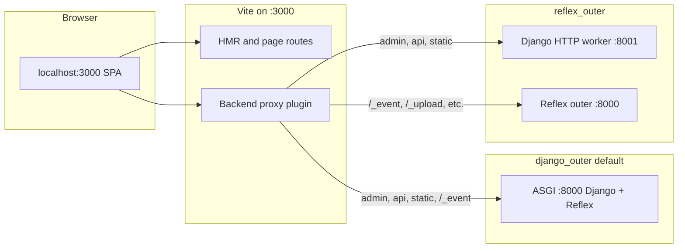

# Local development

**What you will learn:** Which URLs to open in dev, how the two-port layout works, and how Vite proxies backend traffic when `REFLEX_DJANGO_SEPARATE_DEV_PORTS=True`.

**When you need this:**

- You ran `run_reflex` and are unsure whether to browse `:3000` or `:8000`.
- Admin, API, or WebSocket calls fail from the SPA, or CSRF errors appear when you use `:3000`.

---

## The short version

```bash
python manage.py run_reflex
```

That one command starts **two servers** in default `django_outer` mode:

| Server | Port (default) | What you open it for |
|:---|:---|:---|
| **Vite** (frontend) | `3000` | **Reflex UI** (pages, hot reload, in-browser navigation) |
| **ASGI backend** | `8000` | **Django + Reflex backend** (admin, API, `/_event` WebSocket) |

**For frontend work, open `http://localhost:3000/`.**

**For backend-only checks**, hit `http://localhost:8000/admin/` or your API on `:8000`.

!!! tip "One URL in the address bar?"
    `python manage.py run_reflex --env dev` serves the compiled SPA from Django on `:8000` only (no Vite, no HMR).

---

## Two-port dev and Vite proxies

Default dev sets `REFLEX_DJANGO_SEPARATE_DEV_PORTS=True`. Vite listens on `:3000` and **proxies backend paths** so the browser stays on one origin for cookies and CSRF.

| Routing mode | Django prefixes (`/admin`, `/api`, …) | Reflex paths (`/_event`, `/_upload`, …) |
|:---|:---|:---|
| **`django_outer`** (default) | → `:8000` | → `:8000` |
| **`reflex_outer`** | → `:8001` (Django HTTP worker) | → `:8000` (Reflex outer) |

In **`django_outer`**, every proxied backend path goes to the **same** ASGI process on `:8000`.

In **`reflex_outer`**, `run_reflex` spawns a Django HTTP worker on `:8001` automatically. Reflex reserved paths still proxy to `:8000`. You do not browse `:8001` directly; stay on `:3000` or `:8000`.



!!! warning "Single-port dev strips proxies"
    When `REFLEX_DJANGO_SEPARATE_DEV_PORTS=False` (for example `--env dev`), reflex-django **removes** Vite proxy rules to avoid request loops. Browse `:8000` for everything in that mode.

---

## What `run_reflex` does

When you run the default command (no extra flags):

1. **Compiles** the Reflex SPA into `.web/`
2. **Patches** `.web/vite.config.js` with backend proxy routes (two-port mode)
3. **Starts Vite** on the frontend port (default `3000`)
4. **Starts** uvicorn (or granian) on `:8000` with `reflex_django.asgi.entry:application`
5. **Watches** Python files and reloads the backend; page edits hot-reload through Vite

You should see a banner like:

```text
reflex-django: Vite-HMR dev loop (default). Editing a Reflex page recompiles the SPA ...
reflex-django patched .web/vite.config.js for backend proxies (1 upstream group(s)).
INFO:     Uvicorn running on http://0.0.0.0:8000
```

In `reflex_outer`, you also see the Django HTTP worker come up on `:8001`:

--8<-- "snippets/reflex_outer_settings.py"

### Commands to avoid for SPA dev

| Command | Why it breaks the SPA |
|:---|:---|
| `python manage.py runserver` | WSGI only. No Vite, no dev proxies. |
| `uvicorn ...:application` alone | No Vite unless you start and proxy it yourself |

Use `run_reflex` instead.

---

## Dev modes at a glance

| Mode | Command | Browse | Vite proxies |
|:---|:---|:---|:---|
| **Default two-port HMR** | `run_reflex` | `:3000` for UI | Yes (see table above) |
| **Compile dev (one port)** | `run_reflex --env dev` | `:8000` | No (stripped) |
| **From disk, no HMR** | `run_reflex --from-build` | `:8000` | No |

Optional advanced layout: set `REFLEX_DJANGO_DEV_PROXY=True` and `REFLEX_DJANGO_SEPARATE_DEV_PORTS=False` in settings if you want Django on `:8000` to reverse-proxy SPA assets to Vite on `:3000`. There is no CLI flag for that today.

---

## Configuring ports

Ports live in `REFLEX_DJANGO_RX_CONFIG` and propagate to Vite, env files, and the backend:

```python
REFLEX_DJANGO_RX_CONFIG = {
    "frontend_port": 3000,
    "backend_port": 8000,
}
```

Environment overrides: `REFLEX_DJANGO_FRONTEND_PORT`, `REFLEX_DJANGO_BACKEND_PORT`.

Wire pages the usual way:

```python
--8<-- "snippets/minimal_urls.py"
```

---

## Django dev middleware and CSRF

When you browse admin from `:3000`, POST requests need trusted origins for both ports:

```python
from reflex_django.dev.django_middleware import DEFAULT_DEV_MIDDLEWARE

USE_X_FORWARDED_HOST = True
CSRF_TRUSTED_ORIGINS = [
    "http://localhost:8000",
    "http://127.0.0.1:8000",
    "http://localhost:3000",
    "http://127.0.0.1:3000",
]

MIDDLEWARE = [
    *DEFAULT_DEV_MIDDLEWARE,
    # ... your middleware ...
    "reflex_django.bridge.streaming.AsyncStreamingMiddleware",
]
```

---

## Troubleshooting

**"Reflex SPA bundle not found" on `:8000`**
In default two-port mode, `:8000` does not serve the SPA shell. Open `:3000`. With `--env dev` or `--from-build`, browse `:8000`.

**Port 3000 already in use**
Stop the other Vite or `run_reflex` instance, then start again.

**Django admin returns 403 CSRF**
Include both `:3000` and `:8000` in `CSRF_TRUSTED_ORIGINS`, set `USE_X_FORWARDED_HOST = True`, and prepend `DEFAULT_DEV_MIDDLEWARE`.

**`useContext is not a function` in the browser**
Restart `run_reflex` and hard-refresh. Check the compile log for "frontend stability patches".

**Wrong backend port from `:3000`**
Confirm `REFLEX_DJANGO_SEPARATE_DEV_PORTS=1` (set automatically in default two-port dev). In `reflex_outer`, list custom API roots in `REFLEX_DJANGO_DJANGO_PREFIX` if auto-detection misses them.

---

## What just happened?

Default dev keeps you on `:3000` for the SPA while Vite forwards Django and Reflex backend traffic to the right upstream. In `django_outer`, that upstream is always `:8000`. In `reflex_outer`, Django HTTP goes to `:8001` and Reflex internals stay on `:8000`, but your browser still uses one origin on `:3000`.

---

**Next up:** [Deployment](deployment.md)
