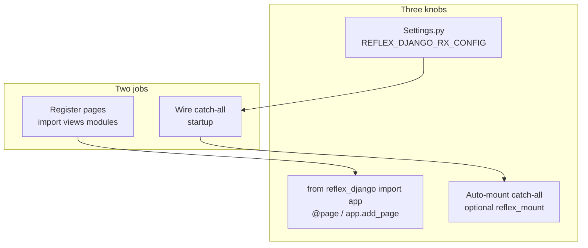

# The three knobs (start here)

If reflex-django feels confusing, it is usually because two different jobs got mixed up:

1. **Register pages** — make routes like `/` and `/about` exist in the SPA.
2. **Wire the SPA catch-all** — tell Django to serve the Reflex shell for everything that is not `/admin`, `/api`, etc.

Those are separate. Settings and imports handle pages. Auto-mount handles the catch-all.

This page is the short map. Everything else in the docs links back here.

---

## Three knobs

Most projects only touch **settings** and **pages**. The URL catch-all is automatic.

| Knob | Where | What you control |
|:---|:---|:---|
| **Settings** | `REFLEX_DJANGO_RX_CONFIG`, `REFLEX_DJANGO_PLUGINS`, … in `settings.py` | `app_name`, ports, `redis_url`, plugins — everything `rxconfig.py` used to hold |
| **App** | `from reflex_django import app` | The shared `rx.App()` — use `app.add_page()` like native Reflex `shop/shop.py` |
| **URLs** | automatic (default) or optional `reflex_mount()` | SPA catch-all only; use `reflex_mount()` when you need prefix overrides |



---

## What replaced plain Reflex files?

| Plain Reflex | django-first reflex-django |
|:---|:---|
| `rxconfig.py` | `REFLEX_DJANGO_RX_CONFIG` + `REFLEX_DJANGO_PLUGINS` in `settings.py` |
| `shop/shop.py` (`app = rx.App()`) | `from reflex_django import app` |
| Catch-all in `urls.py` via `reflex_mount()` | **Nothing required** — `REFLEX_DJANGO_AUTO_MOUNT=True` (default) |
| Pages in `shop/views.py` with `@rx.page` | Same idea — `@page` from `reflex_django.pages.decorators` |

---

## Minimal project shape

```python
# settings.py — knob 1: config
REFLEX_DJANGO_RX_CONFIG = {
    "app_name": "shop",
    "frontend_port": 3000,
    "backend_port": 8000,
}
REFLEX_DJANGO_PLUGINS = [
    "reflex.plugins.RadixThemesPlugin",
]
```

```python
# urls.py — register pages + Django routes (knob 3 is automatic)
import shop.views  # noqa: F401 — runs @page decorators at import time

from django.contrib import admin
from django.urls import path

urlpatterns = [
    path("admin/", admin.site.urls),
]
# SPA catch-all appended at startup when REFLEX_DJANGO_AUTO_MOUNT=True (default)
```

```python
# shop/views.py — knob 2: pages
import reflex as rx
from reflex_django.pages.decorators import page

@page(route="/", title="Home")
def index() -> rx.Component:
    return rx.heading("Hello")
```

```bash
python manage.py run_reflex
```

Starts **two** dev servers (Vite `:3000` + backend `:8000`). Open **`http://localhost:3000/`** for the SPA; admin and API are proxied to `:8000`. Optional: `--single-port` to browse only `:8000`. See [Local development](local_development.md).

---

## Override Reflex config

### Level 1 — settings (usual)

Put any allowed `rx.Config` field in `REFLEX_DJANGO_RX_CONFIG`:

```python
REFLEX_DJANGO_RX_CONFIG = {
    "app_name": "shop",
    "frontend_port": 3000,
    "backend_port": 8000,
    "redis_url": os.environ.get("REDIS_URL"),
    "show_built_with_reflex": False,
}
```

Add UI/tooling plugins separately:

```python
REFLEX_DJANGO_PLUGINS = [
    "reflex.plugins.RadixThemesPlugin",
    "reflex.plugins.TailwindV4Plugin",
]
```

Tune the built-in Django bridge plugin:

```python
REFLEX_DJANGO_PLUGIN = {
    "django_prefix": ("/admin", "/api"),
}
```

Most teams stop here.

### Level 2 — manual `reflex_mount()` (URL + config overrides)

Only when you need a non-root mount or explicit prefix lists:

```python
from reflex_django.urls import reflex_mount

urlpatterns += reflex_mount(
    mount_prefix="/app",
    django_prefix=("/admin", "/api/v2"),
    rx_config={"frontend_port": 3001},
)
```

`reflex_mount()` kwargs **merge over** settings. If auto-mount already appended a catch-all, a manual mount is skipped when it would duplicate.

!!! warning "Deprecated"
    `reflex_mount(app_name="shop")` is deprecated. Put `app_name` in `REFLEX_DJANGO_RX_CONFIG` instead.

### Level 3 — custom `rx.App` (theme, style)

Replaces `shop/shop.py`:

```python
# settings.py
REFLEX_DJANGO_CREATE_APP = "myapp.reflex.create_app"
```

```python
# myapp/reflex.py
import reflex as rx

def create_app():
    return rx.App(theme=rx.theme(accent_color="blue"))
```

Or assign before page modules import:

```python
import reflex as rx
import reflex_django.django_led_app as django_led

django_led._app = rx.App(...)
```

Then `from reflex_django import app` everywhere — same object.

### Level 4 — keep `rxconfig.py` on disk

```python
REFLEX_DJANGO_USE_RXCONFIG_FILE = True
```

reflex-django merges your file with Django settings.

See [Configuration](configuration.md) for the full ladder and [REFLEX_DJANGO_* settings](settings_reference.md) for every knob.

---

## Register pages

Pages exist only after Python **imports** the module that defines them (decorators run at import time) or after you call `app.add_page()`.

### Option A — `@page` decorator (most common)

```python
from reflex_django.pages.decorators import page

@page(route="/about", title="About", login_required=True)
def about() -> rx.Component:
    return rx.text("About us")
```

reflex-django's `@page` wraps Reflex's `@rx.page` and adds Django extras (`login_required`, breadcrumbs, etc.).

**You must import the module** so the decorator runs:

```python
# urls.py
import shop.views  # noqa: F401
```

### Option B — `app.add_page()` (native Reflex style)

```python
from reflex_django import app
import reflex as rx

def contact() -> rx.Component:
    return rx.text("Contact")

app.add_page(contact, route="/contact")
```

No decorator — you register on the shared app singleton.

### Option C — explicit package list (settings)

```python
REFLEX_DJANGO_PAGE_PACKAGES = [
    "shop.views",
    "modules.ai.studio.views",
]
```

Same idea as `urls.py` imports, but driven from settings.

### Option D — auto-discover (works today, deprecated)

With `REFLEX_DJANGO_AUTO_DISCOVER_PAGES=True` (still the default), reflex-django scans `INSTALLED_APPS` and imports every `{app}.views` at **compile time**. That is why a project can work **without** a `urls.py` import today — but you will see a deprecation warning, and auto-discover will be removed in a future major release.

!!! tip "Recommended"
    Prefer explicit `import myapp.views` in `urls.py` or `REFLEX_DJANGO_PAGE_PACKAGES`. It is obvious, stable, and matches where Django already loads code.

See [Pages live in views.py](pages_in_views.md) for layout helpers, auth pages, and troubleshooting.

---

## What is `app_name`?

`app_name` in `REFLEX_DJANGO_RX_CONFIG` is Reflex's **compile label** — like the project id in a plain `rxconfig.py`. It is **not** "all pages must live in `{app_name}/views.py`".

Reflex uses it for:

- Grouping decorated pages under the right key at compile time
- Build metadata and the virtual module `shop.shop:app` (pointing at the real `django_led_app.app`)

The actual `rx.App()` instance always loads from `reflex_django.django_led_app`.

### Simple project

`app_name: "shop"` and pages in `shop/views.py` — names match, easy to remember.

### Multi-package project

`app_name: "core"` and pages in `modules.ai.studio.views` — **normal**. The compile label and the Django package that holds pages can differ.

```python
# settings.py
REFLEX_DJANGO_RX_CONFIG = {"app_name": "core", ...}

# urls.py
import modules.ai.studio.views  # noqa: F401
```

`core/views.py` can stay empty. Auth pages can come from `REFLEX_DJANGO_AUTH` in settings. Studio routes live in the studio package.

!!! note
    Keep `app_name` stable unless you plan a full recompile. Changing it without rebuilding `.web` can cause blank screens or dispatch errors.

---

## When do things run?

| When | What happens |
|:---|:---|
| `django.setup()` | `urls.py` loads; explicit view imports run `@page` |
| `AppConfig.ready()` | Auto-mount may append SPA catch-all |
| `run_reflex` / compile | `prepare_pages_for_compile()` imports page modules (discover or packages), merges pages onto `app` |
| Request to `/` | Django catch-all serves SPA shell |
| WebSocket `/_event` | Reflex runs your `@rx.event` handlers with Django session |

Page registration and catch-all wiring happen at **different moments**. That is why one can work without the other being obvious.

---

## When things go wrong

**Blank SPA, no errors**

- Page modules never imported and auto-discover disabled? Add `import shop.views` or `REFLEX_DJANGO_PAGE_PACKAGES`.
- Wrong `app_name` after a rename without recompile? Restore old name or `rm -rf .web && python manage.py run_reflex`.

**404 on `/admin` or `/api`**

- Catch-all swallowed Django routes? Put Django `path()` entries **above** where the SPA catch-all is appended. Pass explicit `django_prefix` to `reflex_mount()` if you use `re_path()` without a clear first segment.

**`AppRegistryNotReady` in views**

- You imported a Django model at module top level in `views.py`. Move the import inside the event handler.

**"Do I need `reflex_mount()`?"**

- No, for a standard django-first SPA on `/`. Yes, only for prefix overrides, i18n URL layouts, or when `REFLEX_DJANGO_AUTO_MOUNT=False`.

More answers in the [FAQ](faq.md).

---

## Where to go next

| I want to… | Read |
|:---|:---|
| Install and run | [Installation](installation.md) → [Quickstart](quickstart.md) |
| Every setting | [Configuration](configuration.md), [Settings reference](settings_reference.md) |
| Pages and `@page` | [Pages live in views.py](pages_in_views.md) |
| URLs and dispatch | [Routing](routing.md) |
| Add to existing Django | [Existing Django project](existing_django_project.md) |
