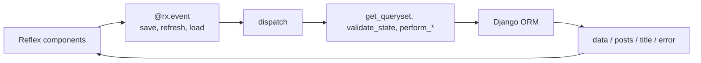
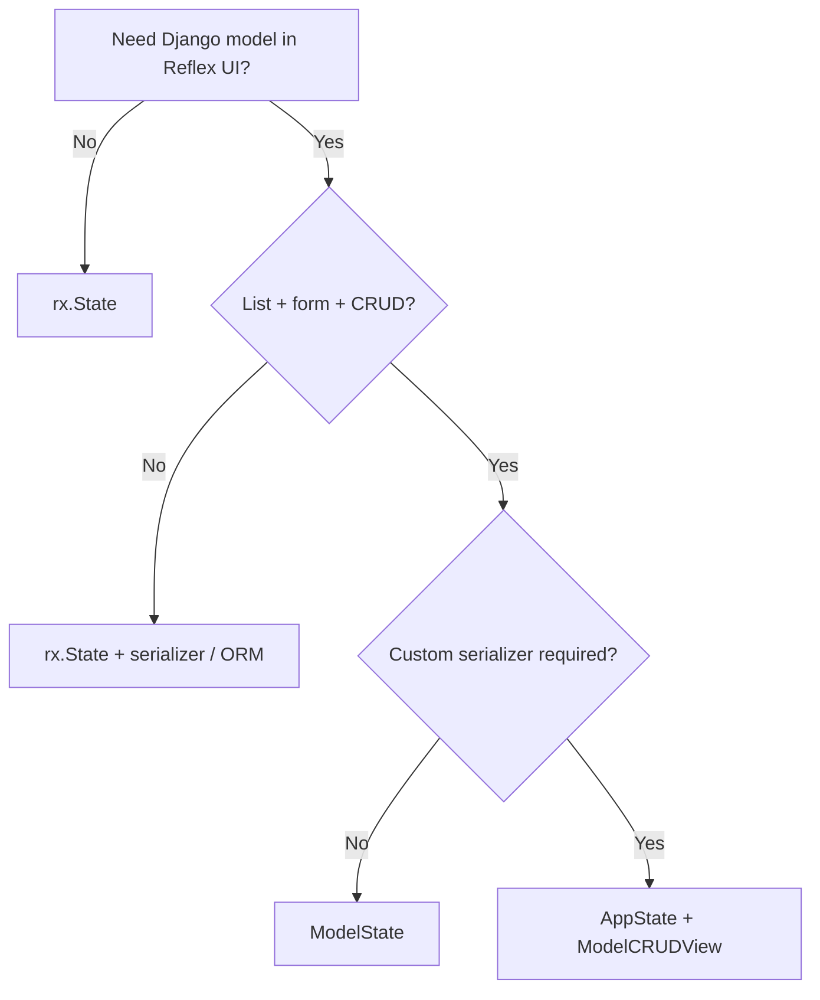

# ModelState and ModelCRUDView

reflex-django provides two ways to build **reactive list + form + CRUD** UIs for Django models. They share the **same pipeline** (queryset → serialize → Reflex vars → `dispatch` → hooks → ORM). The difference is **how you configure** that pipeline and **what names** appear in your UI code.

| Approach | Base classes | You declare | Default list var | Default handlers |
|----------|--------------|-------------|------------------|------------------|
| **`ModelState`** (recommended) | `AppState` + `ModelCRUDView` (built in) | `model` + `fields` | `data` | `load`, `save`, `refresh`, … |
| **`ModelCRUDView`** (explicit) | `AppState, ModelCRUDView` | `serializer_class` | pluralized (`products`, `posts`, …) | `save_post`, `on_load_posts`, … (legacy) **and** canonical when enabled |

**Start with `ModelState`.** Use `AppState, ModelCRUDView` when you need a hand-written serializer, legacy event names, or fine-grained control over assembly.

---

## How they relate

```text
                    ┌─────────────────────────────────────┐
                    │           AppState                  │
                    │  auth, session, self.request.user   │
                    └─────────────────┬───────────────────┘
                                      │
                    ┌─────────────────▼───────────────────┐
                    │         ModelCRUDView               │
                    │  dispatch, hooks, pagination, search  │
                    │  serializer_class OR model+fields   │
                    └─────────────────┬───────────────────┘
                                      │
              ┌───────────────────────┴───────────────────────┐
              │                                               │
    ┌─────────▼─────────┐                         ┌───────────▼──────────┐
    │    ModelState     │                         │  AppState +            │
    │  model + fields   │                         │  ModelCRUDView only    │
    │  data, error, …   │                         │  posts, posts_error, … │
    └───────────────────┘                         └────────────────────────┘
```

At **import time**, `AppStateMeta` runs **assembly**:

1. Resolve or build a `ReflexDjangoModelSerializer`.
2. Declare Reflex vars (list, errors, form fields, pagination).
3. Inject `@rx.event` handlers for names **not** already in your class body.

At **runtime**, handlers call `dispatch("save")` (etc.), which binds `self.request`, checks permissions, runs your hooks, updates the ORM, and refreshes reactive vars.



---

## Shared concepts (both styles)

### Hooks (override on your state class)

| Hook | When it runs |
|------|----------------|
| `get_queryset()` | Base queryset before filter/search/order |
| `filter_queryset(qs)` | Search, extra filters |
| `get_object_lookup(pk)` | `get()` kwargs for edit/delete |
| `validate_state(ctx)` | Before save; return field errors dict |
| `perform_create(state_data)` / `perform_update(instance, state_data)` | Create/update |
| `perform_destroy(instance)` | Delete |

### Configuration

Set options on the **class body** (IDE-friendly) or in **`class Meta(ModelCRUDMeta):`**. Examples: `paginate_by`, `search_fields`, `ordering`, `read_only_fields`, `structured_errors`, `reset_after_save`.

Resolved names: `YourState.get_options()` or `YourState.options` → `ModelStateOptions`.

### Requirements

- Django configured (`ReflexDjangoPlugin` / `configure_django()`).
- **Event bridge** enabled for **`self.request.user`** and `@login_required` in handlers ([Django middleware to Reflex](django_middleware_to_reflex.md), [Authentication — `self.request`](authentication.md#accessing-the-django-request-on-appstate)).

---

## ModelState — recommended path

`ModelState` is a single base class: **`AppState` + `ModelCRUDView` + `model` / `fields`**. You do not add `AppState` separately.

### Minimal example

**Model:**

```python
# shop/models.py
from django.db import models

class Product(models.Model):
    name = models.CharField(max_length=120)
    price = models.DecimalField(max_digits=10, decimal_places=2, default=0)
    sku = models.CharField(max_length=32, unique=True)
    is_active = models.BooleanField(default=True)
```

**State:**

```python
# shop/states/product.py
from reflex_django.state import ModelState
from shop.models import Product

class ProductState(ModelState):
    model = Product
    fields = ["name", "price", "sku", "is_active"]
    ordering = ("-id",)
```

**What assembly creates:**

| Category | Names |
|----------|--------|
| List | `data`, `error` |
| Form | `name`, `price`, `sku`, `is_active`, `set_name`, … |
| Edit mode | `editing_id` (`-1` = new, `≥ 0` = pk) |
| Form reset | `form_reset_key` (bind to `rx.form(..., key=...)`) |
| Canonical API | `load`, `save`, `create`, `delete`, `refresh`, `cancel_edit`, `filter`, `clear_filter`, `paginate` |
| Legacy aliases | `save_product`, `start_edit`, `on_load_data`, … (same pipeline) |

### Full page example

```python
# shop/pages/products.py
import reflex as rx
from shop.states.product import ProductState

def products_page() -> rx.Component:
    return rx.vstack(
        rx.heading("Products"),
        rx.cond(
            ProductState.error != "",
            rx.callout(ProductState.error, color_scheme="red"),
        ),
        rx.cond(
            ProductState.data.length() > 0,
            rx.foreach(
                ProductState.data,
                lambda row: rx.card(
                    rx.hstack(
                        rx.text(row["name"], weight="bold"),
                        rx.spacer(),
                        rx.button("Edit", on_click=ProductState.load(row["id"])),
                        rx.button(
                            "Delete",
                            color_scheme="red",
                            on_click=ProductState.delete(row["id"]),
                        ),
                        width="100%",
                    ),
                ),
            ),
            rx.text("No products yet.", color="gray"),
        ),
        rx.divider(),
        rx.cond(
            ProductState.editing_id >= 0,
            rx.text(f"Editing #{ProductState.editing_id}"),
            rx.text("New product"),
        ),
        rx.form(
            rx.vstack(
                rx.input(
                    value=ProductState.name,
                    on_change=ProductState.set_name,
                    placeholder="Name",
                ),
                rx.input(
                    value=ProductState.sku,
                    on_change=ProductState.set_sku,
                    placeholder="SKU",
                ),
                rx.input(
                    value=ProductState.price,
                    on_change=ProductState.set_price,
                    placeholder="Price",
                ),
                rx.checkbox(
                    "Active",
                    checked=ProductState.is_active,
                    on_change=ProductState.set_is_active,
                ),
                spacing="3",
                width="100%",
            ),
            key=ProductState.form_reset_key,
            width="100%",
        ),
        rx.hstack(
            rx.button("Save", on_click=ProductState.save),
            rx.button("New", variant="outline", on_click=ProductState.create),
            rx.button("Cancel", variant="ghost", on_click=ProductState.cancel_edit),
            rx.button("Reload", variant="ghost", on_click=ProductState.refresh),
            spacing="3",
        ),
        spacing="4",
        width="100%",
        max_width="48em",
        on_mount=ProductState.refresh,
    )
```

Register with `app.add_page(products_page, route="/products", on_load=ProductState.refresh)` (or `@rx.page`).

### Pagination and search

```python
class ProductState(ModelState):
    model = Product
    fields = ["name", "price", "sku", "is_active"]
    paginate_by = 20
    search_fields = ("name", "sku")
    ordering = ("-id",)
```

| Var / method | Role |
|--------------|------|
| `search`, `set_search` | Filter via `search_fields` |
| `page`, `page_size`, `total_count`, `page_count` | Pagination |
| `next_page`, `prev_page`, `go_to_page` | Navigation helpers |
| `paginate(page=2)` | Imperative page change + refresh |

In the UI, use **`ProductState.data.length() > 0`**, not Python `len()`.

### User-scoped rows

```python
from reflex_django.state import ModelState
from reflex_django.state.mixins.scoping import UserScopedMixin
from blog.models import Post

class PostState(ModelState, UserScopedMixin):
    model = Post
    fields = ["title", "body", "published"]
    scope_field = "author_id"
    ordering = ("-created_at",)
```

Or override `get_queryset()` / `get_create_kwargs()` on any `ModelState` subclass.

### Custom serializer on ModelState

You can still pass an explicit serializer; `model` + `fields` are optional when `serializer_class` is set:

```python
class ProductState(ModelState):
    serializer_class = ProductSerializer  # your ReflexDjangoModelSerializer
```

### Typing helper

```python
class ProductState(ModelState[Product]):
    fields = ["name", "price"]  # model inferred from Product
```

---

## ModelCRUDView — explicit serializer style

Use **`AppState, ModelCRUDView`** when:

- You already maintain serializers in a `serializers.py` module.
- You need **custom `validate_*`**, nested fields, or computed serializer fields.
- You want **per-model var names** (`posts`, `posts_error`) instead of generic `data` / `error`.
- You are migrating legacy code that calls `save_post`, `on_load_posts`, etc.

`ModelCRUDView` does **not** include auth — you must mix in **`AppState`**.

### Model and serializer

```python
# blog/models.py
from django.conf import settings
from django.db import models

class BlogPost(models.Model):
    title = models.CharField(max_length=200)
    slug = models.SlugField(max_length=220)
    body = models.TextField(blank=True)
    published = models.BooleanField(default=False)
    created_at = models.DateTimeField(auto_now_add=True)
    author = models.ForeignKey(settings.AUTH_USER_MODEL, on_delete=models.CASCADE)
```

```python
# blog/serializers.py
from reflex_django.serializers import ReflexDjangoModelSerializer
from blog.models import BlogPost

class BlogPostSerializer(ReflexDjangoModelSerializer):
    class Meta:
        model = BlogPost
        fields = ("id", "title", "slug", "body", "published", "created_at")
        read_only_fields = ("id", "created_at")
```

### Minimal state (legacy event names)

```python
from reflex_django.state import AppState, ModelCRUDView

class PostsState(AppState, ModelCRUDView):
    serializer_class = BlogPostSerializer

    class Meta:
        list_var = "posts"
        save_event = "save_post"
        delete_event = "delete_post"
```

**Generated (typical):** `posts`, `posts_error`, `editing_id`, `title`, `slug`, `body`, `published`, `set_*`, `on_load_posts`, `save_post`, `start_edit`, `delete_post`, `cancel_edit`, `form_reset_key`.

### Same page with ModelCRUDView

```python
import reflex as rx
from blog.states import PostsState

def blog_admin() -> rx.Component:
    return rx.vstack(
        rx.cond(
            PostsState.posts_error != "",
            rx.callout(PostsState.posts_error, color_scheme="red"),
        ),
        rx.form(
            rx.vstack(
                rx.input(value=PostsState.title, on_change=PostsState.set_title),
                rx.input(value=PostsState.slug, on_change=PostsState.set_slug),
                rx.text_area(value=PostsState.body, on_change=PostsState.set_body),
                rx.checkbox(
                    "Published",
                    checked=PostsState.published,
                    on_change=PostsState.set_published,
                ),
                spacing="3",
                width="100%",
            ),
            key=PostsState.form_reset_key,
            width="100%",
        ),
        rx.hstack(
            rx.button("Save", on_click=PostsState.save_post),
            rx.button("Cancel", on_click=PostsState.cancel_edit),
            spacing="3",
        ),
        rx.foreach(
            PostsState.posts,
            lambda row: rx.hstack(
                rx.text(row["title"], weight="bold"),
                rx.spacer(),
                rx.button("Edit", on_click=PostsState.start_edit(row["id"])),
                rx.button(
                    "Delete",
                    color_scheme="red",
                    on_click=PostsState.delete_post(row["id"]),
                ),
                width="100%",
            ),
        ),
        spacing="4",
        width="100%",
        on_mount=PostsState.on_load_posts,
    )
```

### Canonical API on ModelCRUDView

By default, **`use_canonical_api = True`** also injects `load`, `save`, `refresh`, … on `ModelCRUDView` subclasses. You can wire the UI to either style:

```python
# Legacy
on_click=PostsState.save_post
on_mount=PostsState.on_load_posts

# Canonical (same dispatch pipeline)
on_click=PostsState.save
on_mount=PostsState.refresh
on_click=PostsState.load(row["id"])
```

To disable canonical handlers and keep only legacy names:

```python
class PostsState(AppState, ModelCRUDView):
    serializer_class = BlogPostSerializer
    use_canonical_api = False
```

### User-scoped posts (ModelCRUDView)

```python
from reflex_django.state import AppState, ModelCRUDView
from reflex_django.state.mixins.scoping import UserScopedMixin

class PostsState(AppState, ModelCRUDView, UserScopedMixin):
    serializer_class = BlogPostSerializer
    scope_field = "author_id"

    class Meta:
        list_var = "posts"
```

Or hooks:

```python
class PostsState(AppState, ModelCRUDView):
    serializer_class = BlogPostSerializer

    def get_queryset(self):
        return BlogPost.objects.filter(author=self.request.user)

    def get_create_kwargs(self, state_data: dict) -> dict:
        return {**state_data, "author": self.request.user}
```

### Pagination and search (ModelCRUDView)

Same options as `ModelState` — set on the class body or `Meta`:

```python
class PostsState(AppState, ModelCRUDView):
    serializer_class = BlogPostSerializer
    paginate_by = 20
    search_fields = ("title", "slug")

    class Meta:
        list_var = "posts"
        # Optional: search_var = "posts_search"  # default would be posts_search if list_var is posts
```

On **`ModelCRUDView`** with default `list_var = "posts"`, search/error vars are typically **`posts_search`**, **`posts_error`** unless you override `search_var` / `error_var`. On **`ModelState`**, defaults are always **`search`** and **`error`**.

---

## Side-by-side: same feature, two styles

| Task | ModelState | ModelCRUDView (`list_var = "posts"`) |
|------|------------|--------------------------------------|
| Declare model | `model = BlogPost` | Via serializer `Meta.model` |
| Declare fields | `fields = ["title", "body"]` | Via serializer `Meta.fields` |
| List in UI | `PostState.data` | `PostsState.posts` |
| Error message | `PostState.error` | `PostsState.posts_error` |
| Load list | `PostState.refresh` or `on_load_data` | `PostsState.on_load_posts` or `refresh` |
| Edit row | `PostState.load(pk)` or `start_edit(pk)` | `PostsState.start_edit(pk)` or `load(pk)` |
| Save | `PostState.save` or `save_post` | `PostsState.save_post` or `save` |
| Delete | `PostState.delete(pk)` | `PostsState.delete_post(pk)` |
| Search input | `PostState.search` | `PostsState.posts_search` (unless `search_var` set) |

---

## ModelListView (read-only)

For **display-only** tables (no create/update/delete), use **`AppState, ModelListView`**:

```python
from reflex_django.state import AppState, ModelListView

class AuditState(AppState, ModelListView):
    serializer_class = BlogPostSerializer

    class Meta:
        list_var = "entries"
        on_load_event = "on_load_entries"
```

No `save_*` / `delete_*` handlers are assembled. For new read-only screens, `ModelState` with only `refresh` in the UI is often enough; use `ModelListView` when you want a strict read-only stack.

---

## When to use what

| Scenario | Use |
|----------|-----|
| New CRUD screen for one Django model | **`ModelState`** + `model` + `fields` |
| Reuse existing DRF-style serializers | **`AppState, ModelCRUDView`** + `serializer_class` |
| Keep legacy handler names in UI | **`ModelCRUDView`** + `Meta.save_event` / `delete_event` |
| Same generic names across all models | **`ModelState`** (`data`, `error`, `load`, `save`) |
| Read-only audit table | **`ModelListView`** or **`ModelState`** (list only) |
| Multi-step wizard / cart | Plain **`rx.State`** |
| Auth navbar only | **`AppState`** without model mixins |



---

## Migrating between styles

**ModelCRUDView → ModelState**

Before:

```python
from reflex_django.state import AppState, ModelCRUDView
from notes.serializers import NoteSerializer

class NotesState(AppState, ModelCRUDView):
    serializer_class = NoteSerializer

    class Meta:
        list_var = "notes"
        save_event = "save_note"
```

After:

```python
from reflex_django.state import ModelState
from notes.models import Note

class NotesState(ModelState):
    model = Note
    fields = ["title", "content"]
```

Update UI: `notes` → `data`, `notes_error` → `error`, `save_note` → `save`, `on_load_notes` → `refresh`.

To migrate gradually, keep plural names:

```python
class NotesState(ModelState):
    model = Note
    fields = ["title", "content"]

    class Meta:
        list_var = "notes"  # still NotesState.notes in UI
```

**ModelState → custom serializer**

Keep `ModelState` and set `serializer_class = MySerializer` instead of `fields`, or switch to `AppState, ModelCRUDView` if you prefer the explicit mixin style.

---

## Common mistakes

| Mistake | Fix |
|---------|-----|
| `ModelCRUDView` without `AppState` | Add `AppState` for `self.request.user` / login |
| Missing `fields` on `ModelState` | Set `fields = [...]` or provide `serializer_class` |
| `len(State.data)` in `rx.cond` | Use `State.data.length() > 0` |
| `run_model_validation = True` on class body | Use **`Meta.run_model_validation` only** |
| UI calls `save_post` but you migrated to `ModelState` | Use `save` or keep `Meta.save_event` |
| Empty list after login | Fix `get_queryset()` / `UserScopedMixin` |
| Form not clearing after save | `rx.form(..., key=State.form_reset_key)` |

---

## Further reading

| Topic | Page |
|-------|------|
| Full `ModelState` guide (hooks, troubleshooting) | [Reactive ModelState](reactive_model_state.md) |
| `ModelCRUDView` tutorial (BlogPost) | [CRUD with mixins and states](crud_with_mixins_and_states.md) |
| Manual ORM without mixins | [CRUD without mixins](crud_without_mixins.md) |
| Serializers | [Serializers](serializers.md) |
| Auth in state | [Authentication](authentication.md), [State management](state_management.md) |
| Forms & validation | [Forms and validation](forms_and_validation.md) |

---

**Navigation:** [← State management](state_management.md) | [Reactive ModelState →](reactive_model_state.md) | [CRUD with mixins →](crud_with_mixins_and_states.md) | [Docs index](index.md)
