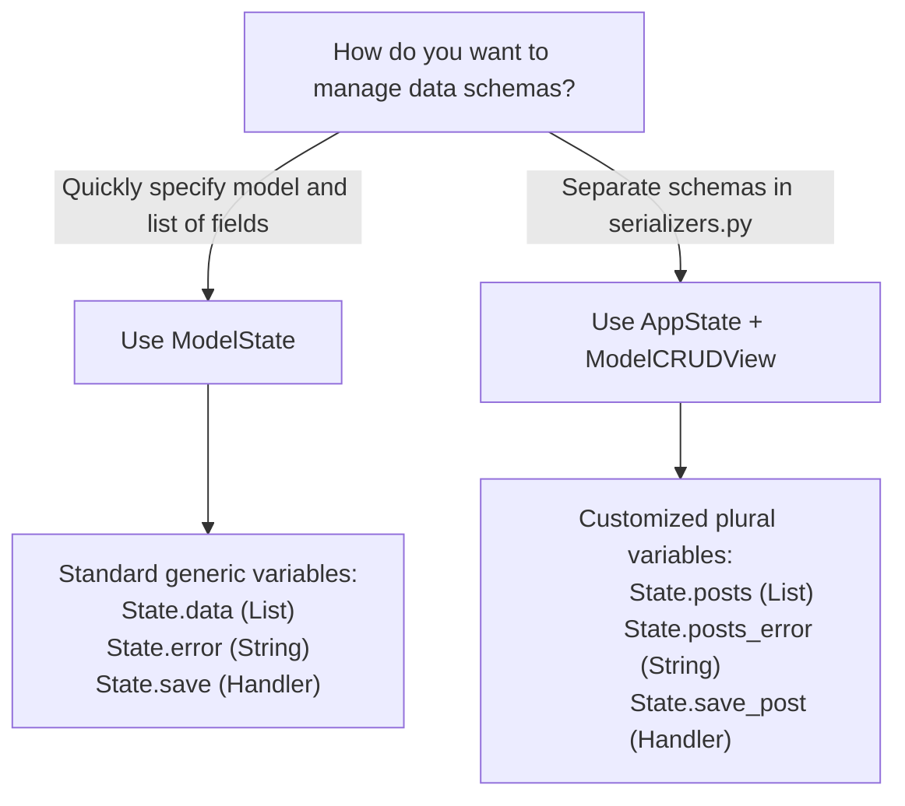

# ModelState vs. ModelCRUDView

When building admin portals, user settings pages, or database-driven catalogs, you want to avoid writing dozens of repetitive event handlers just to move text from database columns to form inputs. 

To automate this, **reflex-django** provides a high-productivity reactive CRUD engine. It comes in two styling paradigms that run on the exact same underlying processing pipeline:

1. **`ModelState`** (Recommended): A single, unified class that aggregates user auth, database querysets, and auto-generated reactive variables under a highly simplified, generic API.
2. **`ModelCRUDView`**: A modular, explicit mixin class designed for projects with pre-existing serializers, pluralized naming patterns, or legacy action event configurations.

This guide analyzes both paradigms side-by-side, detailing how they relate under the hood and helping you select the perfect tool for your application architecture.

---

## 1. Architectural Relationship

Both approaches execute the exact same database integration lifecycle. During process startup, the class metaclass runs an **assembly routine**:

1. **Resolve Serializer**: Scans class variables to locate or dynamically compile a matching `ReflexDjangoModelSerializer`.
2. **Inject State Properties**: Automatically binds reactive fields for every writable column in the model (e.g., `self.name`, `self.price`), plus edit trackers and error buffers.
3. **Register Event Handlers**: Dynamically injects event handler methods (like `.save()`, `.delete()`) into the class body.
4. **Dispatch Pipeline**: At runtime, client events trigger the central `.dispatch()` routine, which binds the user request context, executes security validations, runs lifecycle hooks, and mutates database records.

```text
                     ┌─────────────────────────────────────┐
                     │              AppState               │
                     │  (Request Context & Session Auth)   │
                     └──────────────────┬──────────────────┘
                                        │
                     ┌──────────────────▼──────────────────┐
                     │            ModelCRUDView            │
                     │  (Dispatch, Hooks, Slicing, Query)  │
                     └──────────────────┬──────────────────┘
                                        │
             ┌──────────────────────────┴──────────────────────────┐
             ▼                                                     ▼
   ┌──────────────────┐                                  ┌──────────────────┐
   │    ModelState    │                                  │  ModelCRUDView   │
   │  (Unified Base)  │                                  │ (Explicit Mixin) │
   │                  │                                  │                  │
   │ Base: AppState + │                                  │ Inherit:         │
   │       ModelCRUD  │                                  │ AppState,        │
   │                  │                                  │ ModelCRUDView    │
   │ List: .data      │                                  │ List: .[plural]  │
   │ Error: .error    │                                  │ Error: .[plural] │
   │                  │                                  │        _error    │
   └──────────────────┘                                  └──────────────────┘
```

---

## 2. Paradigms Side-by-Side

| Feature | `ModelState` (Recommended) | `ModelCRUDView` (Explicit) |
|:---|:---|:---|
| **Base Class** | Subclass `ModelState` directly. | Subclass `AppState` **and** `ModelCRUDView`. |
| **Data Definition** | Declare `model` and `fields` on state class. | Declare `serializer_class` referencing schema. |
| **Default List Property** | **`self.data`** (Generic list of dictionaries) | **`self.[plural_name]`** (e.g. `self.products`, `self.posts`) |
| **Default Error Buffer** | **`self.error`** (Generic string) | **`self.[plural_name]_error`** |
| **Event Handlers** | Generic canonical methods: `.load()`, `.save()`, `.delete()`, `.refresh()` | Pluralized or canonical names: `.save_post()`, `.delete_post()`, `.on_load_posts()` |

---

## 3. The Recommended Path: `ModelState`

`ModelState` represents the highest level of productivity. It is designed to get a new database-backed form up and running in seconds using simple, standard naming conventions.

### Step 1: Declare the State

You do not need to declare a separate serializer or inherit from `AppState` explicitly. Simply subclass `ModelState`:

```python
# shop/states/products.py
from reflex_django.state import ModelState
from shop.models import Product

class ProductState(ModelState):
    """Unified state managing product listings and form inputs."""
    model = Product
    fields = ["name", "price", "sku", "is_active"]
    ordering = ("-id",)
    
    # Enable pagination and text search auto-filters
    paginate_by = 10
    search_fields = ("name", "sku")
```

### What Assembly Automatically Declares:
* **Reactive Variables**: `data` (list of matching serialized records), `error` (error string), `editing_id` (record primary key or `-1`), and `form_reset_key`.
* **Input Bindings**: `name`, `price`, `sku`, and `is_active` (plus their standard `set_*` mutations).
* **Canonical Action Handlers**:
    * **`refresh`**: Reloads querysets, applies page/search parameters, and hydrates `data`.
    * **`save`**: Performs client form validation, creates or updates the database row, resets inputs, and refreshes listings.
    * **`load(id)`**: Fetches a single record and populates form input fields for editing.
    * **`delete(id)`**: Safely removes the database record and updates the list.
    * **`cancel_edit`**: Aborts edit mode and clears input fields.

### Step 2: Construct the Page Component

Because `ModelState` uses predictable, generic variable names, your UI bindings feel clean and cohesive:

```python
# shop/pages/products.py
import reflex as rx
from shop.states.products import ProductState

def products_page() -> rx.Component:
    return rx.container(
        rx.heading("Inventory Catalog", margin_bottom="1rem"),
        
        # 1. Error Display
        rx.cond(
            ProductState.error != "",
            rx.callout(ProductState.error, color_scheme="red", margin_bottom="1.5rem")
        ),
        
        # 2. Search & Filter Bar
        rx.hstack(
            rx.input(
                placeholder="Search products...",
                value=ProductState.search,
                on_change=ProductState.set_search,
            ),
            rx.button("Search", on_click=ProductState.refresh),
            margin_bottom="1.5rem"
        ),
        
        # 3. Product Cards list
        rx.vstack(
            rx.foreach(
                ProductState.data,
                lambda row: rx.hstack(
                    rx.vstack(
                        rx.text(row["name"], weight="bold"),
                        rx.text(f"SKU: {row['sku']} • ${row['price']}", color_scheme="gray"),
                        align_items="start"
                    ),
                    rx.spacer(),
                    rx.button("Edit", on_click=ProductState.load(row["id"])),
                    rx.button("Delete", color_scheme="red", on_click=ProductState.delete(row["id"])),
                    width="100%", padding="0.5rem", border_bottom="1px solid rgba(0,0,0,0.05)"
                )
            ),
            width="100%", min_height="200px"
        ),
        
        # 4. Input Form wrapped in dynamic reset key
        rx.form(
            rx.vstack(
                rx.heading(rx.cond(ProductState.editing_id >= 0, "Edit Item", "Create Item"), size="3"),
                rx.input(placeholder="Product Name", value=ProductState.name, on_change=ProductState.set_name),
                rx.input(placeholder="SKU", value=ProductState.sku, on_change=ProductState.set_sku),
                rx.input(placeholder="Price", value=ProductState.price, on_change=ProductState.set_price),
                rx.hstack(
                    rx.button("Save", on_click=ProductState.save, color_scheme="indigo"),
                    rx.button("Cancel", on_click=ProductState.cancel_edit, variant="ghost")
                ),
                spacing="3", margin_top="2rem", width="100%"
            ),
            key=ProductState.form_reset_key,
            width="100%"
        ),
        padding="2rem"
    )
```

---

## 4. The Explicit Path: `ModelCRUDView`

Use `AppState, ModelCRUDView` when you prefer to separate database schema serialization from state management, or if you need custom, pluralized naming patterns to align with legacy applications.

### Step 1: Declare the Serializer and State

First, define your serializer class:

```python
# blog/serializers.py
from reflex_django.serializers import ReflexDjangoModelSerializer
from blog.models import BlogPost

class PostSerializer(ReflexDjangoModelSerializer):
    class Meta:
        model = BlogPost
        fields = ("id", "title", "body", "published")
        read_only_fields = ("id",)
```

Then, subclass both `AppState` (for authentication and session storage) and `ModelCRUDView`, passing the serializer configuration:

```python
# blog/states/posts.py
from reflex_django.state import AppState, ModelCRUDView
from blog.serializers import PostSerializer

class PostCRUDState(AppState, ModelCRUDView):
    """Explicit CRUD state utilizing pre-defined serializers."""
    serializer_class = PostSerializer
    
    class Meta:
        # Define pluralized variables for UI consistency
        list_var = "posts"
        
        # (Optional) Customize generated event handler names
        save_event = "save_blog_post"
```

### What Assembly Automatically Declares:
* **Pluralized List**: **`self.posts`** receives the list of matching blog posts.
* **Pluralized Error**: **`self.posts_error`** captures transaction errors.
* **Input Bindings**: `title` and `body` (maps from serializer fields).
* **Canonical API Aliases**: In addition to generated handlers like `self.save_blog_post`, assembly binds generic aliases like `.save()`, `.refresh()`, and `.load()` unless you explicitly disable them via setting `use_canonical_api = False`.

---

## 5. Choosing the Right Tool

Use this architectural decision tree to determine the optimal configuration for your page requirements:



### Read-Only Optimization: `ModelListView`
If you are building a dashboard or a simple data grid that only displays database records and does not perform modifications (Create, Update, or Delete operations), use **`ModelListView`** instead. This keeps your classes clean by omitting form inputs and mutator handlers:

```python
# blog/states/analytics.py
from reflex_django.state import AppState, ModelListView
from blog.serializers import PostSerializer

class ArticleGridState(AppState, ModelListView):
    """A highly performant read-only data listing."""
    serializer_class = PostSerializer
    
    class Meta:
        list_var = "articles"
```

---

## 6. Common Pitfalls

* **Omitting `AppState` on `ModelCRUDView`**: Subclassing `ModelCRUDView` alone does not bind request-level session or authenticated user information. Always inherit from `AppState` first (e.g., `class MyState(AppState, ModelCRUDView)`).
* **Binding Forms Without `form_reset_key`**: If you do not assign `key=State.form_reset_key` to your HTML `<form>` or `rx.form` components, input inputs will not clear after saving or canceling edits.
* **Incorrect Metadata Declarations**: Standard configuration settings (like `paginate_by` or `search_fields`) should be defined directly on the class body for IDE autocompletion, or enclosed in a nested `class Meta(ModelCRUDMeta):` configuration block.

---

**Navigation:** [← CRUD (No Mixins)](crud_without_mixins.md) | [Next: Reactive ModelState →](reactive_model_state.md)
