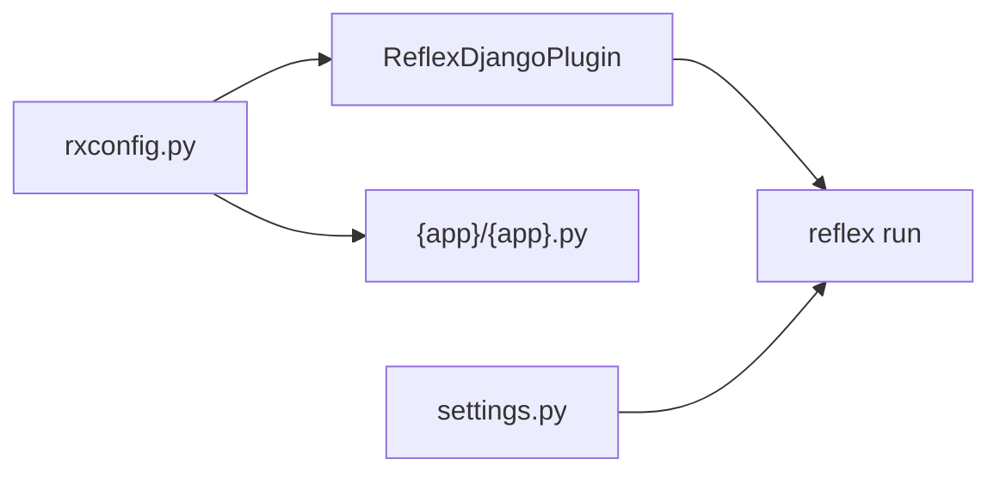

# How reflex-django fits together

You already know Django. reflex-django adds a reactive UI in Python on the same site, with the same session cookies, so `request.user` works when someone clicks a button.

**Brownfield?** See [Getting started](../getting-started/index.md#brownfield-integration).

## At a glance

| You keep | You add |
|:---|:---|
| Models, admin, migrations, DRF | `rxconfig.py` with `ReflexDjangoPlugin` |
| `settings.py`, `urls.py`, sessions | `{app_name}/{app_name}.py` with `app = rx.App()` |
| Your middleware and auth | `reflex run` for dev |

## Integration model (v4)

## Two layers

| Layer | File | What |
|:---|:---|:---|
| Reflex + mount | `rxconfig.py` | `rx.Config`, `ReflexDjangoPlugin`, ports, Reflex plugins |
| Django | `settings.py` | `INSTALLED_APPS`, `MIDDLEWARE`, optional `RX_*` tuning |

## Development vs production

=== "Development"

- `reflex run` - browse **http://localhost:3000/** for the UI (Vite HMR)
- Vite proxies admin, API, and `/_event` to the Reflex backend on port 8000
- Django runs in-process on the backend

=== "Production"

- `reflex export` in CI
- `collectstatic` then serve with Django ASGI

## Compared to plain Reflex

| Plain Reflex | reflex-django |
|:---|:---|
| `rxconfig.py` | Same - plus `ReflexDjangoPlugin` in `plugins` |
| `{app}/{app}.py` | Same - your `app = rx.App()` |
| `@rx.page` | `@page` from `reflex_django.pages.decorators` optional |
| `reflex run` | Same dev command |

## What is app_name

`app_name` in `rx.Config` is Reflex's compile label. It must match `{app_name}/{app_name}.py`.

## See also

- [Configuration](../getting-started/configuration.md)
- [App entry and pages](../guides/app_entry_and_pages.md)
