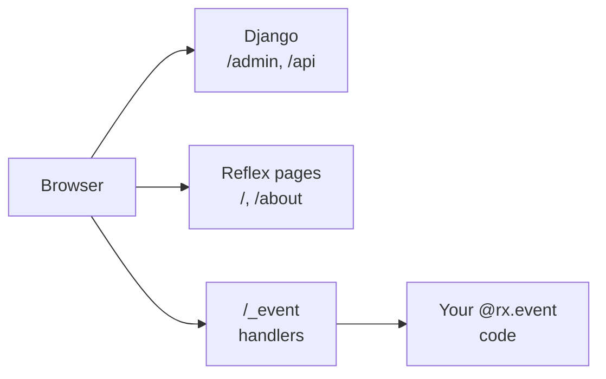

# How reflex-django fits together

You already know Django. reflex-django adds a reactive UI in Python on the same site, with the same session cookies, so `request.user` works when someone clicks a button.

This page is a short map. For step-by-step setup, go to [Getting started](../getting-started/index.md).

**Brownfield?** See [Getting started — brownfield integration](../getting-started/index.md#brownfield-integration): [existing Django](../getting-started/existing_django_project.md), [existing Reflex (settings)](../getting-started/existing_reflex_project.md), or [existing Reflex (plugin)](../getting-started/existing_reflex_project_plugin.md).

## At a glance

| You keep | You add |
|:---|:---|
| Models, admin, migrations, DRF | Reflex pages in `views.py` |
| `settings.py`, `urls.py`, sessions | One dev command: `python manage.py run_reflex` |
| Your middleware and auth | Shared cookies between Django and the UI |

## How requests are routed

In dev you usually open **port 3000** (Vite). In production you serve everything from **one port** on Django ASGI.

<strong>Browser</strong>Opens a page or clicks a button

→

<strong>Django paths</strong><code>/admin</code>, <code>/api</code>, media

→

<strong>Reflex paths</strong><code>/</code>, <code>/about</code>, SPA pages

→

<strong>Button clicks</strong><code>/_event</code> runs your handler with Django context

## The three knobs

Most projects only change **settings** and **pages**. The catch-all URL is automatic unless you turn off auto-mount.

Knob 1

Settings

<strong>Where:</strong> <code>settings.py</code>

<strong>What:</strong> <code>RX_CONFIG</code>, auth, plugins, performance

Knob 2

App

<strong>Where:</strong> <code>from reflex_django import app</code>

<strong>What:</strong> Shared Reflex app; <code>@page</code> registers routes

Knob 3

URLs

<strong>Where:</strong> Auto-mount (default) or <code>reflex_mount()</code>

<strong>What:</strong> Serves the SPA shell for non-Django paths

!!! tip "Two jobs (do not mix them up)"
    **Job 1: Register pages.** Import your views in `urls.py` so `@page` runs and routes like `/` exist.

    **Job 2: Wire the catch-all.** Let reflex-django serve the SPA shell for paths that are not `/admin`, `/api`, and so on. Auto-mount does this by default.

    Settings and imports handle Job 1. Auto-mount handles Job 2. They run at different times. That is normal.

    **Entry module vs page hub:** Reflex also expects `{app_name}/{app_name}.py` on disk (keep it thin). Your page imports usually live in `{app_name}/views.py`. See [App entry module and page registration](../guides/app_entry_and_pages.md).

## Development vs production

=== "Development"

- Browse **http://localhost:3000/** for the UI (Vite hot reload).
- Vite proxies admin, API, and `/_event` to the Reflex backend on **port 8000**.
- Django runs in-process on the backend. Cookies work on both ports.
- Optional: run Django on `runserver` separately and set `RX_PROXY_SERVER`.

=== "Production"

- No Vite. Export the SPA with `manage.py export_reflex`.
- Django ASGI serves admin, API, static files, and the compiled SPA shell on **one port**.
- Your reverse proxy forwards `/_event` and uploads to the Reflex backend if needed.

See [Local development](../getting-started/local_development.md) and [Deployment](../operations/deployment.md).

## Compared to plain Reflex

| Plain Reflex | reflex-django |
|:---|:---|
| `rxconfig.py` | `RX_CONFIG` in `settings.py` |
| `shop/shop.py` with `app = rx.App()` | `from reflex_django import app` |
| Catch-all in `urls.py` | Optional; auto-mount covers the default |
| `@rx.page` | `@page` from `reflex_django.pages.decorators` |

## Minimal project shape

You touch three files, then run one command:

1. **`settings.py`** - `INSTALLED_APPS`, `RX_CONFIG`, middleware
2. **`urls.py`** - `import yourapp.views` so pages register
3. **`views.py`** - `@page` functions and state classes

Copy-paste examples live in [Your first app](../getting-started/quickstart.md). The [home page](../index.md) also shows the smallest snippets.

## What is app_name {#what-is-app_name}

`app_name` in `RX_CONFIG` is Reflex's **compile label** (which `.web` bundle to build). It is not always the same as your Django app package name.

If you omit it, reflex-django uses the folder name next to `manage.py` (hyphens become underscores).

## See also

- [App entry module and page registration](../guides/app_entry_and_pages.md)
- [Your first app](../getting-started/quickstart.md)
- [Project structure](../getting-started/project_structure.md)
- [Architecture](../internals/architecture.md) (full request and event flow)
- [Event pipeline](../internals/event_pipeline.md) (what runs on each button click)