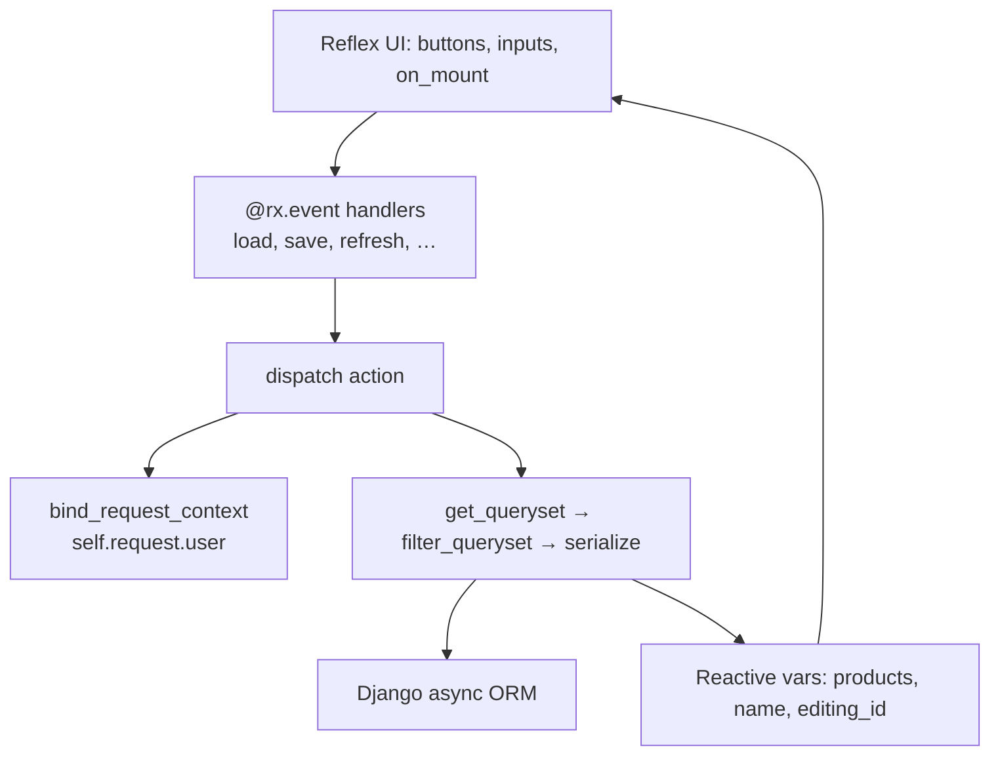
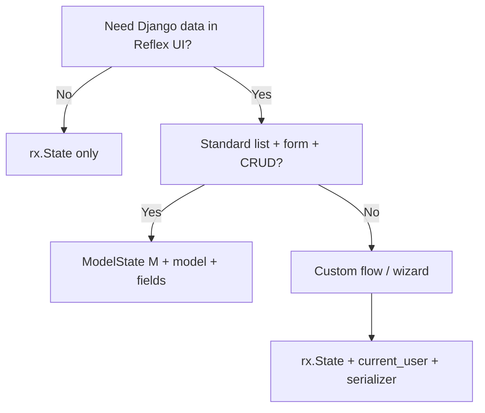

# Reactive ModelState

**`ModelState`** is the recommended way to build reactive CRUD for **any** Django model. Subclass it, set **`model`** and **`fields`** on the class, and reflex-django assembles a serializer, Reflex state vars, and event handlers at **class definition time**. Your UI binds to stable method names (`load`, `save`, `refresh`, …) instead of memorizing per-model event names like `save_note` or `save_product`.

The optional subscript **`ModelState[Product]`** only helps type checkers (or infers `model` if you omit it in the class body)—the normal style is **`class ProductState(ModelState): model = Product`**.

---

## What you get

| Layer | What reflex-django provides |
|-------|---------------------------|
| **Auth** | `ModelState` extends `AppState` → `self.user`, `self.session`, `login`, `logout`, `has_perm`, reactive `is_authenticated`, … |
| **Serializer** | Auto-built from `model` + `fields` (or your custom `serializer_class`) |
| **List var** | `products`, `orders`, … — `list[dict[str, Any]]` of serialized rows |
| **Form vars** | One Reflex var per writable field (`name`, `price`, …) plus `set_name`, … |
| **Handlers** | Canonical `load` / `save` / `refresh` / … plus legacy names (`save_product`, `start_edit`) |
| **Hooks** | Django CBV-style overrides: `get_queryset`, `validate_state`, `perform_create`, … |

You still write normal Reflex components. ModelState does not replace `rx.State` for unrelated UI (carts, wizards, counters).

---

## Mental model



**At import time** (`AppStateMeta`), reflex-django:

1. Resolves or builds a `ReflexDjangoModelSerializer` for your model.
2. Declares missing Reflex vars (`products`, `products_error`, `editing_id`, field vars, pagination vars).
3. Injects default `@rx.event` handlers **only for names not already in your class body**.

**At runtime**, each handler calls `dispatch("save")` (etc.), which binds `self.request`, runs permission checks, calls your hooks, hits the ORM, and updates reactive vars so the UI re-renders.

---

## Quick start (Product CRUD)

### 1. Model

```python
# shop/models.py
from django.db import models

class Product(models.Model):
    name = models.CharField(max_length=120)
    price = models.DecimalField(max_digits=10, decimal_places=2, default=0)
    sku = models.CharField(max_length=32, unique=True)
    is_active = models.BooleanField(default=True)
    created_at = models.DateTimeField(auto_now_add=True)
```

### 2. State (one class per model)

```python
# shop/state.py
import reflex as rx
from reflex_django.state import ModelState
from shop.models import Product

class ProductState(ModelState):
    model = Product
    fields = ["name", "price", "sku", "is_active"]
    ordering = ("-created_at",)
```

That is enough for assembly to generate:

- **List:** `products`, `products_error`
- **Form:** `name`, `price`, `sku`, `is_active`, `set_name`, …
- **Edit mode:** `editing_id` (`-1` = create, `>= 0` = editing pk)
- **Events:** `load`, `save`, `create`, `delete`, `refresh`, `filter`, `clear_filter`, `paginate`, `cancel_edit`
- **Legacy aliases:** `save_product`, `start_edit`, `on_load_products`, …

### 3. Page

```python
# shop/pages.py
import reflex as rx
from shop.state import ProductState

def products_page() -> rx.Component:
    return rx.vstack(
        rx.heading("Products"),
        rx.cond(
            ProductState.products_error != "",
            rx.callout(ProductState.products_error, color_scheme="red"),
        ),
        # List
        rx.foreach(
            ProductState.products,
            lambda row: rx.card(
                rx.hstack(
                    rx.vstack(
                        rx.text(row["name"], weight="bold"),
                        rx.text(f"SKU: {row['sku']}  ·  ${row['price']}"),
                        rx.badge(
                            rx.cond(row["is_active"], "Active", "Inactive"),
                        ),
                    ),
                    rx.spacer(),
                    rx.button(
                        "Edit",
                        on_click=ProductState.load(row["id"]),
                    ),
                    rx.button(
                        "Delete",
                        color_scheme="red",
                        on_click=ProductState.delete(row["id"]),
                    ),
                    width="100%",
                ),
            ),
        ),
        rx.divider(),
        # Form
        rx.cond(
            ProductState.editing_id >= 0,
            rx.text(f"Editing #{ProductState.editing_id}"),
            rx.text("New product"),
        ),
        rx.input(
            placeholder="Name",
            value=ProductState.name,
            on_change=ProductState.set_name,
        ),
        rx.input(
            placeholder="SKU",
            value=ProductState.sku,
            on_change=ProductState.set_sku,
        ),
        rx.input(
            placeholder="Price",
            value=ProductState.price,
            on_change=ProductState.set_price,
        ),
        rx.checkbox(
            "Active",
            checked=ProductState.is_active,
            on_change=ProductState.set_is_active,
        ),
        rx.hstack(
            rx.button("Save", on_click=ProductState.save),
            rx.button("New", variant="outline", on_click=ProductState.create),
            rx.button("Cancel", variant="ghost", on_click=ProductState.cancel_edit),
            rx.button("Reload list", variant="ghost", on_click=ProductState.refresh),
        ),
        spacing="4",
        width="100%",
        max_width="48em",
        padding="2em",
        on_mount=ProductState.refresh,
    )
```

Register the page with Reflex as usual (`app.add_page` or `@rx.page`). ModelState does not dictate routing.

### 4. Requirements

- Django configured (`configure_django()` or plugin).
- **Event bridge** enabled so `login_required` and `self.request.user` work in handlers ([Django middleware to Reflex](django_middleware_to_reflex.md)).

---

## Canonical API reference

These names are **stable across every model**. Use them in `on_click`, `on_mount`, and custom `@rx.event` wrappers.

| Method | Signature | What it does |
|--------|-----------|--------------|
| `load` | `load(pk: int)` | Fetch one row; populate form vars; set `editing_id` |
| `save` | `save()` | Create (if `editing_id == -1`) or update current row |
| `create` | `create()` | Set `editing_id = -1`, then `save()` (new row) |
| `delete` | `delete(pk=None)` | Delete by pk; default pk = current `editing_id` |
| `refresh` | `refresh()` | Reload list var from DB (`dispatch("load_list")`) |
| `filter` | `filter(**kwargs)` | Store Django ORM filters, then `refresh()` |
| `clear_filter` | `clear_filter()` | Clear stored filters, then `refresh()` |
| `paginate` | `paginate(page=…, page_size=…)` | Update page vars (if `paginate_by` set), then `refresh()` |
| `cancel_edit` | `cancel_edit()` | Clear form fields; `editing_id = -1` |
| `get_row` | `get_row(pk) -> dict \| None` | Read one row from the **current** list var (no DB hit) |

**Legacy names** (still generated for backward compatibility):

| Canonical | Legacy equivalent |
|-----------|-------------------|
| `load(pk)` | `start_edit(pk)` |
| `save()` | `save_{model_name}` e.g. `save_product` |
| `delete(pk)` | `delete_{model_name}` |
| `refresh()` | `on_load_{list_var}` → `_load_{list_var}` |
| `cancel_edit()` | `cancel_edit` (same name by default) |

Set `Meta.use_canonical_api = False` if you only want legacy names and no `load`/`save`/… injection.

---

## How save and edit mode work

```text
editing_id == -1  →  save() runs CREATE  (perform_create → acreate)
editing_id >= 0   →  save() runs UPDATE  (perform_update → asave on instance)

load(42)          →  dispatch("start_edit", pk=42)
                     →  get_object(42) → copy fields into state vars
                     →  editing_id = 42

create()          →  editing_id = -1, then save()  (new row)

cancel_edit()     →  reset_state_fields(), editing_id = -1
```

After a successful save, the default pipeline calls `reset_state_fields()` when `Meta.reset_after_save` is `True` (default), bumps `form_reset_key` (for `rx.form` remounting), and reloads the list.

---

## Example: Blog posts (author-scoped)

Same pattern as [CRUD with mixins](crud_with_mixins_and_states.md), but with `ModelState` and canonical methods.

```python
# blog/models.py
from django.conf import settings
from django.db import models

class BlogPost(models.Model):
    title = models.CharField(max_length=200)
    slug = models.SlugField(max_length=220)
    body = models.TextField(blank=True)
    published = models.BooleanField(default=False)
    created_at = models.DateTimeField(auto_now_add=True)
    author = models.ForeignKey(settings.AUTH_USER_MODEL, on_delete=models.CASCADE)
```

```python
# blog/state.py
from reflex_django.state import ModelState
from reflex_django.state.mixins.scoping import UserScopedMixin
from blog.models import BlogPost

class PostState(ModelState[BlogPost], UserScopedMixin):
    fields = ["title", "slug", "body", "published"]
    scope_field = "author_id"  # FK column on BlogPost
    ordering = ("-created_at",)

    class Meta:
        list_var = "posts"
        read_only_fields = ("author",)  # author set via UserScopedMixin, not form
```

`UserScopedMixin` wires:

- `get_queryset()` → only current user's posts
- `get_object_lookup(pk)` → pk + author constraint
- `get_create_kwargs()` → injects `author_id`

**Without the mixin** (explicit hooks):

```python
class PostState(ModelState[BlogPost]):
    fields = ["title", "slug", "body", "published"]

    def get_queryset(self):
        return BlogPost.objects.filter(author=self.request.user)

    def get_object_lookup(self, pk: int) -> dict:
        return {"pk": pk, "author": self.request.user}

    def get_create_kwargs(self, state_data: dict) -> dict:
        return {**state_data, "author": self.request.user}
```

Use `self.request.user` inside hooks during `dispatch` (not only `self.user` from AppState—both work when the bridge is on).

---

## Example: Categories (minimal public CRUD)

```python
from reflex_django.state import ModelState
from catalog.models import Category

class CategoryState(ModelState[Category]):
    fields = ["label"]
    ordering = ("label",)

    class Meta:
        permission_classes = ()  # public list if you customize permissions
        login_required_actions = frozenset()  # opt out of @login_required on handlers
```

Only add this when you intentionally want anonymous access; defaults require login for load/save/delete.

---

## Filtering, search, and pagination

### ORM filter shortcut (`filter` / `clear_filter`)

```python
class ProductState(ModelState[Product]):
    fields = ["name", "price", "is_active"]

    @rx.event
    async def show_active_only(self):
        await self.filter(is_active=True)

    @rx.event
    async def show_all(self):
        await self.clear_filter()
```

`filter(**kwargs)` sets `self._queryset_filter` and calls `refresh()`. `filter_queryset()` applies it on top of `get_queryset()`:

```python
def filter_queryset(self, queryset):
    extra = getattr(self, "_queryset_filter", None)
    if extra:
        queryset = queryset.filter(**extra)
    return super().filter_queryset(queryset)
```

### Built-in search (`Meta.search_fields`)

```python
class ProductState(ModelState[Product]):
    fields = ["name", "price", "sku"]

    class Meta:
        search_fields = ("name", "sku")
        # Generates: products_search, set_products_search, clear_products_search
```

Wire UI to `set_products_search` or call `refresh()` after updating search.

### Pagination (`Meta.paginate_by`)

```python
class ProductState(ModelState[Product]):
    fields = ["name", "price"]

    class Meta:
        paginate_by = 25
        max_page_size = 100
```

Generated: `page`, `page_size`, `products_total_count`, `products_page_count`, `next_page`, `prev_page`, `go_to_page`, `set_page_size`.

```python
# UI
rx.button("Next", on_click=ProductState.next_page)
rx.button("Page 2", on_click=ProductState.paginate(page=2))
```

### Custom search on the same class

```python
class ProductState(ModelState[Product]):
    fields = ["name", "price"]
    search_query: str = ""

    @rx.event
    def set_search_query(self, value: str):
        self.search_query = value

    def filter_queryset(self, qs):
        q = self.search_query.strip()
        if q:
            from django.db.models import Q
            qs = qs.filter(Q(name__icontains=q) | Q(sku__icontains=q))
        return super().filter_queryset(qs)

    @rx.event
    async def apply_search(self):
        self.reset_page()  # when paginate_by is set
        await self.refresh()
```

---

## Forms (`rx.form` + `use_form_submit`)

For HTML form posts with a single `form_data` dict:

```python
class ProductState(ModelState[Product]):
    fields = ["name", "price"]

    class Meta:
        use_form_submit = True
        # Generates save_product_form(form_data) in addition to save()
```

```python
rx.form(
    rx.input(name="name"),
    rx.input(name="price"),
    rx.button("Save", type="submit"),
    on_submit=ProductState.save_product_form,
    reset_on_submit=False,
    key=ProductState.form_reset_key,  # remount after save when reset_after_save=True
)
```

---

## Custom serializer (DRF-style override)

When you need nested fields, computed columns, or strict validation:

```python
from reflex_django.serializers import ReflexDjangoModelSerializer
from reflex_django.state import ModelState

class ProductSerializer(ReflexDjangoModelSerializer):
    class Meta:
        fields = ("id", "name", "price", "category_id", "display_name")
        read_only_fields = ("id", "display_name")

class ProductState(ModelState[Product]):
    model = Product
    serializer_class = ProductSerializer  # wins over auto-built from fields
    fields = ["name", "price"]  # ignored for serializer when serializer_class set
```

**Precedence:** `Meta.serializer` or `serializer_class` **always** beats `model` + `fields` for serialization. You can still use `fields` only when no custom serializer is provided.

---

## Auth on model pages

`ModelState` includes `AppState`. In handlers:

```python
class OrderState(ModelState[Order]):
    fields = ["status", "total"]

    def get_queryset(self):
        if self.user.is_staff:
            return Order.objects.all()
        return Order.objects.filter(customer=self.user)

    @rx.event
    async def mark_shipped(self, order_id: int):
        if not self.has_perm("shop.change_order"):
            return
        await self.load(order_id)
        self.status = "shipped"
        await self.save()
```

Navbar (reactive vars, no extra `on_load`):

```python
rx.cond(
    OrderState.is_authenticated,
    rx.text("Hi, ", OrderState.username),
    rx.link("Login", href="/login"),
)
```

See [Authentication](authentication.md) for `login`, `logout`, `@permission_required`, and `REFLEX_DJANGO_AUTH_AUTO_SYNC`.

---

## Overrides and hooks (full guide)

**Rule:** If you define a method name in the class body, assembly **does not** replace it.

### Replace a generated handler

```python
from reflex_django.state.constants import ACTION_SAVE
from reflex_django.auth.decorators import login_required

class ProductState(ModelState[Product]):
    fields = ["name", "price"]

    @rx.event
    @login_required  # you must re-apply when overriding
    async def save(self):
        if not self.name.strip():
            self.products_error = "Name is required."
            return
        await self.dispatch(ACTION_SAVE)
```

### Hook reference (override without replacing events)

| Hook | When it runs | Example |
|------|----------------|---------|
| `get_queryset()` | Before every list/load/edit query | `return Product.objects.filter(shop=self.shop_id)` |
| `filter_queryset(qs)` | After `get_queryset` | Search, tags, merge `_queryset_filter` |
| `get_ordering()` | List ordering | Dynamic sort from `products_ordering` var |
| `get_object_lookup(pk)` | `load` / `delete` | `{"pk": pk, "owner": self.user}` |
| `get_create_kwargs(data)` | Create | `{"author_id": self.user.pk, **data}` |
| `perform_create(ctx, instance)` | After instance built, before save | Side effects |
| `perform_update(ctx, instance)` | Before `asave` | Audit fields |
| `perform_delete(ctx, instance)` | Delete | Soft-delete |
| `validate_state(ctx, data)` | Before save | Cross-field rules → error dict |
| `clean_{field}(value)` | Per field | Normalize slug |
| `has_object_permission(ctx, obj)` | Edit/delete | Row-level check |
| `on_save_success(ctx, instance)` | After save | Toast, redirect |
| `on_state_invalid(ctx, errors)` | Validation failed | Custom error message |
| `handle_exception(ctx, exc)` | Any exception in dispatch | Log + user message |
| `setup(action)` / `teardown(action)` | Around each action | Metrics |

**Validation example:**

```python
class PostState(ModelState[BlogPost]):
    fields = ["title", "slug", "body"]

    class Meta:
        run_model_validation = True
        structured_errors = True  # posts_field_errors: dict[str, str]

    async def validate_state(self, ctx):
        errors = await super().validate_state(ctx)
        if len(self.title.strip()) < 3:
            errors.setdefault("title", "Title must be at least 3 characters.")
        return errors

    def on_state_invalid(self, ctx, errors):
        if isinstance(errors, dict):
            self.posts_error = "; ".join(f"{k}: {v}" for k, v in errors.items())
```

---

## Declaration reference

| Attribute | Required | Role |
|-----------|----------|------|
| `model` | Yes* | Django model class (`model = Product`) |
| `fields` | Yes* | Writable field names (`"author_id"` for FK attnames) |
| `ModelState[YourModel]` | No | Optional typing / infers `model` if omitted in class body |
| `serializer_class` / `Meta.serializer` | Optional | Overrides auto serializer |
| `read_only_fields` | Optional | Extra read-only (beyond serializer) |
| `ordering` | Optional | Default `("-created_at",)` — set `()` if model has no `created_at` |
| `paginate_by`, `search_fields` | Optional | On class or `Meta` |

\*When using an explicit serializer only, `ModelState[M]` and `fields` are not required.

**Field validation at import:**

```python
# Raises ImproperlyConfigured: Invalid fields for shop.product: not_a_field
class BadState(ModelState[Product]):
    fields = ["name", "not_a_field"]
```

Auto serializer always includes `id` in `Meta.fields`.

---

## Reactive vars (naming)

| Var | Default for `Product` | Type / role |
|-----|----------------------|-------------|
| `products` | pluralized model name | `list[dict[str, Any]]` rows |
| `products_error` | `{list_var}_error` | Last error string |
| `products_field_errors` | when `structured_errors=True` | `dict[str, str]` |
| `editing_id` | `-1` create, `>=0` edit | `int` |
| `name`, `price`, … | from `fields` | Form bindings |
| `form_reset_key` | increments on reset | Bind to `rx.form(..., key=...)` |
| `page`, `page_size`, … | when `paginate_by` set | Pagination |

Override with `Meta.list_var = "items"`, etc.

**Typing:** `ModelState[Product]` is for static checkers; runtime uses the declared `model` class. Row dicts match serializer output (`id` always present when included in serializer fields).

---

## Multiple models in one app

One `ModelState` subclass per Django model; compose in UI:

```python
def dashboard() -> rx.Component:
    return rx.hstack(
        rx.box(posts_panel(), width="50%"),
        rx.box(products_panel(), width="50%"),
    )
# posts_panel uses PostState.refresh / PostState.posts
# products_panel uses ProductState.refresh / ProductState.products
```

Unrelated UI stays on plain `rx.State`:

```python
class CartState(rx.State):
    item_count: int = 0
```

---

## When to use what

| Scenario | Recommended approach |
|----------|---------------------|
| Admin-style CRUD for one model | `ModelState[M]` + canonical methods |
| Read-only table | `ModelState[M]` + only `refresh` / list vars, or `ModelListView` |
| Wizard / multi-step checkout | Plain `rx.State` + services or manual ORM |
| Navbar auth only | `AppState` without model |
| Full manual control | `AppState, ModelCRUDView` + `serializer_class` |
| Legacy event names only | `Meta.use_canonical_api = False` |



---

## Escape hatches

| Need | Use |
|------|-----|
| Non-CRUD UI | `rx.State` + `current_user()` / `current_request()` |
| Manual serialization | `await ProductSerializer(qs, many=True).adata()` in any handler |
| Legacy explicit CRUD | `AppState, ModelCRUDView` + `serializer_class` |
| Skip canonical handlers | `Meta.use_canonical_api = False` |
| Low-level pipeline | `await self.dispatch(ACTION_SAVE)` from custom code |
| Mix states | `ProductState` + `CartState(rx.State)` on same page |

---

## Meta options (common)

| Meta key | Default | Purpose |
|----------|---------|---------|
| `use_canonical_api` | `True` | Inject `load`, `save`, `refresh`, … |
| `serializer` | — | Custom serializer class |
| `list_var` | `"data"` | List var name |
| `error_var` | `"error"` | Error message var |
| `search_var` | `"search"` | Search input var (when `search_fields` set) |
| `total_count_var` | `"total_count"` | Pagination total (when `paginate_by` set) |
| `page_count_var` | `"page_count"` | Pagination page count |
| `save_event` / `delete_event` | `save_{model}`, `delete_{model}` | Legacy handler names |
| `login_required_actions` | load, save, delete, start_edit | Which handlers get `@login_required` |
| `permission_classes` | `()` | DRF-style permission classes |
| `paginate_by` | `None` | Page size; enables pagination vars |
| `search_fields` | `()` | Enables search var + setters |
| `ordering` | `("-created_at",)` | Default queryset ordering |
| `read_only_fields` | `()` | Extra non-editable fields |
| `required_fields` | first writable field | Validation |
| `run_model_validation` | `False` | Call model `full_clean()` |
| `structured_errors` | `False` | Per-field `field_errors` (`field_errors_var`) |
| `reset_after_save` | `True` | Clear form after save |
| `use_form_submit` | `False` | `save_*_form(form_data)` handler |
| `load_context_processors` | `True` | Fill `self.request` from context processors |

Full catalog: [CRUD with mixins and states](crud_with_mixins_and_states.md).

---

## Troubleshooting

| Symptom | Likely cause | Fix |
|---------|--------------|-----|
| `ImproperlyConfigured` on import | Missing `fields` or invalid field name | Fix `fields`; or add `serializer_class` |
| Empty list after login | Queryset scoped wrong | `get_queryset()` / `UserScopedMixin` |
| `save()` does nothing visible | Validation failed | Check `{list}_error` / `structured_errors` |
| Handler never runs | Same name in subclass replaced assembly | Inspect class `__dict__` |
| `self.request.user` anonymous | Bridge off or not logged in | [Authentication](authentication.md), event bridge |
| Stale rows after external change | List not reloaded | Call `refresh()` or rely on post-save reload |
| Duplicate handlers / wrong one | Overrode canonical but UI still calls legacy | Point UI at `ProductState.save` not `save_product` |

---

## Migration from `ModelCRUDView`

**Before (explicit serializer):**

```python
from reflex_django.state import AppState, ModelCRUDView
from notes.serializers import NoteSerializer

class NotesState(AppState, ModelCRUDView):
    serializer_class = NoteSerializer

    class Meta:
        list_var = "notes"
        save_event = "save_note"
```

**After (`ModelState`):**

```python
from reflex_django.state import ModelState
from notes.models import Note

class NotesState(ModelState):
    model = Note
    fields = ["title", "content"]

    class Meta:
        list_var = "notes"
        # save_note still generated; prefer NotesState.save in new UI
```

Both styles can coexist in one codebase during migration.

---

## Related documentation

- [State management](state_management.md) — plain `rx.State` vs helpers vs ModelState  
- [Authentication](authentication.md) — `AppState`, login, permissions  
- [Serializers](serializers.md) — `ReflexDjangoModelSerializer`  
- [CRUD with mixins](crud_with_mixins_and_states.md) — `ModelCRUDView` / `Meta` catalog  
- [CRUD without mixins](crud_without_mixins.md) — manual ORM in `rx.State`  
- [Django middleware to Reflex](django_middleware_to_reflex.md) — event bridge  
