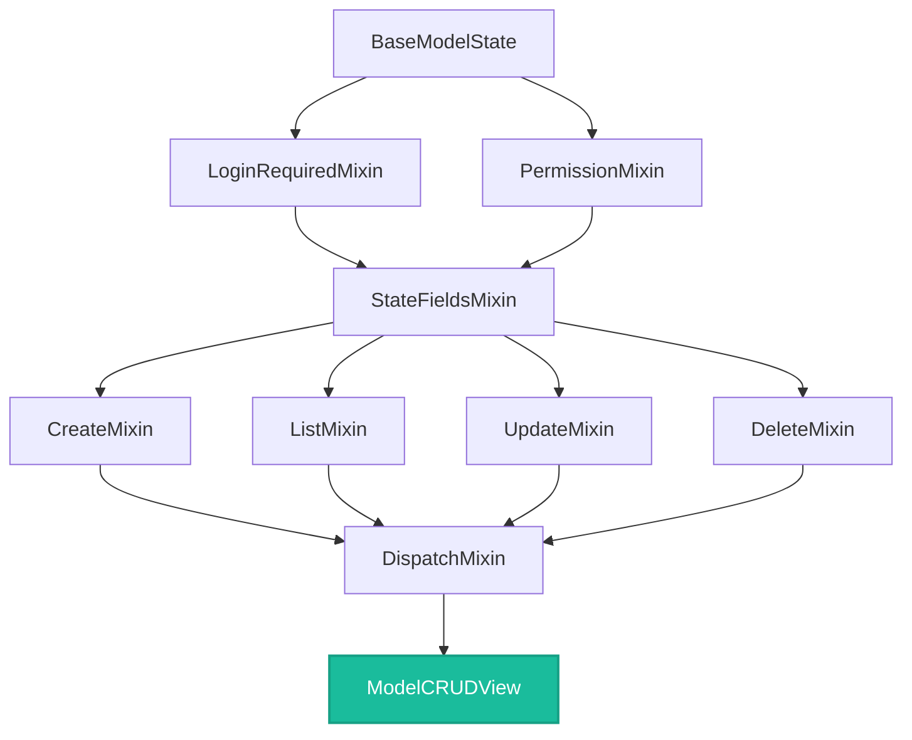

# reflex-django Mixins & Composition

The power of `reflex-django` lies in its **modular, composable state stack**. Rather than being a monolithic, hardcoded system, both `ModelState` and `ModelCRUDView` are built on top of a collection of highly focused, discrete Python mixins. 

By understanding this hierarchy, you can leverage custom composed pipelines (such as read-only or create-only interfaces), override specific stages of the operational lifecycle, or hook into the session authentication routines.

---

## 1. The Mixin Hierarchy & MRO (Method Resolution Order)

When `ModelState` or `ModelCRUDView` is parsed, the class metaclass leverages standard Python Method Resolution Order (MRO) to construct the runtime execution flow. The following diagram illustrates the relationship between these granular components:



### Pre-Assembled Shortcuts
Instead of stitching these mixins together yourself, `reflex-django` provides three highly-optimized base classes:
* **`ModelCRUDView`**: Integrates the entire stack (listing, creation, updating, deletion, validation, and permissions).
* **`ModelListView`**: Strips out creation, updating, and deletion dispatch actions. It includes only the listing stack, permission evaluations, and login restrictions—perfect for read-only analytics dashboard feeds.
* **`ModelState`**: A high-productivity wrapper inheriting from `AppState` and `ModelCRUDView` that dynamically builds its own serializer from a declared model and list of writable fields.

---

## 2. The Runtime Dispatch Loop

Every CRUD action (saving, loading, deleting, or refreshing) is routed through `DispatchMixin.dispatch(action, *args, **kwargs)`. This central controller guarantees that request-level context, security checks, and database transaction lifecycles execute in a thread-safe, predictable sequence:

```text
               Client UI Event (e.g. Save Button Click)
                           │
                           ▼
                 bind_request_context
           (Attaches request-level session & user)
                           │
                           ▼
                     build_context
            (Compiles action state metadata)
                           │
                           ▼
                     setup(action)
           (Hook to initialize operational loggers)
                           │
                           ▼
                   check_permissions
          (Evaluates custom permission_classes)
                           │
                           ▼
                  Run Hook / Handler
          (clean_{field} -> validate_state -> DB action)
                           │
                           ▼
                   teardown(action)
            (Hook to finalize audits or triggers)
```

> [!NOTE]
> By routing all actions through the `dispatch` pipeline, the package ensures that even custom-declared event handlers automatically benefit from request user resolution, session tracking, and structured validation.

---

## 3. The Lifecycle Hook Catalog

You can customize almost any stage of the database integration pipeline by overriding the following hook methods on your custom state subclass:

### Query & Slicing Hooks
| Method Signature | Default Behavior | Customization Role |
|:---|:---|:---|
| `get_queryset(self)` | Returns `model.objects.all()` | Enforce multi-tenant borders, visibility settings, or base queries. |
| `filter_queryset(self, qs)` | Applies search and filter parameters. | Add custom text searches, date range criteria, or dynamic taxonomy filters. |
| `get_ordering(self)` | Returns `Meta.ordering` | Return dynamic sort order lists based on active column clicks. |

### Retrieval & Mutation Hooks
| Method Signature | Default Behavior | Customization Role |
|:---|:---|:---|
| `get_object_lookup(self, pk)` | Returns `{"pk": pk}` | Add scoping constraints during record edits (e.g. `{"pk": pk, "user": self.user}`). |
| `get_create_kwargs(self, data)` | Returns `data` dict. | Inject author IDs or static category slugs into new models. |
| `perform_create(self, ctx, obj)` | Executes `await obj.asave()` | Trigger external notification webhooks after record insertion. |
| `perform_update(self, ctx, obj)` | Executes `await obj.asave()` | Populate modified-by audit tracking fields before committing updates. |
| `perform_delete(self, ctx, obj)` | Executes `await obj.adelete()`| Override database deletes with soft-delete flags (e.g. `obj.is_deleted = True`). |

### Validation & Operational Hooks
| Method Signature | Default Behavior | Customization Role |
|:---|:---|:---|
| `validate_state(self, ctx)` | Executes default field constraints. | Build cross-field business logic; returns dict mapping `field: error_msg`. |
| `clean_{field_name}(self, val)`| Returns raw `val` | Normalize telephone formats, capitalize addresses, or compute slugs. |
| `on_save_success(self, ctx, obj)`| Resets form variables. | Direct users to new pages, trigger toaster alerts, or clear caches. |
| `on_state_invalid(self, ctx, errs)`| Populates error string. | Convert structured validation objects into custom alert layouts. |
| `check_permissions(self, req)`| Evaluates `permission_classes`| Return boolean flags or raise permission exceptions to restrict handlers. |

---

## 4. Compose-Your-Own: Custom State Pipelines

If `ModelCRUDView` provides more actions than you want to expose (for example, you want a secure submission page that allows users to submit feedback and view their past posts, but *never* edit or delete them), you can compose your own state class using individual mixins.

Simply subclass `AppState` alongside the specific operational mixins you need:

```python
# feedback/states.py
from reflex_django.state import AppState
from reflex_django.state.mixins import (
    ListMixin,
    CreateMixin,
    StateFieldsMixin,
    PermissionMixin,
    IsAuthenticated
)
from feedback.serializers import FeedbackSerializer

class FeedbackState(AppState, ListMixin, StateFieldsMixin, CreateMixin, PermissionMixin):
    """Composed state allowing users to securely list and submit feedback posts."""
    serializer_class = FeedbackSerializer
    
    # Restrict actions to authenticated users only
    permission_classes = (IsAuthenticated,)
    
    class Meta:
        list_var = "feedback_items"
        save_event = "submit_feedback"
        
    def get_queryset(self):
        """Only return feedback items created by this user."""
        return Feedback.objects.filter(author=self.request.user)

    def get_create_kwargs(self, state_data: dict) -> dict:
        """Link submitted feedback items to the active user."""
        return {**state_data, "author": self.request.user}
```

Since this class does not inherit from `UpdateMixin` or `DeleteMixin`, the code assembly process **completely ignores** edit, update, or deletion handler configurations. No `load()`, `delete()`, or editing variables are registered, preventing unauthorized actions at both the Python and UI levels.

---

## 5. Security & Permissions

`PermissionMixin` brings Django Rest Framework (DRF) style authorization checking into your Reflex states. You configure permissions by declaring classes inside the `permission_classes` tuple:

```python
from reflex_django.state.mixins import IsAuthenticated, AllowAny

class SecureState(AppState, ModelCRUDView):
    serializer_class = DocumentSerializer
    
    # Evaluates access controls before dispatching actions
    permission_classes = (IsAuthenticated,)
```

### Writing a Custom Permission Class
A permission class is a simple Python object implementing `has_permission(self, context)` and optionally `has_object_permission(self, context, obj)`:

```python
# shop/permissions.py
from reflex_django.state.mixins.permissions import BasePermission

class IsStoreManager(BasePermission):
    """Restricts operations to users flag-configured as staff members."""
    
    def has_permission(self, context) -> bool:
        # The context contains context.request, context.user, and context.state
        return (
            context.user is not None and 
            context.user.is_authenticated and 
            context.user.is_staff
        )

    def has_object_permission(self, context, obj) -> bool:
        """Row-level permission check: only allowing creators or staff to mutate files."""
        return context.user.is_staff or obj.creator == context.user
```

---

## 6. The JavaScript Session Authentication Mixin

Managing login forms, processing authentication states, and synchronizing cookies across WebSockets can be complex. `reflex-django` automates this using the **`session_auth_mixin`** wrapper.

```python
# shop/states/auth.py
from reflex_django import DjangoUserState
from reflex_django.mixins import SessionAuthConfig, session_auth_mixin

# Configure redirection URLs for login routing
auth_config = SessionAuthConfig(
    post_login_redirect="/dashboard",
    post_logout_redirect="/login",
    redirect_when_authenticated="/dashboard",
)

# Compile a reactive login manager inheriting from DjangoUserState
LoginState = session_auth_mixin(auth_config, base=DjangoUserState)
```

### What `LoginState` Implements Automatically:
* **Form Inputs**: Exposes `username` and `password` reactive variables, complete with their standard `set_*` hooks.
* **Authentication Handlers**:
  * `submit_login`: Performs Django's native authentication flow asynchronously, maps any login errors to `self.error`, and redirects the client browser upon success.
  * `submit_login_form(form_data)`: Integrates seamlessly with `rx.form` container submissions.
  * `logout`: Logs the active user out, clears session identifiers, and redirects the browser.
* **Cookie Synchronization**: On successful login, the mixin runs a background synchronization routine to update session cookies securely over WebSocket channels.

---

## 7. Common Developer Mistakes

* **Incorrect session_auth_mixin Import Paths**: Do not attempt to import `session_auth_mixin` from the package root directory (e.g. `from reflex_django import session_auth_mixin` will crash). Always reference the dedicated mixins directory: `from reflex_django.mixins import session_auth_mixin`.
* **Relying on python `len()` in the UI**: When using mixin lists, remember that `self.posts` is a Reflex reactive pointer in your UI components. Python's `len(State.posts)` will throw an evaluation error. Always use the Reflex-optimized length function: `State.posts.length() > 0`.
* **Omitting AppState**: Individual mixins (like `ListMixin` or `CreateMixin`) do not inherit from `AppState` on their own. When composing custom pipelines, you must explicitly declare `AppState` first in your inheritance chain to ensure request and user variables load properly.

---

**Navigation:** [← CRUD with Mixins & States](crud_with_mixins_and_states.md) | [Next: Forms & Validation →](forms_and_validation.md)
