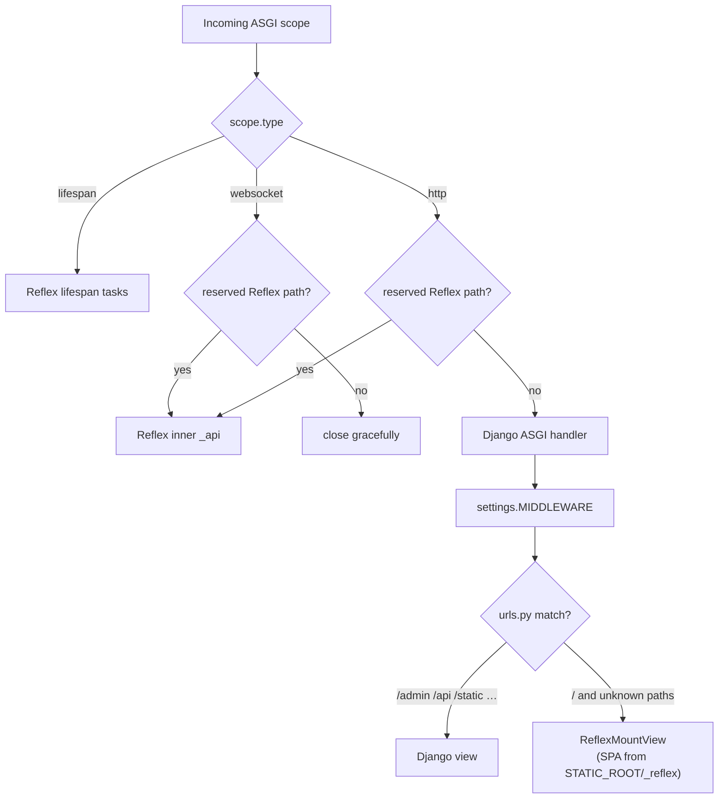

# Routing & URL Dispatching

`reflex-django` runs Django as the **outer** ASGI app. Every incoming HTTP request and WebSocket scope first hits the **outer dispatcher**, which decides whether to forward it to Reflex's inner ASGI (Socket.IO event channel, upload endpoint, health probes) or to Django (`urls.py`, admin, your API, the SPA shell). Inside Django, your `urls.py` decides whether the path belongs to a Django view or falls through to the Reflex SPA catch-all.

Two routing layers, in order:

1. **Outer ASGI dispatcher** — sends reserved Reflex paths to Reflex, everything else to Django.
2. **Django `urls.py`** — your explicit HTTP routes (`/admin`, `/api`, …) + the SPA catch-all at the end.

The Reflex client router then handles SPA navigation entirely in the browser.

---

## 1. Reflex SPA routes (client-side)

Define SPA pages with `@template` (or `@page`) in any Django app's `views.py`:

```python
# shop/views.py
import reflex as rx
from reflex_django import template


@template(route="/notes", title="My Notes")
def notes_page() -> rx.Component:
    return rx.heading("My Private Notes")
```

### Rules

- `route` is the browser path. Visiting `http://localhost:8000/notes` shows this page.
- **Do not** add a matching `path("notes/", ...)` to Django — the catch-all serves the SPA.
- Use `on_load` on `@template` / `@page` (or state `@rx.event` handlers) for data loading.

Pages from every entry in `INSTALLED_APPS` are auto-discovered. Restrict the scan with `REFLEX_DJANGO_PAGE_APPS = ["shop", "billing"]`.

---

## 2. Django HTTP routes

Register your Django routes **before** `reflex_mount()` in the same `urls.py`. `reflex_mount()` installs the SPA catch-all at the bottom of `urlpatterns`.

```python
# config/urls.py
from django.contrib import admin
from django.urls import include, path

from reflex_django.urls import reflex_mount

urlpatterns = [
    path("admin/", admin.site.urls),
    path("api/", include("shop.api_urls")),
]

urlpatterns += [
    reflex_mount(
        app_name="shop",
        django_prefix=("/admin", "/api"),
        rx_config={"backend_port": 8000},
    ),
]
```

`django_prefix` is a list of path prefixes Django owns. Every prefix listed here must correspond to a real `path(...)` entry **above** the `reflex_mount()` line. The catch-all only triggers for paths that don't match any of those prefixes.

---

## 3. The outer dispatcher decision flow



### Reserved Reflex prefixes

These paths are always sent to Reflex, regardless of any URL patterns or catch-alls:

| Prefix | Purpose |
|:---|:---|
| `/_event` | Socket.IO state-update channel (HTTP + WebSocket) |
| `/_upload` | Reflex file upload endpoint |
| `/_health`, `/ping` | Liveness probes |
| `/_all_routes` | Internal route enumeration |
| `/auth-codespace` | Reflex auth dev tooling |

Add custom reserved prefixes via `REFLEX_DJANGO_RESERVED_REFLEX_PREFIXES`.

### The SPA catch-all

`reflex_mount()` appends a wildcard URL pattern that points at `ReflexMountView`. The view:

1. Resolves the compiled SPA index (`STATIC_ROOT/_reflex/index.html`, `.web/build/client/index.html`, or `.web/_static/index.html`).
2. Optionally pipes the HTML through Django's template engine (`REFLEX_DJANGO_RENDER_SPA_VIA_TEMPLATE_ENGINE = True`) so the shell can render `{{ request.user }}`, ``, `{{ messages }}`, etc.
3. Streams non-HTML assets (JS bundles, CSS, source maps, images) untouched.

If the bundle is missing, the view returns a 404 with a clear hint pointing at `manage.py export_reflex`.

---

## 4. Pre-built authentication routes

The built-in authentication SPA pages (login, register, reset) register in one line:

```python
# shop/views.py
from reflex_django.auth import add_auth_pages

add_auth_pages()  # registers /login, /register, /password_reset, …
```

Customize the URLs via `REFLEX_DJANGO_AUTH` in `settings.py`. See [Authentication](authentication.md).

---

## 5. WebSocket scopes

Every WebSocket connection lands on the outer dispatcher:

| Scope path | Behaviour |
|:---|:---|
| `/_event/...` | Forwarded to Reflex Socket.IO (the state channel) |
| `/_upload/...` | Forwarded to Reflex's upload endpoint |
| Anything else | Closed politely (no Django Channels needed) |

Django itself never sees a WebSocket scope, so your `urls.py` does not need to know about WebSockets at all.

For an end-to-end trace of what happens when a Reflex event arrives on `/_event` — Socket.IO handshake, the synthetic `HttpRequest`, the middleware chain, and how `request.user` is bound to your handler — see [WebSocket event pipeline](websocket_event_pipeline.md).

---

## 6. Common pitfalls

### Prefix drift (404)

**Symptom:** `GET /api/products/` returns 404.

**Cause:** `django_prefix=("/api",)` does not match the actual Django path. For example, your `urls.py` mounts `path("v1/", include(...))` instead of `path("api/", ...)`.

**Fix:** Align the strings exactly. The dispatcher and the Django URL resolver both use `django_prefix`.

### Catch-all shadowing

**Symptom:** SPA pages return blank screens or raw Django 404s.

**Cause:** You registered a permissive Django pattern (e.g. `re_path(r'^.*$', some_view)`) **above** `reflex_mount()`. It captures `/`, `/notes`, etc. before the SPA catch-all gets a chance.

**Fix:** Keep your Django URLs tightly scoped under explicit prefixes (`/api/`, `/admin/`) and let the SPA catch-all own the root.

### Missing SPA bundle

**Symptom:** `GET /` returns 404 with a "compiled SPA not found" message.

**Cause:** The SPA was never built or staged into `STATIC_ROOT/_reflex/`.

**Fix:** Run `python manage.py export_reflex --frontend-only --no-zip --stage-to-static-root`, or use `python manage.py run_reflex` which auto-exports before serving.

### Hijacking a reserved prefix

**Symptom:** Reflex events stop arriving after you added a Django route under `/_event/...`.

**Cause:** Reserved Reflex prefixes (`/_event`, `/_upload`, `/_health`, `/ping`, `/auth-codespace`) are always claimed by Reflex — but Django will still try to resolve them in admin / DRF routers if you add such routes by accident.

**Fix:** Don't add Django routes under those prefixes. Customise the reserved list via `REFLEX_DJANGO_RESERVED_REFLEX_PREFIXES` if you need extra space.

---

## 7. Path ownership cheat sheet

| Path | Who handles it |
|:---|:---|
| `/_event`, `/_upload`, `/_health`, `/ping`, `/_all_routes`, `/auth-codespace` | Reflex (reserved) |
| `/admin/...`, `/api/...`, anything in `django_prefix` | Django views |
| `/static/...` | Django (`ASGIStaticFilesHandler` in dev, Nginx/Caddy in prod) |
| `/static/_reflex/...` | Django staticfiles serving the compiled SPA assets |
| `/` and any other unknown path | `ReflexMountView` → compiled SPA |

Everything happens on the same port. Same origin. Same cookies. Same session.

---

**Navigation:** [← Architecture](architecture.md) | [Next: API Integration →](api_integration.md)
