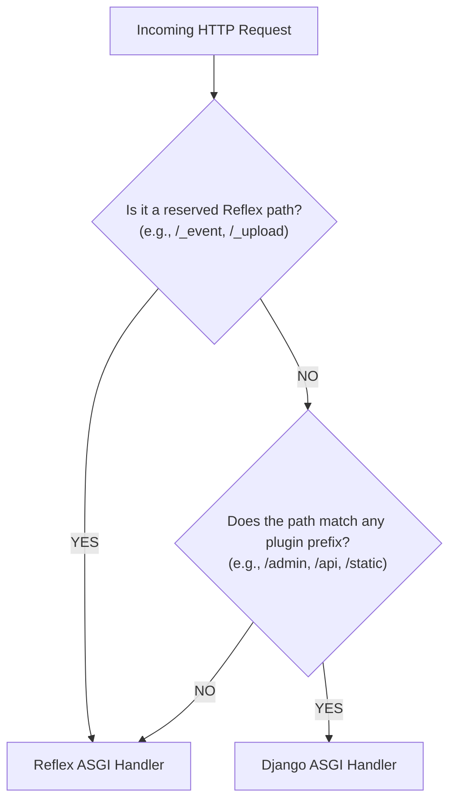

# Routing & URL Dispatching

reflex-django uses two routing layers:

1. **Django `urls.py`** — explicit HTTP routes (`/admin`, `/api`, …)
2. **Reflex client router** — SPA routes from `@template(route=...)` in `{app}/views.py`

The ASGI dispatcher sends traffic by **path prefix**. Configure prefixes on **`reflex_mount()`**.

See [Django-led URL routing](django_urls.md) for the full mental model.

---

## 1. Reflex SPA routes (client-side)

Define routes in Django app `views.py`:

```python
# shop/views.py
import reflex as rx
from reflex_django import template

@template(route="/notes", title="My Notes")
def notes_page() -> rx.Component:
    return rx.heading("My Private Notes")
```

### Rules

* **`route`** is the browser path (e.g. `/notes` → `http://localhost:3000/notes`).
* **Do not** add matching `path("notes/", ...)` in Django — the catch-all serves the SPA.
* Use `on_load` on `@template` / `@page` or state handlers for data loading.

---

## 2. Django HTTP routes

Register APIs and admin in `urls.py` **before** `reflex_mount()`:

```python
# config/urls.py
from reflex_django.urls import reflex_mount

urlpatterns = [
    path("admin/", admin.site.urls),
    path("api/", include("shop.api_urls")),
]

urlpatterns += [
    reflex_mount(
        django_prefix=("/admin", "/api"),
        rx_config={"frontend_port": 3000},
    ),
]
```

Then, map the exact corresponding routes in your `backend/urls.py` file:

```python
# backend/urls.py
from django.contrib import admin
from django.urls import path, include

urlpatterns = [
    # Mount the Django admin panel
    path("admin/", admin.site.urls),  # Matches admin_prefix="/admin"
    
    # Mount your custom backend application APIs
    path("api/", include("shop.urls")),  # Matches backend_prefix="/api"
]
```

---

## The Path Dispatcher Decision Flow

When a request arrives at your unified ASGI server, the path dispatcher intercepts it and applies matching logic to determine which framework should receive it:



> [!NOTE]
> **Reserved Reflex Paths:** Subpaths starting with `/_event`, `/_upload`, `/_health`, `/ping`, or `/auth-codespace` are hardlocked for Starlette and the Socket.IO compiler. Django will **never** capture them, even if you define a catch-all URL pattern.

---

## Pre-built Authentication Routes

If you use the built-in authentication views supplied by `reflex-django` (which include ready-to-use registration, login, and password reset interfaces), you can register them in one line:

```python
# frontend/frontend.py
from reflex_django.auth import add_auth_pages

app = rx.App()

# Autoloads pre-built login, register, and reset views
add_auth_pages(app)
```

This registers the standard login views. You can customize these routes (such as shifting the default `/login` route to `/signin`) by adjusting the `REFLEX_DJANGO_AUTH` settings inside your Django settings module. See [Authentication](authentication.md) for custom parameters.

---

## Vite Development Proxy Alignment

During local development, Reflex runs a Vite development server to compile your React pages. 

To ensure incoming calls compile correctly, `reflex-django` automatically injects Vite `server.proxy` rules behind the scenes. This ensures that any frontend requests directed to `/api/...` or `/admin/...` are transparently proxied back to the main unified Python process.

---

## Common Pitfalls & Mismatches

### The Prefix Drift (404 Error)
* **Symptom:** Visiting `http://localhost:3000/api/products/` returns a `404 Not Found` error.
* **Cause:** Your plugin configuration and Django `urls.py` patterns are out of sync. For example, your plugin sets `backend_prefix="/api"`, but your `urlpatterns` maps routes under `path("v1/", include(...))`.
* **Fix:** Align them. Ensure the root path segments declared inside `urls.py` correspond exactly with your plugin prefixes.

### The Catch-All Shadowing Issue
* **Symptom:** Reflex pages fail to load, showing a blank screen or a raw Django response.
* **Cause:** You have registered a catch-all route (like `re_path(r'^.*$', ...)` or `path("<path:slug>", ...)`) at the root of your Django `urls.py` file, which intercepts and steals requests before they can fall back to the Reflex ASGI handler.
* **Fix:** Keep your Django URLs tightly scoped under clear path prefixes (like `/api/` or `/backend/`), and let Reflex manage the root routing scope.

---

**Navigation:** [← Architecture](architecture.md) | [Next: API Integration →](api_integration.md)
