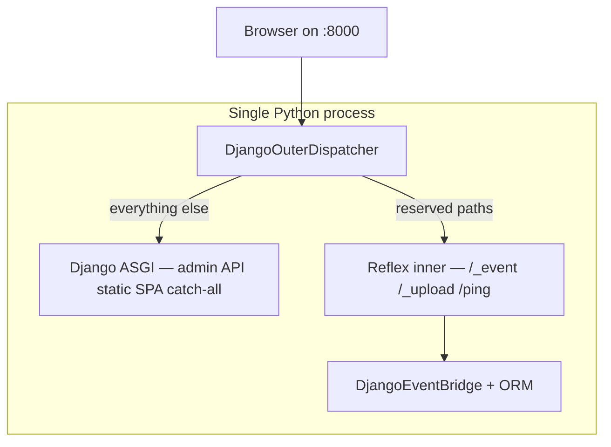

# Routing & URL dispatching

Every HTTP request and WebSocket connection has to answer one question first: **does this go to Django, or to Reflex?**

`reflex-django` gives you two well-supported ways to answer that question. Both serve your SPA, Django admin, and API on **one public port** (usually `:8000`). Both keep the ORM and event bridge in the same Python interpreter as Reflex, so `self.request.user` and `await Model.objects.aget(...)` keep working in your handlers.

The difference is **who sits at the front door** — Django or Reflex — and whether Django's HTTP stack runs in the same process or in a dedicated worker.

| | **`django_outer`** (default) | **`reflex_outer`** |
|:---|:---|:---|
| Who owns the public port? | Django | Reflex |
| Where does `/admin` run? | Same process as Reflex events | Separate Django HTTP worker (auto-spawned or external) |
| Best when… | You're Django-first; admin/API are first-class | Reflex events must stay snappy under heavy admin/API load |
| Setting | leave default (`"auto"`) | `REFLEX_DJANGO_URL_ROUTING = "reflex_outer"` |

The rest of this page walks through both modes with concrete examples, then dives into the three URL layers (`django_outer` detail), pitfalls, and legacy modes.

If you read [Architecture overview](architecture.md), this is the same picture from the perspective of "where does this URL go?".

---

## Choosing a mode: `django_outer` vs `reflex_outer`

### The short version

- **`django_outer`** — Think "Django is the server; Reflex is a guest." Django handles almost all HTTP (`/`, `/admin`, `/api`, `/static`). Reflex only gets a small set of reserved paths (`/_event`, `/_upload`, …) for real-time UI work. **One process. Simple mental model. Default for new projects.**

- **`reflex_outer`** — Think "Reflex is the server; Django admin/API live next door." Reflex owns the public port and your SPA. When someone hits `/admin` or `/api`, Reflex forwards that HTTP request to a **Django-only worker** (started automatically in dev, or managed by you in production). Your Reflex handlers and ORM still run in the main process — only the HTTP-facing Django views are isolated. **Two processes for HTTP, one for events — like Zulip splitting Tornado and Django behind nginx, but wired up for you.**

You don't pick based on syntax. Your `urls.py`, `@page` routes, and state classes look the same either way.

### Side-by-side: what happens when…

Same project in both examples:

```python
# config/urls.py — identical in both modes
import shop.views  # noqa: F401

from django.contrib import admin
from django.urls import include, path

urlpatterns = [
    path("admin/", admin.site.urls),
    path("api/", include("shop.api_urls")),
]
# SPA catch-all is auto-mounted (REFLEX_DJANGO_AUTO_MOUNT=True)
```

```python
# shop/views.py — identical in both modes
import reflex as rx
from reflex_django import AppState, page

@page(route="/", title="Home")
def home() -> rx.Component:
    return rx.heading("Welcome")

class CartState(AppState):
    async def add_item(self, product_id: int):
        product = await Product.objects.aget(pk=product_id)
        # self.request.user works — event bridge runs in the Reflex process
        ...
```

#### Example 1 — Someone opens `http://localhost:8000/`

**`django_outer`**

```text
Browser  →  port 8000  →  DjangoOuterDispatcher
                              └── not a reserved path  →  Django
                                    └── urls.py catch-all  →  ReflexMountView
                                          └── serves STATIC_ROOT/_reflex/index.html
```

Django serves the SPA shell. The browser loads React; client-side routing takes over for `/about`, `/cart`, etc.

**`reflex_outer`**

```text
Browser  →  port 8000  →  Reflex outer ASGI
                              └── not /admin or /api  →  Reflex frontend (StaticFiles / compiled bundle)
```

Reflex serves the SPA directly. No trip through Django's URL resolver for the homepage.

#### Example 2 — User clicks "Add to cart" (WebSocket / Socket.IO event)

**Both modes — same path**

```text
Browser  →  /_event  →  Reflex inner ASGI  →  DjangoEventBridge
                                                  └── synthetic HttpRequest + MIDDLEWARE
                                                        └── CartState.add_item runs
                                                              └── await Product.objects.aget(...)
```

Real-time UI traffic always lands on Reflex. The event bridge and Django ORM live in the **main Reflex process** in both modes. That is why your state handlers feel "Django-native" even in `reflex_outer`.

#### Example 3 — Staff opens `http://localhost:8000/admin/`

**`django_outer`**

```text
Browser  →  port 8000  →  DjangoOuterDispatcher  →  Django  →  admin.site.urls
```

One process. Admin runs in the same interpreter as Reflex events.

**`reflex_outer`**

```text
Browser  →  port 8000  →  Reflex dispatcher  →  HTTP proxy (httpx)
                                                    └── 127.0.0.1:8001  →  Django HTTP worker
                                                              └──  admin.site.urls
```

Reflex recognizes `/admin` as a Django prefix and proxies the request to the worker on port `8001` (configurable). The admin response comes back through Reflex to the browser — still **one origin, one cookie jar** from the browser's point of view.

#### Example 4 — Mobile app calls `GET /api/orders/`

**`django_outer`** — Django view runs in-process.

**`reflex_outer`** — Reflex proxies to the Django HTTP worker; DRF/your views run there.

### Architecture diagrams

=== "`django_outer` — Django at the front"



=== "`reflex_outer` — Reflex at the front"

```mermaid
flowchart TB
  Client[Browser on :8000]

  subgraph MainProcess [Main process — Reflex + ORM + events]
    ReflexOuter[Reflex outer ASGI]
    ReflexInner[/_event Socket.IO]
    Bridge[DjangoEventBridge + ORM]
    Proxy[HTTP proxy to Django worker]
  end

  subgraph DjangoWorker [Django HTTP worker — default :8001]
    DjangoHTTP[Django only — admin API static]
  end

  Client --> ReflexOuter
  ReflexOuter -->|/_event etc| ReflexInner
  ReflexOuter -->|/admin /api /static| Proxy
  Proxy --> DjangoHTTP
  ReflexInner --> Bridge
```

### When should I use which?

**Stay on `django_outer` (default) if:**

- You're adding Reflex to an existing Django project.
- Admin and API traffic is normal — not hammering the server while hundreds of users have live Reflex sessions open.
- You want the simplest deployment story (one process, one ASGI entry point).
- You rely on `ReflexMountView` piping `index.html` through Django's template engine (`{{ request.user }}` in the shell).

**Switch to `reflex_outer` if:**

- Profiling shows slow Django HTTP work (heavy admin queries, slow DRF endpoints) **blocking or delaying** Reflex WebSocket events on the same worker.
- You want Reflex to own `/` and the compiled frontend mount without going through Django's catch-all.
- You're okay running (or auto-spawning) a second process for Django HTTP — similar in spirit to how [Zulip](https://github.com/zulip/zulip) runs Tornado for real-time and Django for everything else, with nginx routing between them. Here, reflex-django wires the split for you.

**You probably don't need either legacy mode** (`reflex_led`, `django_led`) unless you're maintaining an older project. They mount Django **in-process** under Reflex without the subprocess worker. See [Migrating from older versions](migration_django_outer.md).

### How to enable each mode

**Default — do nothing**

```python
# settings.py
# REFLEX_DJANGO_URL_ROUTING = "auto"   # resolves to django_outer
```

**`reflex_outer`**

```python
# settings.py
REFLEX_DJANGO_URL_ROUTING = "reflex_outer"
```

Keep `config/asgi.py` as:

```python
from reflex_django.asgi_entry import application
```

Run dev:

```bash
python manage.py run_reflex
```

`run_reflex` starts the Django HTTP worker for you (default port `8001`) before Reflex binds the public port.

**Production with an external supervisor** — run the Django worker yourself:

```bash
uvicorn reflex_django.django_http_entry:application --host 127.0.0.1 --port 8001
```

Then on the Reflex process:

```python
REFLEX_DJANGO_HTTP_UPSTREAM = "http://127.0.0.1:8001"
REFLEX_DJANGO_HTTP_SUBPROCESS = False
```

Only the Reflex-facing process needs the full Reflex app; the HTTP worker is Django-only.

### Settings cheat sheet (`reflex_outer` only)

| Setting | Default | What it does |
|:---|:---|:---|
| `REFLEX_DJANGO_HTTP_PORT` | `8001` | Port for the auto-spawned Django HTTP worker |
| `REFLEX_DJANGO_HTTP_UPSTREAM` | `""` (derived from port) | Full base URL when the worker is managed externally |
| `REFLEX_DJANGO_HTTP_SUBPROCESS` | `True` | Auto-spawn the worker in dev; set `False` when you run it yourself |

Full reference: [REFLEX_DJANGO_* settings](settings_reference.md#routing).

### Quick comparison table

| Request | `django_outer` | `reflex_outer` |
|:---|:---|:---|
| `GET /` | Django → SPA catch-all | Reflex → compiled SPA |
| `GET /about` (client nav) | Browser only — no server round-trip | Same |
| `GET /about` (hard refresh) | Django → SPA catch-all | Reflex → SPA |
| `GET /admin/` | Django in-process | Proxied → Django worker |
| `GET /api/orders/` | Django in-process | Proxied → Django worker |
| `GET /static/...` | Django staticfiles | Proxied → Django worker |
| WebSocket `/_event` | Reflex in-process | Reflex in-process |
| Reflex handler uses ORM | Main process | Main process (not the HTTP worker) |
| Processes (typical dev) | 1 (+ Vite if HMR) | 2 (+ Vite if HMR) |
| Public port | `:8000` | `:8000` |

---

## The three layers (`django_outer` detail)

There are three different "URL resolvers" inside a `django_outer` deployment. They run in this order:

1. **The outer ASGI dispatcher** — chooses Django or Reflex for each incoming scope.
2. **Django's `urls.py`** — matches an HTTP request to a Django view or to the SPA catch-all.
3. **The Reflex client router** — handles SPA navigation in the browser (no server round-trip).

In `reflex_outer`, layer 1 is Reflex's path dispatcher (prefixes → proxy or Reflex), and layer 2 applies inside the Django HTTP worker instead of the main process. Layer 3 is the same in both modes.

```text
Incoming ASGI scope (HTTP or WebSocket)
   │
   ▼
[1] DjangoOuterDispatcher
       ├── reserved Reflex prefix (/_event, /_upload, /_health, /ping, …)? → Reflex inner ASGI
       └── everything else                                                 → Django ASGI handler
                                                                                │
                                                                                ▼
                                                                  [2] settings.MIDDLEWARE
                                                                                │
                                                                                ▼
                                                                          Django urls.py
                                                                                ├── /admin/, /api/, …  → Django view
                                                                                └── catch-all          → ReflexMountView (SPA)
                                                                                                          │
                                                                                                          ▼
                                                                                              [3] Reflex client router
                                                                                                  (in-browser navigation)
```

Layer 1 is at the network boundary. Layer 2 is inside Django. Layer 3 is in the user's browser.

---

## Layer 1 — the outer dispatcher

`reflex_django.django_outer_dispatcher.DjangoOuterDispatcher` is the very first thing every ASGI scope hits. It's a thin function that asks one question: *is this a path Reflex needs to handle directly?*

```text
incoming ASGI scope
  │
  ▼
scope["type"] == "lifespan"  ──►  Reflex lifespan tasks
scope["type"] == "websocket" ──►  reserved Reflex path?
                                       ├── yes → Reflex inner _api
                                       └── no  → close gracefully
scope["type"] == "http"      ──►  reserved Reflex path?
                                       ├── yes → Reflex inner _api
                                       └── no  → Django ASGI handler
```

### Reserved Reflex prefixes

These are *always* claimed by Reflex, even if you added a Django route for them:

| Prefix | What it is |
|:---|:---|
| `/_event` | Socket.IO state channel (the WebSocket carrying every UI event) |
| `/_upload` | Reflex file upload endpoint |
| `/_health`, `/ping` | Liveness probes |
| `/_all_routes` | Internal route enumeration |
| `/auth-codespace` | Reflex dev tooling |

Don't add Django `path()` entries under these prefixes — Reflex's WebSocket will stop working. If you need extra reserved paths (uncommon), set `REFLEX_DJANGO_RESERVED_REFLEX_PREFIXES`.

### Lifespan scopes

ASGI servers send a `"lifespan"` scope at startup and shutdown so apps can run setup/teardown tasks. The dispatcher forwards lifespan to Reflex's inner ASGI (where Reflex's event processor and background tasks live).

### Unknown WebSocket scopes

WebSocket connections to anything other than the reserved paths are closed gracefully — Django itself never sees WebSocket scopes by default. If you want WebSocket access for non-Reflex paths, you'd typically reach for Django Channels, but `reflex-django` doesn't include it; Reflex owns the one WebSocket on `/_event`.

---

## Layer 2 — Django's `urls.py`

For HTTP requests that aren't reserved, Django takes over. Your `urls.py` controls what happens next:

```python
# config/urls.py
import shop.views  # noqa: F401

from django.contrib import admin
from django.urls import include, path

urlpatterns = [
    path("admin/", admin.site.urls),
    path("api/", include("shop.api_urls")),
]
# With REFLEX_DJANGO_AUTO_MOUNT=True (default), the SPA catch-all is appended at startup.
```

Two things happen here:

- Django routes go **first**.
- A final wildcard pattern pointing at `ReflexMountView` is appended automatically (or via optional `reflex_mount()` for overrides).

`django_prefix` is inferred automatically from those routes (first segment of each top-level `path()`). Pass an explicit tuple only when you use `re_path()` or need to override. Reflex ports and `redis_url` belong in `REFLEX_DJANGO_RX_CONFIG` in settings.

### The SPA catch-all

The final catch-all pattern (auto-mounted or from optional `reflex_mount()`) is roughly:

```python
re_path(r".*", ReflexMountView.as_view())
```

It's intentionally permissive. Anything that didn't match `/admin/` or `/api/` (or your other explicit prefixes) ends up at `ReflexMountView`, which serves the compiled SPA's `index.html`.

The SPA then takes over and does client-side routing.

### What `ReflexMountView` does

1. Looks for the compiled SPA index at `STATIC_ROOT/_reflex/index.html`, falling back to `.web/build/client/index.html`, then `.web/_static/index.html`.
2. If `REFLEX_DJANGO_RENDER_SPA_VIA_TEMPLATE_ENGINE = True` (the default), runs the HTML through Django's template engine first — so `{{ request.user }}`, ``, `{{ messages }}`, and any context-processor key work inside `index.html`.
3. Streams non-HTML assets (JS, CSS, images, source maps) untouched.

If the bundle is missing, the view returns a 404 with a hint pointing at `manage.py export_reflex`.

---

## Layer 3 — the Reflex client router

Once the SPA is loaded, in-page navigation between `/`, `/about`, `/cart`, etc. happens **entirely in the browser**. Reflex generates a React router from your `@page(route=...)` declarations and intercepts link clicks.

The browser doesn't make an HTTP request to the server when the user clicks `<a href="/about">`. It just changes the URL and re-renders.

That has two consequences:

- **Don't add Django `path()` entries for SPA routes.** The client router handles `/about`. Django would never see the request.
- **A hard refresh (Ctrl+R) on `/about` does hit the server** — and the server's URL resolver falls through to `ReflexMountView`, serves the SPA again, and the SPA navigates to `/about` client-side. The user sees the same page either way.

---

## Path ownership cheat sheet

| Path | Who handles it |
|:---|:---|
| `/_event`, `/_upload`, `/_health`, `/ping`, `/_all_routes`, `/auth-codespace` | Reflex (reserved) |
| `/admin/...`, `/api/...`, anything in `django_prefix` | Django views |
| `/static/...` | Django (`ASGIStaticFilesHandler` in dev, Nginx/Caddy in prod) |
| `/static/_reflex/...` | Django (serves the compiled SPA assets from `STATIC_ROOT`) |
| `/` and any other unknown path | `ReflexMountView` → compiled SPA |

Everything happens on one port. Same origin. Same cookies. Same session.

---

## The cardinal rules

1. **List Django routes in `urlpatterns`.** With `REFLEX_DJANGO_AUTO_MOUNT=True` (default), the SPA catch-all is appended at startup — you don't need `reflex_mount()` unless you want URL overrides.
2. **Django prefixes are auto-detected** from those routes (first segment of each top-level `path()`). Override with `django_prefix=(...)` on `reflex_mount()` only when needed.
3. **Don't `path()` for SPA pages.** Use `@page(route=...)` in `views.py` instead.
4. **Don't add Django routes under reserved Reflex prefixes.**

If you stick to these, routing just works.

!!! note "Auto-mount vs manual `reflex_mount()`"
    **Default:** `REFLEX_DJANGO_AUTO_MOUNT=True` appends the catch-all after your Django routes. **Manual:** call `reflex_mount()` when you need `mount_prefix`, explicit `django_prefix`, or per-mount `rx_config`. See [The three knobs](mental_model.md).

---

## WebSocket scopes

Every WebSocket connection lands on the outer dispatcher:

| Scope path | Behavior |
|:---|:---|
| `/_event/...` | Forwarded to Reflex Socket.IO (the state channel) |
| `/_upload/...` | Forwarded to Reflex's upload endpoint |
| Anything else | Closed politely (no Channels needed) |

Django itself never sees a WebSocket scope, so your `urls.py` doesn't need to know about WebSockets at all.

For the full trace of what happens when a Reflex event arrives on `/_event` — handshake, synthetic `HttpRequest`, middleware chain, handler dispatch — see [The WebSocket event pipeline](websocket_event_pipeline.md).

---

## Built-in auth routes

The built-in authentication SPA pages register in one line:

```python
# shop/views.py
from reflex_django.auth import add_auth_pages

add_auth_pages()    # registers /login, /register, /password-reset, /password-reset/confirm/[uid]/[key]
```

These are SPA routes — they live in the Reflex client router, not in `urls.py`. Customize via `REFLEX_DJANGO_AUTH` in settings. ([Details](authentication.md).)

---

## Common pitfalls

### Prefix drift (404 on a Django URL)

**Symptom:** `GET /api/orders/` returns 404 (or worse, returns the SPA shell).

**Cause:** Your Django route uses a different first segment than you expect — e.g. `path("v1/", include(...))` instead of `path("api/", ...)`. Auto-detection reserves `/v1`, not `/api`.

**Fix:** Rename the Django `path()` or pass `django_prefix=("/api", "/v1", ...)` explicitly so the catch-all and dev proxy stay aligned with your real routes.

### Catch-all shadowing (blank SPA pages)

**Symptom:** SPA pages return blank screens or raw Django 404s.

**Cause:** You added a permissive Django pattern (e.g. `re_path(r"^.*$", some_view)`) **above** `reflex_mount()`. It captures `/`, `/about`, etc. before the SPA catch-all gets a chance.

**Fix:** Keep Django routes under explicit prefixes (`/api/`, `/admin/`). Let the SPA catch-all own the root.

### Missing SPA bundle

**Symptom:** `GET /` returns 404 with a "compiled SPA not found" message.

**Cause:** The SPA was never built or never staged into `STATIC_ROOT/_reflex/`.

**Fix:** Run `python manage.py export_reflex --frontend-only --no-zip --stage-to-static-root`, or use `python manage.py run_reflex` which auto-exports before serving.

### Hijacking a reserved prefix

**Symptom:** Reflex events stop arriving after you added a Django route under `/_event/...`.

**Cause:** Reserved Reflex prefixes are always claimed by Reflex — but Django will still try to resolve them in admin / DRF routers if you add such routes by accident.

**Fix:** Don't add Django routes under reserved prefixes. Customize `REFLEX_DJANGO_RESERVED_REFLEX_PREFIXES` if you need extra space.

### "SPA route renders, then 404s on refresh"

**Symptom:** Visiting `/cart` via a link works. Hitting Ctrl+R returns 404.

**Cause:** Your reverse proxy (Nginx, etc.) isn't forwarding unknown paths to the ASGI process — it tries to serve a static file from disk and fails.

**Fix:** In Nginx, the catch-all `try_files $uri $uri/ @django;` (or `proxy_pass`) ensures every URL falls back to Django, which then serves the SPA.

---

## Helpers for common setups

`reflex_django.urls` exposes a couple of convenience wrappers:

```python
import shop.views  # noqa: F401
from reflex_django.urls import admin_urlpatterns

urlpatterns = admin_urlpatterns("/admin")    # path("/admin", admin.site.urls) + a redirect
urlpatterns += [path("api/", include("shop.api_urls"))]
# catch-all: automatic (REFLEX_DJANGO_AUTO_MOUNT=True)
# Manual override example: urlpatterns += reflex_mount(mount_prefix="/app")
```

`admin_urlpatterns(prefix)` saves you a couple of lines if you're using a non-default admin prefix.

---

## Configuration knob: `REFLEX_DJANGO_URL_ROUTING`

This setting picks the routing mode. Most projects leave it at `"auto"` (which means `django_outer`).

| Value | Behavior |
|:---|:---|
| `"auto"` (default → `"django_outer"`) | Django is the outer ASGI app; Reflex Socket.IO is mounted under it. **Recommended default.** |
| `"reflex_outer"` | Reflex is the outer app on one public port; Django admin/API/static run in a separate HTTP worker and are reverse-proxied. ORM and the event bridge stay in the Reflex process. See [Choosing a mode](#choosing-a-mode-django_outer-vs-reflex_outer) above. |
| `"reflex_led"` | Legacy layout. Reflex is outer; Django is mounted **in-process** by URL prefix (no subprocess). |
| `"django_led"` | Legacy alias; in-process Reflex-outer with reserved-path guarantees. |

Environment override: `REFLEX_DJANGO_URL_ROUTING=reflex_outer python manage.py run_reflex`

---

**Next:** [The WebSocket event pipeline →](websocket_event_pipeline.md)
