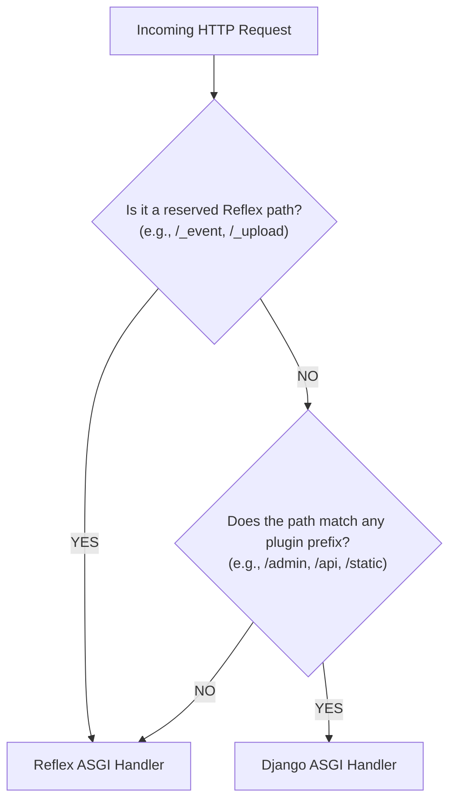

# Routing & URL Dispatching

When building applications with **reflex-django**, you are working with a dual-routing system: the **Reflex Frontend Router** (which handles interactive SPA page loads in the browser) and the **Django Backend Router** (which handles traditional HTTP views, API endpoints, static assets, and the administration panel).

This guide explains how paths are routed, how prefixes are matched, and how to avoid routing conflicts.

---

## 1. Reflex Frontend Pages

Reflex pages represent interactive frontend views. You register them directly on the `rx.App` instance using standard page decorators or manual registration:

```python
# frontend/frontend.py
import reflex as rx
from frontend.states.notes import NotesState

def notes_page() -> rx.Component:
    return rx.vstack(
        rx.heading("My Private Notes"),
        # UI components bind to NotesState variables
    )

app = rx.App()

# Registering a page route
app.add_page(
    notes_page,
    route="/notes",
    on_load=NotesState.refresh,  # Refreshes the database data on mount
    title="My Notes",
)
```

### Routing Rules for Reflex Pages:
* **Base Path**: The `route` parameter specifies the path served to the client browser.
* **No Pre-fixing**: Reflex page routes are **not** automatically prefixed by Django. A route registered as `/notes` is served directly at `http://localhost:3000/notes`.
* **State Loading**: The `on_load` argument binds a state handler (often a `refresh` method from your `ModelState` or `ModelCRUDView` class) to load model data asynchronously when the browser mounts the view.

---

## 2. Django Backend HTTP Routes

Traditional HTTP routes (like Django Rest Framework endpoints, webhook receivers, or custom views) are registered in your backend's main `urls.py` file.

First, configure your path prefixes in `rxconfig.py`:

```python
# rxconfig.py
from reflex_django import ReflexDjangoPlugin

config = rx.Config(
    app_name="frontend",
    plugins=[
        ReflexDjangoPlugin(
            settings_module="backend.settings",
            backend_prefix="/api",  # Matches custom HTTP API urls
            admin_prefix="/admin",  # Matches Django Admin mount point
        ),
    ],
)
```

Then, map the exact corresponding routes in your `backend/urls.py` file:

```python
# backend/urls.py
from django.contrib import admin
from django.urls import path, include

urlpatterns = [
    # Mount the Django admin panel
    path("admin/", admin.site.urls),  # Matches admin_prefix="/admin"
    
    # Mount your custom backend application APIs
    path("api/", include("shop.urls")),  # Matches backend_prefix="/api"
]
```

---

## The Path Dispatcher Decision Flow

When a request arrives at your unified ASGI server, the path dispatcher intercepts it and applies matching logic to determine which framework should receive it:



> [!NOTE]
> **Reserved Reflex Paths:** Subpaths starting with `/_event`, `/_upload`, `/_health`, `/ping`, or `/auth-codespace` are hardlocked for Starlette and the Socket.IO compiler. Django will **never** capture them, even if you define a catch-all URL pattern.

---

## Pre-built Authentication Routes

If you use the built-in authentication views supplied by `reflex-django` (which include ready-to-use registration, login, and password reset interfaces), you can register them in one line:

```python
# frontend/frontend.py
from reflex_django.auth import add_auth_pages

app = rx.App()

# Autoloads pre-built login, register, and reset views
add_auth_pages(app)
```

This registers the standard login views. You can customize these routes (such as shifting the default `/login` route to `/signin`) by adjusting the `REFLEX_DJANGO_AUTH` settings inside your Django settings module. See [Authentication](authentication.md) for custom parameters.

---

## Vite Development Proxy Alignment

During local development, Reflex runs a Vite development server to compile your React pages. 

To ensure incoming calls compile correctly, `reflex-django` automatically injects Vite `server.proxy` rules behind the scenes. This ensures that any frontend requests directed to `/api/...` or `/admin/...` are transparently proxied back to the main unified Python process.

---

## Common Pitfalls & Mismatches

### The Prefix Drift (404 Error)
* **Symptom:** Visiting `http://localhost:3000/api/products/` returns a `404 Not Found` error.
* **Cause:** Your plugin configuration and Django `urls.py` patterns are out of sync. For example, your plugin sets `backend_prefix="/api"`, but your `urlpatterns` maps routes under `path("v1/", include(...))`.
* **Fix:** Align them. Ensure the root path segments declared inside `urls.py` correspond exactly with your plugin prefixes.

### The Catch-All Shadowing Issue
* **Symptom:** Reflex pages fail to load, showing a blank screen or a raw Django response.
* **Cause:** You have registered a catch-all route (like `re_path(r'^.*$', ...)` or `path("<path:slug>", ...)`) at the root of your Django `urls.py` file, which intercepts and steals requests before they can fall back to the Reflex ASGI handler.
* **Fix:** Keep your Django URLs tightly scoped under clear path prefixes (like `/api/` or `/backend/`), and let Reflex manage the root routing scope.

---

**Navigation:** [← Architecture](architecture.md) | [Next: API Integration →](api_integration.md)
