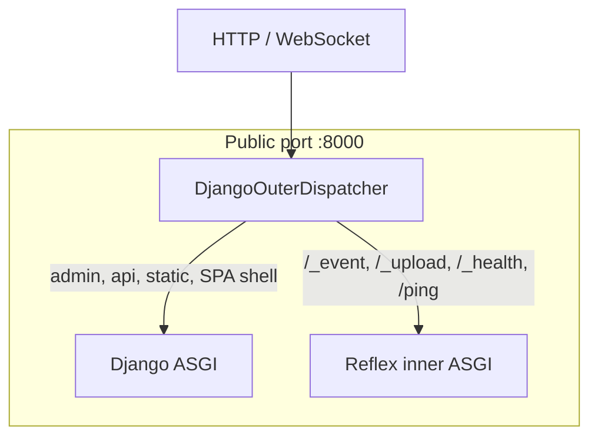
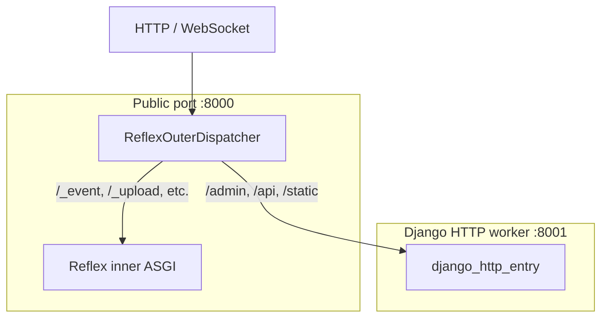
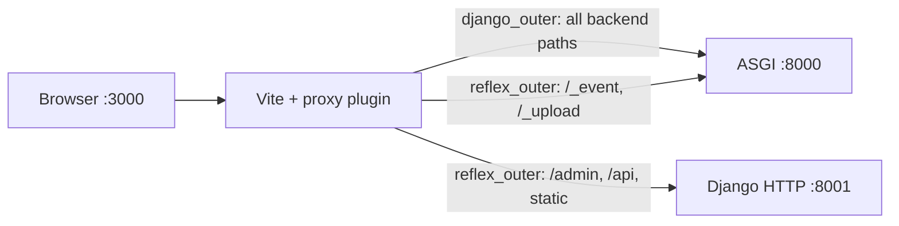

# Routing

**What you will learn:** How reflex-django chooses Django vs Reflex for each URL, how `django_outer` and `reflex_outer` differ, and how the multi-target Vite proxy keeps one browser origin in dev.

**When you need this:**

- Admin or API routes hit the SPA shell, or `/_event` never reaches Reflex.
- You are choosing between `django_outer` and `reflex_outer` for production.
- You need the exact list of reserved Reflex prefixes.

---

## The two-layer model

Every HTTP request passes through **two** decision points:

1. **Outer ASGI dispatcher** (`DjangoOuterDispatcher` or `ReflexOuterDispatcher`): sends reserved Reflex prefixes inward, routes everything else according to mode.
2. **Django `urlpatterns`**: explicit Django views vs SPA catch-all (`ReflexMountView`).

Reflex client-side routing then handles in-SPA navigation (`/about`, `/cart`) without full page reloads.

See also [Pages in views.py (URL split)](pages_in_views.md#the-url-split-django-routes-vs-reflex-routes).

---

## Choosing a mode: `django_outer` vs `reflex_outer`

Both modes expose **one public port** to browsers in production (usually `:8000`). Both keep the ORM and event bridge in the same interpreter as Reflex handlers. The difference is **which ASGI app is outer** and **where Django HTTP runs**.

| | **`django_outer`** (default) | **`reflex_outer`** |
|:---|:---|:---|
| Outer ASGI app | Django | Reflex (`ReflexOuterDispatcher`) |
| Django admin / API | Same process as Reflex | Separate HTTP worker (default `:8001`) |
| Reflex `/_event`, `/_upload` | Same process, reserved paths | Main Reflex process |
| Typical production | One uvicorn/granian process | Two supervised processes (Reflex + Django HTTP) |
| When to pick | Default for new and brownfield Django projects | Heavy Reflex traffic should not share Django's HTTP queue |

Set the mode in settings:

```python
REFLEX_DJANGO_URL_ROUTING = "django_outer"   # default via "auto"
# or
REFLEX_DJANGO_URL_ROUTING = "reflex_outer"
```

Legacy names **`reflex_led`** and **`django_led`** are removed in v1.0. See [Migrating to v1.0](migration/v1_migration.md).

### `django_outer` flow



Django is the front door. Almost all HTTP goes through Django middleware and URL resolution. Reflex receives only [reserved prefixes](#reserved-reflex-prefixes-both-modes).

### `reflex_outer` flow



Reflex owns the public port. `ReflexOuterDispatcher` proxies Django-owned prefixes to the HTTP worker. Handlers and ORM still run in the main process; only **stateless Django HTTP views** (admin, DRF, webhooks) hit the worker.

`run_reflex` can auto-spawn the worker when `REFLEX_DJANGO_HTTP_SUBPROCESS=True` (default in dev).

---

## Reserved Reflex prefixes (both modes)

These paths **always** forward to Reflex's inner ASGI, never to Django HTTP views:

| Prefix | Purpose |
|:---|:---|
| `/_event` | Socket.IO event channel (WebSocket) |
| `/_upload` | Multipart file uploads |
| `/_health` | Health check |
| `/ping` | Liveness ping |
| `/auth-codespace` | Reflex auth helper (when enabled) |
| `/_all_routes` | Reflex route manifest |

Configure extras with `REFLEX_DJANGO_RESERVED_REFLEX_PREFIXES`.

**Do not** register Django `path()` entries under these prefixes.

---

## Django prefix detection

Django-owned prefixes (admin, API, static) must be known to:

- The outer dispatcher (in `reflex_outer`)
- The Vite dev proxy (so `:3000` forwards correctly)
- The SPA `env.json` (backend URL hints)

**Default:** auto-detect from the first segment of each top-level `path()` in `ROOT_URLCONF`.

**Override** when auto-detection misses `re_path()` routes or unusual layouts:

```python
reflex_mount(django_prefix=("/admin", "/api", "/internal"))
```

Or at runtime via env:

```bash
export REFLEX_DJANGO_DJANGO_PREFIX="/admin,/api,/internal"
python manage.py run_reflex
```

Full setting reference: [Settings (`REFLEX_DJANGO_DJANGO_PREFIX`)](settings_reference.md#reflex_django_django_prefix).

---

## Multi-target Vite proxy (dev)

Default dev sets `REFLEX_DJANGO_SEPARATE_DEV_PORTS=True`. Vite on `:3000` proxies backend paths so the browser keeps one origin for cookies and CSRF.

| Routing mode | Django prefixes (`/admin`, `/api`, …) | Reflex paths (`/_event`, …) |
|:---|:---|:---|
| **`django_outer`** | → `:8000` | → `:8000` |
| **`reflex_outer`** | → `:8001` (Django HTTP worker) | → `:8000` (Reflex outer) |

reflex-django patches `.web/vite.config.js` with a **multi-target** proxy plugin after each compile. One browser origin (`:3000`), multiple upstream groups.



When `REFLEX_DJANGO_SEPARATE_DEV_PORTS=False` (for example `run_reflex --env dev`), proxy rules are **stripped** to avoid loops. Browse `:8000` for everything in that mode.

Details: [Local development](local_development.md).

---

## SPA catch-all and mount prefix

With `REFLEX_DJANGO_AUTO_MOUNT=True` (default), reflex-django appends a catch-all route that serves `index.html` for non-Django paths.

| Setting | Default | Purpose |
|:---|:---|:---|
| `REFLEX_DJANGO_AUTO_MOUNT` | `True` | Append catch-all at startup |
| `REFLEX_DJANGO_MOUNT_PREFIX` | `"/"` | Prefix for the catch-all |

Explicit Django routes in `urlpatterns` must appear **before** the catch-all. Import page modules so `@page` registers routes at import time.

---

## Production notes

- **`django_outer`:** Point your reverse proxy at a single ASGI server running `reflex_django.asgi_entry:application`. Enable WebSocket upgrade for `/_event`.
- **`reflex_outer`:** Supervise two processes: Reflex outer on the public port, Django HTTP worker on `REFLEX_DJANGO_HTTP_PORT`. The edge proxy still talks to **one** public port (Reflex).
- Export the SPA in CI (`export_reflex` / `collectstatic`), not on every container boot.

See [Deployment](deployment.md).

---

## Quick troubleshooting

| Symptom | Check |
|:---|:---|
| Admin 404 from `:3000` | `urlpatterns` order, `REFLEX_DJANGO_DJANGO_PREFIX` |
| API returns HTML | Prefix not listed for proxy / catch-all stole the path |
| `/_event` 404 | Reserved prefix collision or wrong routing mode |
| 502 from Vite | Backend or `:8001` worker not running |

Full fixes: [Troubleshooting](troubleshooting.md).

---

## What just happened?

You mapped both routing modes, reserved Reflex paths, Django prefix detection, and the dev proxy layout that keeps one browser origin.

**Next up:** [WebSocket event pipeline](websocket_event_pipeline.md) for what happens after `/_event` connects.
