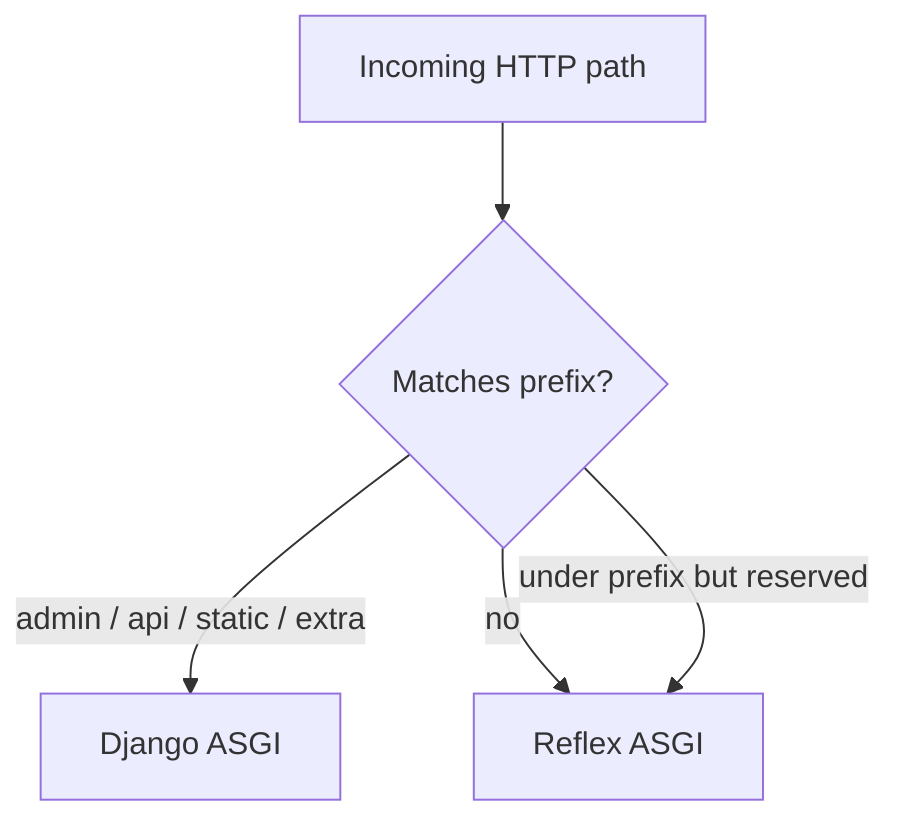

# Routing

**Reflex routes** for UI pages and **Django URL prefixes** for HTTP admin, API, and static files.

---

## Prerequisites

- [Architecture](architecture.md)  
- [Configuration](configuration.md)

---

## Reflex pages

Register UI routes on your `rx.App`:

```python
import reflex as rx

app = rx.App()

app.add_page(
    my_page,
    route="/notes",
    on_load=NotesState.on_load_data,  # ModelState default; or on_load_notes if Meta.list_var = "notes"
    title="Notes",
)
```

- **`route`** — path on the Reflex app (not automatically prefixed by Django).  
- **`on_load`** — event run when the page loads (often `on_load_<list_var>` from `ModelCRUDView`).

---

## Django HTTP routes

Configure the plugin:

```python
ReflexDjangoPlugin(
    settings_module="backend.settings",
    backend_prefix="/api",
    admin_prefix="/admin",
)
```

In `backend/urls.py`:

```python
from django.urls import path, include

urlpatterns = [
    path("admin/", admin.site.urls),
    path("api/", include("myapi.urls")),
]
```

The browser requests `/admin/...` and `/api/...`; the dispatcher forwards those paths to Django ASGI.

---

## Dispatcher decision flow



Reserved Reflex subpaths (never stolen): `/_event`, `/_upload`, `/_health`, `/_all_routes`, `/ping`, `/auth-codespace`.

---

## Auth page routes

Canned login/register/reset pages:

```python
from reflex_django.auth import add_auth_pages

add_auth_pages(app)
```

Or register individually with `register_login_page`, `LoginPage`, `routes.LOGIN_ROUTE`, etc. Settings: `REFLEX_DJANGO_AUTH` — [Authentication](authentication.md).

---

## Development proxy

In `pre_compile`, the plugin injects Vite `server.proxy` rules so the Reflex dev server forwards Django prefixes to `config.api_url`. Production uses a single server—see [Architecture](architecture.md).

---

## Advanced usage

- **`extra_prefixes`** for billing, webhooks, or legacy Django-only paths.  
- CDN `STATIC_URL` with `://` is **not** forwarded (static served externally).

---

## Common mistakes

- Django `path("api/", …)` but `backend_prefix="/v1/api"` — paths must match what the browser requests.  
- Catch-all Django route under `/` that shadows Reflex (keep UI on Reflex, APIs on prefixes).

---

## Troubleshooting

| Symptom | Check |
|---------|--------|
| 404 on `/admin` | `admin_prefix`, `urlpatterns`, `INSTALLED_APPS` admin |
| API 404 | `REFLEX_DJANGO_API_PREFIX` and `ROOT_URLCONF` |

---

## See also

- [API integration](api_integration.md)  
- [Deployment](deployment.md)

---

**Navigation:** [← Architecture](architecture.md) | [Next: Django middleware to Reflex →](django_middleware_to_reflex.md)
