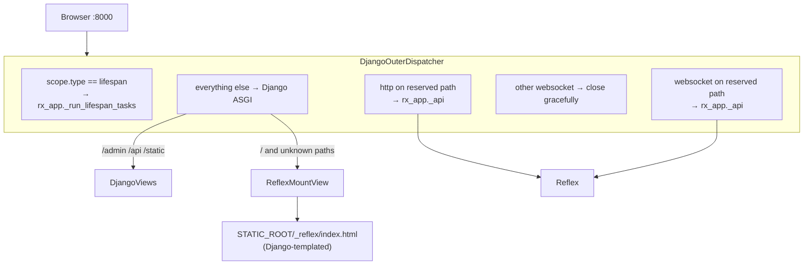
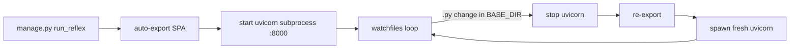

# Single-port architecture reference

`reflex-django` runs Reflex and Django as **one ASGI application on one port** (default `8000`). Django is the outer ASGI app; Reflex's Socket.IO event channel, upload endpoint, and health endpoints are mounted as ASGI sub-applications. The Reflex SPA is built into a static bundle and served from disk by Django — no separate frontend dev server, no second port, no CORS, no token handshake.

Open `http://localhost:8000/` and you get:

| Path | Served by |
|:---|:---|
| `/` and any unknown path | `ReflexMountView` → compiled SPA from `STATIC_ROOT/_reflex/` (run through Django's template engine) |
| `/admin/...` | Django admin |
| `/api/...` | Your Django views and DRF endpoints |
| `/static/...` | Django static files (admin CSS, your assets) |
| `/_event` | Reflex Socket.IO endpoint (HTTP + WebSocket) |
| `/_upload` | Reflex upload endpoint |
| `/_health`, `/ping`, `/_all_routes` | Reflex internal endpoints |
| `/auth-codespace` | Reflex auth tooling |

---

## ASGI composition



The dispatcher (`reflex_django.django_outer_dispatcher.DjangoOuterDispatcher`) makes four routing decisions per scope:

1. `scope["type"] == "lifespan"` → Reflex's lifespan context manager so the event processor, background tasks, and prerender all start with the server.
2. `scope["type"] == "websocket"` with a reserved Reflex prefix → Reflex's inner ASGI.
3. `scope["type"] == "websocket"` outside a reserved prefix → closed gracefully (no Channels needed).
4. Everything else → Django's ASGI handler, which then walks `urls.py` and either dispatches to a Django view or lets the catch-all hit `ReflexMountView`.

---

## ASGI entry point

```python
# config/asgi.py
import os

os.environ.setdefault("DJANGO_SETTINGS_MODULE", "config.settings")
from reflex_django.asgi_entry import application  # noqa: E402,F401
```

Run with any ASGI server:

```bash
uvicorn config.asgi:application --host 0.0.0.0 --port 8000
# or
granian --interface asgi config.asgi:application --host 0.0.0.0 --port 8000
# or
hypercorn config.asgi:application --bind 0.0.0.0:8000
```

`reflex_django.asgi_entry.application` is async and composes the Django ASGI app with Reflex's inner Starlette + Socket.IO app behind the outer dispatcher.

---

## Full middleware chain on every Reflex event

Every Socket.IO event is bridged into a synthetic `HttpRequest` built from `router_data` (cookies, headers, client IP, method, scheme, optional POST payload, resolver match). That request is piped through `settings.MIDDLEWARE` via `reflex_django.event_handler.EventMiddlewareHandler`, a singleton `BaseHandler` subclass.

Result: every event sees the same Django context an HTTP view sees.

- `SessionMiddleware` populates `request.session`.
- `AuthenticationMiddleware` populates `request.user` (eagerly resolved via `aget_user` so handlers can read it without `SynchronousOnlyOperation`).
- `MessageMiddleware` populates `request._messages`.
- `LocaleMiddleware` activates the right `LANGUAGE_CODE`.
- **Your** middleware runs too — same order, same `process_request`, `process_view`, `process_response` semantics.

`CsrfViewMiddleware` and `reflex_django.streaming_middleware.AsyncStreamingMiddleware` are skipped on Socket.IO events by default (no CSRF tokens on persistent sockets, no streaming HTTP responses needed). Override with `REFLEX_DJANGO_EVENT_MIDDLEWARE_SKIP`.

```python
class HomeState(rx.AppState):
    @rx.event
    async def submit(self):
        request = self.request          # synthetic HttpRequest
        response = self.response        # HttpResponse from middleware chain
        user = self.user                # request.user (already resolved)
        session = self.session          # async-safe via aget/asave
        messages = self.messages        # JSON-safe snapshot of messages
        token = self.csrf_token         # CSRF token for the request

        from django.contrib import messages as dj_messages
        dj_messages.success(request, "Saved")  # surfaces next event
```

### Reactive mirrors

The `DjangoUserState` substate exposes reactive variables the SPA can bind to directly:

```python
def navbar():
    return rx.hstack(
        rx.foreach(
            DjangoUserState.messages,
            lambda m: rx.callout(m.message, color_scheme=m.level_tag),
        ),
        rx.spacer(),
        rx.text(f"Locale: {DjangoUserState.language}"),
    )
```

Toggle individual mirrors with `REFLEX_DJANGO_MIRROR_MESSAGES`, `REFLEX_DJANGO_MIRROR_CSRF`, `REFLEX_DJANGO_MIRROR_LANGUAGE`.

### Middleware-driven redirects

When a middleware short-circuits with a 3xx response — e.g. a custom `LoginRequiredMiddleware` returns `HttpResponseRedirect("/login")` — the bridge converts that into a Reflex `rx.redirect(...)` event automatically. The browser navigates; the `@rx.event` handler does not run. Disable with `REFLEX_DJANGO_AUTO_REDIRECT_FROM_MIDDLEWARE = False`.

---

## SPA shell as a Django template

When `REFLEX_DJANGO_RENDER_SPA_VIA_TEMPLATE_ENGINE = True` (default), the compiled `index.html` is piped through Django's template engine before it leaves the server. That gives the shell access to:

- `{{ request.user }}` and any context-processor key
- ``
- `` + ``
- `{{ messages }}` and the message bag
- Your custom template tags / filters

Static asset URLs and the React bootstrap markup pass through unchanged. Non-HTML responses (JS bundles, CSS, source maps, images) skip the template engine entirely. Disable globally with `REFLEX_DJANGO_RENDER_SPA_VIA_TEMPLATE_ENGINE = False` or per-request via the env var `REFLEX_DJANGO_RENDER_SPA_VIA_TEMPLATE_ENGINE=0`.

> Reflex page code (`{app}/views.py`) compiles to React — Django template syntax inside a `rx.text(...)` call does **not** get processed. Use reactive vars (`DjangoUserState.username`, `self.django_context[...]`) inside components, and reserve `{{ }}` / `` for the SPA shell.

---

## Build & serve from disk

The Reflex SPA always runs from a compiled bundle staged at `STATIC_ROOT/_reflex/` (plus fallbacks to `.web/build/client/` and `.web/_static/`).

### Build the bundle

```bash
python manage.py export_reflex --frontend-only --no-zip --stage-to-static-root
```

That command bootstraps the reflex-django integration, runs Reflex's exporter, and (with `--stage-to-static-root`) copies the output into `STATIC_ROOT/_reflex/`. Add `--no-ssr` to disable server-side pre-rendering or `--stage-target <path>` to point somewhere other than `_reflex`.

### Serve

Any ASGI server pointed at `reflex_django.asgi_entry:application` will then serve the SPA from disk:

```bash
uvicorn reflex_django.asgi_entry:application --host 0.0.0.0 --port 8000
```

For local development, `python manage.py run_reflex` does the build + serve in one shot and watches the project tree for changes (see below).

---

## `manage.py run_reflex`

`manage.py run_reflex` is the development entry point. It owns the full local lifecycle:

1. Bootstraps the reflex-django integration in the current Python process.
2. Auto-exports the SPA bundle (`export_reflex --frontend-only --no-zip --stage-to-static-root`) and stages it into `STATIC_ROOT/_reflex/`.
3. Spawns `uvicorn` as a subprocess pointed at `reflex_django.asgi_entry:application`.
4. Watches the project root for `.py` changes via `watchfiles`. On every change, it cleanly stops the uvicorn subprocess, re-exports the SPA, and respawns uvicorn.



Excluded from the watcher: `.web/`, `node_modules/`, `staticfiles/`, `static_collected/`, `.reflex/`, `dist/`, `build/`, and your `STATIC_ROOT`. This prevents the export itself from re-triggering the loop.

### Flags

| Flag | Effect |
|:---|:---|
| *(none)* | Auto-export + watch + restart. The canonical dev loop. |
| `--skip-rebuild` | Keep the watch loop but skip the per-restart re-export. Fast path for Python-only edits that don't touch Reflex pages. |
| `--no-reload` | One-shot: rebuild + serve, no watcher, no auto-restart. |
| `--env prod` | Production semantics: no auto-export at boot (CI is expected to have built the bundle), `DEBUG` off, dev proxy off. |
| `--frontend-only` | Just rebuild the bundle and exit. Useful in CI / pre-deploy. |
| `--backend-only` | Skip the watcher; serve whatever's on disk. |
| `--with-vite` | Opt out of from-build and run the legacy Vite-HMR dev loop instead. |
| `--backend-host`, `--backend-port`, `--loglevel` | ASGI server tuning. |

---

## Settings reference

| Setting | Default | Purpose |
|:---|:---|:---|
| `REFLEX_DJANGO_URL_ROUTING` | `"auto"` (resolves to `django_outer`) | Routing mode. |
| `REFLEX_DJANGO_SERVE_FROM_BUILD` | `True` | `run_reflex` defaults to the auto-export + serve-from-disk loop. |
| `REFLEX_DJANGO_RUN_MIDDLEWARE_CHAIN` | `True` | Run full `settings.MIDDLEWARE` per event. |
| `REFLEX_DJANGO_EVENT_MIDDLEWARE_SKIP` | csrf + streaming | Middleware skipped on Socket.IO events. |
| `REFLEX_DJANGO_AUTO_REDIRECT_FROM_MIDDLEWARE` | `True` | Translate 3xx responses to `rx.redirect`. |
| `REFLEX_DJANGO_EVENT_POST_FROM_PAYLOAD` | `False` | Feed event kwargs into `request.POST`. |
| `REFLEX_DJANGO_MIRROR_MESSAGES` | `True` | Mirror messages to `DjangoUserState.messages`. |
| `REFLEX_DJANGO_MIRROR_CSRF` | `True` | Mirror CSRF token to `DjangoUserState.csrf_token`. |
| `REFLEX_DJANGO_MIRROR_LANGUAGE` | `True` | Mirror language to `DjangoUserState.language` + `language_bidi`. |
| `REFLEX_DJANGO_RENDER_SPA_VIA_TEMPLATE_ENGINE` | `True` | Pipe `index.html` through Django's template engine. |
| `REFLEX_DJANGO_SHOW_BUILT_WITH_REFLEX` | `False` | Show / hide the "Built with Reflex" badge. |
| `REFLEX_DJANGO_DEV_PROXY` | `False` | Reverse-proxy `/` to Vite (only used by `--with-vite`). |
| `REFLEX_DJANGO_RESERVED_REFLEX_PREFIXES` | `()` | Extra Reflex-owned path prefixes. |

---

## Caveats

- Django Channels is not required, supported, or used. The dispatcher forwards lifespan directly to Reflex's lifespan; Channels would compete with it.
- Reflex's `app._api` is a private attribute. The integration pins a compatible Reflex version and falls back gracefully if the attribute disappears.
- `CsrfViewMiddleware` does not run for Socket.IO events. If you need CSRF protection on Reflex events, write a custom middleware that reads a shared-secret token from `event.payload` and add it to your middleware chain (then remove the entry from `REFLEX_DJANGO_EVENT_MIDDLEWARE_SKIP`).
- The SPA bundle must exist on disk before the ASGI server serves a request to `/`. `run_reflex` handles that automatically; production deployments build it in CI via `manage.py export_reflex`.

---

**Navigation:** [← Architecture](architecture.md) | [Deployment →](deployment.md) | [CLI →](cli.md)
