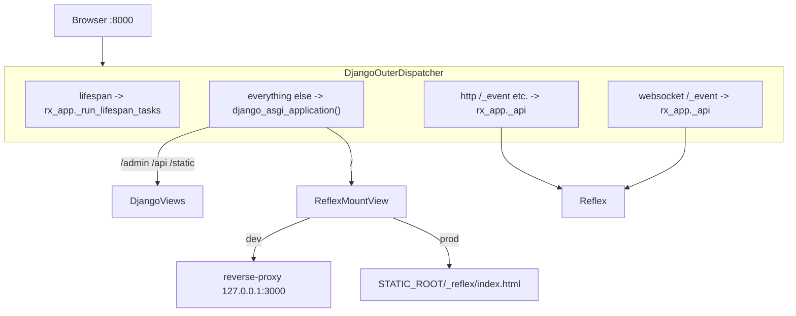

# Single-port, Django-outer architecture

## What it is

`reflex-django` runs Reflex and Django as one ASGI application on **one port**
(default `8000`). Django is the outer application; the Reflex Socket.IO event
endpoint, the Reflex upload endpoint, and the Reflex health endpoints are
mounted as ASGI sub-applications under Django. In development, Django reverse-
proxies the SPA shell to Vite for hot-module reload; in production, Django
serves the compiled SPA bundle from `STATIC_ROOT`.

The user opens `http://localhost:8000/` and gets:

- `/` — the SPA shell (via Vite proxy in dev, via static files in prod)
- `/admin` — Django admin
- `/api/...` — your Django views and DRF endpoints
- `/static/...` — Django static files (admin CSS, your assets)
- `/_event` — Reflex Socket.IO endpoint (WebSocket)
- `/_upload` — Reflex upload endpoint
- `/_health`, `/ping`, `/_all_routes` — Reflex internal endpoints

No second port. No CORS. No bridge process. Django **is** the server.

## How it is composed



The dispatcher (`reflex_django.django_outer_dispatcher.DjangoOuterDispatcher`)
is a thin ASGI app that:

1. Forwards `scope["type"] == "lifespan"` to Reflex's lifespan context manager
   so the event processor, background tasks, and prerender all start with the
   server.
2. Forwards reserved Reflex paths (see
   `DEFAULT_RESERVED_REFLEX_PREFIXES`) to Reflex's inner ASGI.
3. Forwards everything else to Django's ASGI handler.

Production users typically wire the dispatcher up via `config/asgi.py`:

```python
import os

os.environ.setdefault("DJANGO_SETTINGS_MODULE", "config.settings")
from reflex_django.asgi_entry import application  # noqa: E402,F401
```

…then run any ASGI server:

```bash
uvicorn config.asgi:application --host 0.0.0.0 --port 8000
```

## Full middleware chain on every Reflex event

Every Socket.IO event is bridged into a synthetic Django `HttpRequest` built
from the event's `router_data` (cookies, headers, client IP, optional POST
payload, resolver match). That request is then piped through
`settings.MIDDLEWARE` via `reflex_django.event_handler.EventMiddlewareHandler`,
a singleton subclass of `django.core.handlers.base.BaseHandler`.

Result:

- `SessionMiddleware` populates `request.session`.
- `AuthenticationMiddleware` populates `request.user`.
- `MessageMiddleware` populates `request._messages`.
- `LocaleMiddleware` activates the right `LANGUAGE_CODE`.
- Your **custom** middleware runs too — same order, same `process_request`,
  `process_view`, and `process_response` semantics.

Handlers can use the full result:

```python
class HomeState(rx.AppState):
    @rx.event
    async def submit(self):
        request = self.request          # synthetic HttpRequest
        response = self.response        # HttpResponse from middleware chain
        user = self.user                # request.user (live)
        session = self.session          # request.session proxy
        messages = self.messages        # [{level, level_tag, message, tags, extra_tags}]
        token = self.csrf_token         # CSRF token bound to request
        # Use any Django API:
        from django.contrib import messages as dj_messages
        dj_messages.success(request, "Saved")  # shows up on the next event
```

The reactive `DjangoUserState` substate also mirrors `messages`, `csrf_token`,
`language`, and `language_bidi` so the SPA can bind to them directly:

```python
def navbar():
    return rx.flex(
        rx.foreach(DjangoUserState.messages, lambda m: rx.callout(m.message)),
        rx.spacer(),
        rx.text(f"Locale: {DjangoUserState.language}"),
    )
```

## Middleware that short-circuits

When a middleware returns a response without delegating (e.g. a custom
`LoginRequiredMiddleware` returns `HttpResponseRedirect("/login")`), the
bridge translates that into a Reflex `rx.redirect(...)` event automatically,
so the browser navigates. Disable with
`REFLEX_DJANGO_AUTO_REDIRECT_FROM_MIDDLEWARE = False`.

`CsrfViewMiddleware` and `reflex_django.streaming_middleware.AsyncStreamingMiddleware`
are always skipped on Reflex events (no CSRF tokens on Socket.IO, no streaming
HTTP responses). Override the skip list with
`REFLEX_DJANGO_EVENT_MIDDLEWARE_SKIP`.

## Settings cheat-sheet

| Setting | Default | Purpose |
| --- | --- | --- |
| `REFLEX_DJANGO_URL_ROUTING` | `"auto"` (resolves to `django_outer`) | Routing mode. |
| `REFLEX_DJANGO_RUN_MIDDLEWARE_CHAIN` | `True` | Run full `MIDDLEWARE` per event. |
| `REFLEX_DJANGO_EVENT_MIDDLEWARE_SKIP` | csrf + streaming | Middleware skipped on Socket.IO events. |
| `REFLEX_DJANGO_AUTO_REDIRECT_FROM_MIDDLEWARE` | `True` | Translate 3xx responses to `rx.redirect`. |
| `REFLEX_DJANGO_EVENT_POST_FROM_PAYLOAD` | `False` | Feed event kwargs into `request.POST`. |
| `REFLEX_DJANGO_MIRROR_MESSAGES` | `True` | Mirror messages to `DjangoUserState.messages`. |
| `REFLEX_DJANGO_MIRROR_CSRF` | `True` | Mirror CSRF token to `DjangoUserState.csrf_token`. |
| `REFLEX_DJANGO_MIRROR_LANGUAGE` | `True` | Mirror language to `DjangoUserState.language`. |
| `REFLEX_DJANGO_DEV_PROXY` | `True` | Django reverse-proxies `/` to Vite in DEBUG. |
| `REFLEX_DJANGO_RESERVED_REFLEX_PREFIXES` | `()` | Extra Reflex-owned path prefixes. |

## Caveats

- Django Channels is not required, supported, or used. Our dispatcher
  forwards lifespan directly to Reflex's own lifespan; Channels would compete
  with that.
- Reflex's `app._api` is a private attribute. The integration pins a
  compatible Reflex version and falls back gracefully if it disappears.
- `CsrfViewMiddleware` does not run for Socket.IO events. If you need CSRF
  protection on Reflex events, write a custom middleware that reads a
  shared-secret token from `event.payload` and add it to your middleware
  chain (and remove the entry from `REFLEX_DJANGO_EVENT_MIDDLEWARE_SKIP`).
