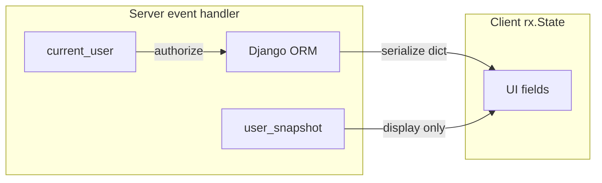

# State management

**Reflex state** plus reflex-django helpers for mirroring Django user and i18n data in the UI.

---

## Prerequisites

- [Django middleware to Reflex](django_middleware_to_reflex.md)

---

## Reflex baseline

```python
import reflex as rx

class Counter(rx.State):
    count: int = 0

    @rx.event
    def increment(self):
        self.count += 1
```

reflex-django adds Django-aware bases and snapshots on top of this model.

---

## `AppState`

Abstract base from `reflex_django.states` (or `reflex_django.state`):

- Subclass for app-specific and CRUD state.  
- `AppStateMeta` assembles `ModelCRUDView` members before Reflex builds vars.

```python
from reflex_django.state import AppState, ModelCRUDView
```

---

## `DjangoUserState`

UI-oriented snapshot of the logged-in user (synced to the client):

```python
from reflex_django import DjangoUserState

class MyState(DjangoUserState):
    @rx.event
    async def on_load(self):
        await self.sync_from_django()
```

Field names (no `django_` prefix): `user_id`, `username`, `email`, `is_authenticated`, `is_staff`, etc.

> **Warning:** Use **`current_user()`** / **`require_login_user()`** for authorization. `DjangoUserState` is a **display snapshot** only.

---

## `user_snapshot` vs `current_user`

| API | Purpose |
|-----|---------|
| `current_user()` | Live `User` on the server during an event |
| `user_snapshot(user)` | JSON-safe dict for display, processors, logging |

```python
from reflex_django import current_user, user_snapshot

user = current_user()
if user.is_authenticated:
    self.label = user_snapshot(user)["username"]
```

---

## `DjangoI18nState`

Exposes language fields for UI when `USE_I18N` is enabled. Works with `REFLEX_DJANGO_I18N_EVENT_BRIDGE` on the synthetic request. See [Django middleware to Reflex](django_middleware_to_reflex.md).

---

## State synchronization model



- **Source of truth:** database + `current_user()` on the server.  
- **Wire format:** JSON-serializable dicts and scalars only.

---

## Event handler patterns

```python
@rx.event
async def load_items(self):
    user = require_login_user()
    qs = Item.objects.filter(owner=user)
    self.items = await ItemSerializer(qs, many=True).adata()
```

Prefer **`async def`** when using Django async ORM APIs.

---

## Advanced usage

- Combine `DjangoUserState` with `session_auth_mixin` for custom login pages — [Authentication](authentication.md).  
- Refresh user snapshot after login: `await self.sync_from_django()`.

---

## Performance tips

- Do not store full querysets or model instances in state vars.  
- Reload lists after mutations, not individual ORM instances on the client.

---

## Common mistakes

- Trusting `is_authenticated` on client state for delete/update guards.  
- Assigning `datetime`, `Decimal`, or model instances to state fields.

---

## Troubleshooting

| Symptom | Fix |
|---------|-----|
| Stale user in UI | Call `sync_from_django` after auth-changing events |
| `AppRegistryNotReady` | Import order; use plugin bootstrap |

---

## See also

- [Django context to Reflex](django_context_to_reflex.md)  
- [Serializers](serializers.md)

---

**Navigation:** [← Django context to Reflex](django_context_to_reflex.md) | [Next: Serializers →](serializers.md)
