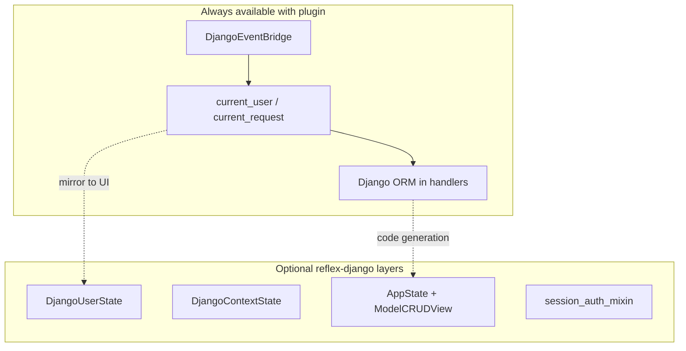
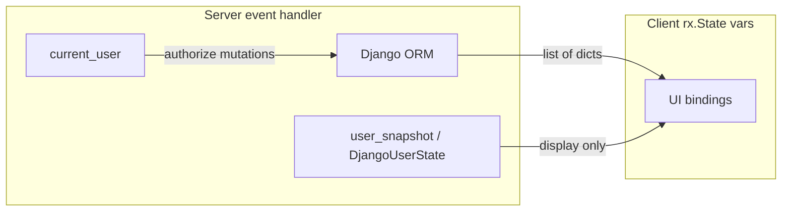

# State management

How to build **Reflex state** when Django and Reflex are already connected by reflex-django—and when to add optional **helper states** and **mixins** on top.

---

## Prerequisites

- [Architecture](architecture.md) — two bridges (HTTP + events)  
- [Django middleware to Reflex](django_middleware_to_reflex.md) — `DjangoEventBridge`  
- [Django context to Reflex](django_context_to_reflex.md) — processors

---

## The connection you already have

Installing `ReflexDjangoPlugin` does **not** force you to use reflex-django state classes or CRUD mixins. It gives every Reflex event handler access to Django through:

| Mechanism | What it provides |
|-----------|------------------|
| **HTTP bridge** | `/admin`, `/api`, static URLs → Django ASGI |
| **Event bridge** (`DjangoEventBridge`) | Synthetic `HttpRequest`, session, `request.user` per event |
| **`request` proxy** | `from reflex_django import request` → `request.user`, `request.session`, `request.GET`, `request.headers` |
| **Context helpers** | `current_request()`, `current_user()`, `current_session()`, `current_language()` |

From there you can write **plain `rx.State`** subclasses—exactly like Reflex documentation—and call Django ORM, auth, and serializers inside `@rx.event` handlers.



**Takeaway:** reflex-django **mixins** and **helper states** save boilerplate; they are not required to use Django from Reflex.

---

## Two ways to build state

| Approach | Base class | Best for |
|----------|------------|----------|
| **A. Plain Reflex + bridges** | `rx.State` | Full control, learning Reflex, custom flows, minimal magic |
| **B. reflex-django helpers** | `DjangoUserState`, `DjangoContextState`, `AppState` + `ModelCRUDView`, … | Less boilerplate for nav user snapshot, context dicts, declarative CRUD |

You can mix both in one app: e.g. `NavbarState(DjangoUserState)` and `TasksState(rx.State)` side by side.

---

## Part A — Plain `rx.State` (no reflex-django mixins or helper states)

### A1. Pure Reflex (no Django in the handler)

Django is still loaded for other pages, but this state does not touch the ORM:

```python
import reflex as rx


class CounterState(rx.State):
    count: int = 0

    @rx.event
    def increment(self):
        self.count += 1
```

### A2. Django auth via the event bridge only

Use **`from reflex_django import request`** (or **`current_user()`**) inside any `rx.State`—no `DjangoUserState` required:

```python
import reflex as rx
from reflex_django import request


class WhoamiState(rx.State):
    label: str = "Loading…"

    @rx.event
    async def refresh(self):
        user = request.user
        self.label = (
            f"Signed in as {user.get_username()}"
            if user.is_authenticated
            else "Guest"
        )
```

Wire on a page:

```python
# app.add_page(whoami_page, route="/whoami", on_load=WhoamiState.refresh)
```

> **Warning:** `self.label` is visible in the browser. Use `current_user()` again inside handlers that **mutate** data or perform deletes.

### A3. Full example: task list without mixins

*Example application code—a `tasks` app with a `Task` model.*

**Model and serializer** (see [Serializers](serializers.md)):

```python
# tasks/models.py
from django.conf import settings
from django.db import models

class Task(models.Model):
    title = models.CharField(max_length=200)
    done = models.BooleanField(default=False)
    owner = models.ForeignKey(settings.AUTH_USER_MODEL, on_delete=models.CASCADE)
```

```python
# tasks/serializers.py
from reflex_django.serializers import ReflexDjangoModelSerializer
from tasks.models import Task

class TaskSerializer(ReflexDjangoModelSerializer):
    class Meta:
        model = Task
        fields = ("id", "title", "done")
```

**State — subclass `rx.State` only** (not `AppState`, not `ModelCRUDView`):

```python
# myapp/states/tasks.py
import reflex as rx
from reflex_django import current_user, require_login_user
from tasks.models import Task
from tasks.serializers import TaskSerializer


class TasksState(rx.State):
    """Plain Reflex state + Django bridge + serializer. No reflex-django CRUD mixins."""

    tasks: list[dict] = []
    error: str = ""
    new_title: str = ""

    @rx.event
    async def load_tasks(self):
        self.error = ""
        user = require_login_user()
        qs = Task.objects.filter(owner=user).order_by("-id")
        self.tasks = await TaskSerializer(qs, many=True).adata()

    @rx.event
    def set_new_title(self, value: str):
        self.new_title = value

    @rx.event
    async def add_task(self):
        self.error = ""
        title = self.new_title.strip()
        if not title:
            self.error = "Title is required."
            return
        user = require_login_user()
        try:
            await Task.objects.acreate(owner=user, title=title, done=False)
            self.new_title = ""
            await self.load_tasks()
        except Exception as exc:
            self.error = str(exc)

    @rx.event
    async def toggle_done(self, task_id: int):
        user = require_login_user()
        task = await Task.objects.aget(pk=task_id, owner=user)
        task.done = not task.done
        await task.asave()
        await self.load_tasks()

    @rx.event
    async def delete_task(self, task_id: int):
        user = require_login_user()
        task = await Task.objects.aget(pk=task_id, owner=user)
        await task.adelete()
        await self.load_tasks()
```

**Page:**

```python
def tasks_page() -> rx.Component:
    return rx.vstack(
        rx.cond(TasksState.error != "", rx.callout(TasksState.error, color_scheme="red")),
        rx.input(
            placeholder="New task",
            value=TasksState.new_title,
            on_change=TasksState.set_new_title,
        ),
        rx.button("Add", on_click=TasksState.add_task),
        rx.foreach(
            TasksState.tasks,
            lambda t: rx.hstack(
                rx.checkbox(
                    checked=t["done"],
                    on_change=TasksState.toggle_done(t["id"]),
                ),
                rx.text(t["title"]),
                rx.button("Delete", on_click=TasksState.delete_task(t["id"])),
            ),
        ),
        width="100%",
    )

# app.add_page(tasks_page, route="/tasks", on_load=TasksState.load_tasks)
```

This is the same pattern as [CRUD without mixins](crud_without_mixins.md) but focused on **state design**: you own every field name, event name, and validation rule.

### A4. Context processors in plain state

You do not need `DjangoContextState` to use processors—call `collect_reflex_context` in any handler:

```python
import reflex as rx
from reflex_django import current_request
from reflex_django.reflex_context import collect_reflex_context


class SiteState(rx.State):
    site_name: str = ""

    @rx.event
    async def load_site(self):
        merged = await collect_reflex_context(current_request())
        self.site_name = str(merged.get("site_name", "My site"))
```

Configure processors in settings (`REFLEX_DJANGO_CONTEXT_PROCESSORS`). Details: [Django context to Reflex](django_context_to_reflex.md).

### A5. Login/logout without `session_auth_mixin`

You can call Django auth APIs on `current_request()` and handle cookie sync yourself, or use canned [Authentication](authentication.md) pages. The mixin only **generates** a `rx.State` subclass with standard fields and `submit_login`—it is optional sugar.

---

## What plain `rx.State` uses from reflex-django

| Use | Import | Required? |
|-----|--------|-----------|
| User / session in handlers | `current_user`, `require_login_user` | Event bridge on |
| Request / session object | `current_request`, `current_session` | Event bridge on |
| Serialize models for UI | `ReflexDjangoModelSerializer` | No (your serializer classes) |
| Row dict helper | `serialize_model_row` via `reflex_django.mixins` | Optional |
| CRUD code generation | `ModelCRUDView` | **No** |

Use **`AppState`** when you want built-in auth (`self.user`, `login`, permissions) or **`ModelCRUDView`**. Plain `rx.State` + `current_user()` remains valid for minimal apps.

---

## Part B — reflex-django built-in helper states

Helper states are still **`rx.State` subclasses**. They add fields and `@rx.event` methods that **copy** bridge data into client-visible vars so your components can bind `State.username` instead of calling helpers in every render path.

### B1. `DjangoUserState` — navbar / conditional UI

Mirrors `request.user` as flat fields: `user_id`, `username`, `email`, `first_name`, `last_name`, `is_authenticated`, `is_staff`, `is_superuser`, `group_names`.

For **new apps**, prefer **`AppState`** (below)—it includes the same snapshot fields plus `self.user`, `self.session`, `login`/`logout`, and optional auto-sync. Use standalone **`DjangoUserState`** when you only want a small nav state separate from CRUD/dashboard state.

```python
import reflex as rx
from reflex_django import DjangoUserState


class NavbarState(DjangoUserState):
    pass


def navbar() -> rx.Component:
    return rx.cond(
        NavbarState.is_authenticated,
        rx.hstack(
            rx.text(NavbarState.username),
            rx.link("Logout", href="/logout"),
        ),
        rx.link("Login", href="/login"),
    )

# With REFLEX_DJANGO_AUTH_AUTO_SYNC=True, AppState subclasses sync on each event.
# For DjangoUserState-only apps, keep:
# app.add_page(home, on_load=NavbarState.sync_from_django)
```

- **`sync_from_django`** — `@rx.event` for `on_load`  
- **`refresh_django_user_fields()`** — call after login/logout in async handlers  

Authorization still uses **`self.user`** / **`current_user()`** on the server ([Authentication](authentication.md)).

### B2. `DjangoI18nState` — language in the UI

Fields: `django_language_code`, `django_language_bidi`. Requires `USE_I18N` and typically `REFLEX_DJANGO_I18N_EVENT_BRIDGE`.

```python
from reflex_django import DjangoI18nState

# app.add_page(home, on_load=DjangoI18nState.sync_from_django)
```

### B3. `DjangoContextState` — merged processor dict

Fields: `django_context`, `django_context_json`. Event: `load_django_context`.

```python
from reflex_django import DjangoContextState

# app.add_page(about, on_load=DjangoContextState.load_django_context)
```

Equivalent manual pattern: Part A4 with `collect_reflex_context`.

### B4. `AppState` — Django auth, `self.request`, optional `ModelCRUDView`

`AppState` (`reflex_django.states` / `reflex_django.state`) extends **`DjangoUserState`** and is the **recommended** base when a state class needs Django auth, sessions, the bridged HTTP request, or declarative CRUD.

| Capability | API |
|------------|-----|
| Live request (handlers) | **`self.request`** (`DjangoStateRequest`: **`.user`**, **`.GET`**, **`.path`**, processors) |
| Raw `HttpRequest` | **`self.django_request`** |
| Live user (handlers) | **`self.user`** (same as **`self.request.user`**) |
| Live session read/write | **`self.session["key"]`** |
| Login / logout | `await self.login(u, p)`, `await self.logout()` |
| Permissions | `await self.has_perm("app.action")`, `await self.has_group("admins")` |
| UI snapshot | `self.is_authenticated`, `self.username`, … |
| CRUD assembly | Add `ModelCRUDView` to bases |

**Full guide with examples:** [Authentication — Accessing the Django request on AppState](authentication.md#accessing-the-django-request-on-appstate).

```python
import reflex as rx
from reflex_django.state import AppState, ModelCRUDView

class NotesState(AppState, ModelCRUDView):
    class Meta:
        serializer = NoteSerializer

class DashboardState(AppState):
    @rx.event
    async def show_name(self):
        if not self.user.is_authenticated:
            return rx.redirect("/login")
        return self.user.get_username()

    @rx.event
    async def remember_view(self, mode: str):
        self.session["dashboard_view"] = mode  # persisted in Django session

def layout() -> rx.Component:
    return rx.cond(
        DashboardState.is_authenticated,
        rx.text("Hello, ", DashboardState.username),
        rx.link("Sign in", href="/login"),
    )
```

**Auto-sync:** When `REFLEX_DJANGO_AUTH_AUTO_SYNC` is `True` (default), `DjangoEventBridge` calls `refresh_django_user_fields()` on each event for `AppState` instances—navbar `rx.cond` bindings stay aligned with login/logout without `on_load` on every route.

**Hooks:** Override `on_auth_failed` and `on_permission_denied` for branded errors or redirects.

Full examples: [Authentication](authentication.md). Use plain **`rx.State`** only when that class never needs Django auth helpers.

### B5. `user_snapshot` vs `current_user`

| API | Purpose |
|-----|---------|
| `current_user()` | Live `User` during an event — **authorize here** |
| `user_snapshot(user)` | JSON dict — display, logging, custom processors |

```python
from reflex_django import current_user, user_snapshot

user = current_user()
if user.is_authenticated:
    self.banner = f"Hello, {user_snapshot(user)['username']}"
```

---

## Part C — Mixins and declarative CRUD (optional layer)

On top of helper states, reflex-django can **generate** list/save/delete handlers, serializers, and form vars at class definition time (`AppStateMeta`).

### Recommended: `ModelState[M]`

One base class per Django model—includes **`AppState`** (auth) and the full CRUD stack:

```python
from reflex_django.state import ModelState
from shop.models import Product

class ProductState(ModelState):
    model = Product
    fields = ["name", "price", "is_active"]
```

Call stable handlers from the UI: `ProductState.refresh`, `ProductState.load(id)`, `ProductState.save`, `ProductState.delete(id)`. See **[Reactive ModelState](reactive_model_state.md)** for full examples (pagination, filters, user scoping, forms, overrides).

### Explicit: `AppState` + `ModelCRUDView`

Hand-written serializer, same hooks and dispatch pipeline; per-model var names (`notes`, `notes_error`) unless you override `Meta.list_var`:

```python
class NotesState(AppState, ModelCRUDView):
    serializer_class = NoteSerializer
```

See **[ModelState and ModelCRUDView](model_state_and_crud_view.md)** for a side-by-side comparison, full page examples, and migration between styles.

| Layer | Types | Doc |
|-------|-------|-----|
| Comparison + examples | `ModelState` vs `ModelCRUDView` | [ModelState and ModelCRUDView](model_state_and_crud_view.md) |
| Reactive ORM (preferred) | `ModelState[M]` | [Reactive ModelState](reactive_model_state.md) |
| Explicit serializer CRUD | `AppState` + `ModelCRUDView` | [CRUD with mixins](crud_with_mixins_and_states.md) |
| Mixin catalog | `ListMixin`, `DispatchMixin`, `UserScopedMixin`, … | [reflex-django mixins](reflex_django_mixins.md) |
| Manual CRUD | Plain `rx.State` | [CRUD without mixins](crud_without_mixins.md) |

Both `ModelState` and `ModelCRUDView` require the **event bridge** for default `@login_required` and `self.request.user` in hooks.

**`from reflex_django import request` vs `self.request` on AppState:** both read the same bridged `HttpRequest` for the current event. On **`AppState`**, prefer **`self.request.user`** and **`self.request.GET`** in handlers. The module **`request`** proxy is for plain **`rx.State`** classes. During **`ModelCRUDView.dispatch`**, **`bind_request_context()`** enriches **`self.request`** with context-processor keys—see [Authentication](authentication.md#accessing-the-django-request-on-appstate).

---

## Choosing an approach

| Need | Use |
|------|-----|
| Simple counter / wizard | `rx.State` only |
| Load/save Django rows with custom UX | `rx.State` + `current_user()` + serializer (Part A3) |
| Show logged-in user in header | `AppState` / `DjangoUserState` (auto-sync) **or** `current_user()` in `on_load` |
| Expose `LANGUAGE_CODE` in UI | `DjangoI18nState` **or** manual `current_language()` |
| Template-like context dict in state | `DjangoContextState` **or** `collect_reflex_context` |
| Standard list + form + edit + delete | `ModelState[M]` (preferred) or `AppState` + `ModelCRUDView` |
| Generated login form state | `session_auth_mixin` ([Authentication](authentication.md)) |

---

## Multiple state classes in one app

Reflex allows several state classes. Typical layout:

```python
# Single AppState for nav + features (recommended)
class SiteState(AppState):
    pass

# Or separate nav-only snapshot state
class NavState(DjangoUserState):
    pass

# Feature page uses plain state + ORM
class TasksState(rx.State):
    ...

# Admin CRUD uses ModelCRUDView
class NotesState(AppState, ModelCRUDView):
    serializer_class = NoteSerializer
```

Register `on_load` on each page for the states that page needs.

---

## State synchronization model



- **Source of truth:** database + `current_user()` in handlers.  
- **Wire format:** JSON-serializable scalars, lists, and dicts only.

---

## Event handler patterns

```python
@rx.event
async def load_items(self):
    user = require_login_user()
    qs = Item.objects.filter(owner=user)
    self.items = await ItemSerializer(qs, many=True).adata()
```

Prefer **`async def`** when using Django async ORM (`acreate`, `aget`, `.adata()`).

---

## Advanced usage

- Disable bridge for stateless demos: `install_event_bridge=False` — then `current_user()` is not populated.  
- Test handlers with `begin_event_request` / `end_event_request` — [Testing](testing.md).  
- Combine plain state with `DjangoUserState` on different pages.

---

## Performance tips

- Do not store model instances or querysets in state vars.  
- Reload lists after mutations; pass only `id` into events.  
- Use `DjangoUserState` only on layouts that need it—not on every CRUD state.

---

## Common mistakes

| Mistake | Fix |
|---------|-----|
| Thinking `AppState` is required for Django | Use `rx.State` + `current_user()` |
| Using `DjangoUserState.is_authenticated` to allow deletes | Call `require_login_user()` in the handler |
| Putting `Decimal`, `datetime`, or models in state fields | Serialize first |
| Subclassing `DjangoUserState` and `ModelCRUDView` together | Split into two state classes |

---

## Troubleshooting

| Symptom | Fix |
|---------|-----|
| `current_user()` always anonymous | Event bridge off or missing session cookie — [Authentication](authentication.md) |
| Stale navbar after login | `await NavbarState.refresh_django_user_fields()` or `sync_from_django` |
| `AppRegistryNotReady` | Ensure plugin in `rxconfig`; avoid importing models before Django setup |

---

## See also

- [Django middleware to Reflex](django_middleware_to_reflex.md) — what the bridge runs  
- [Django context to Reflex](django_context_to_reflex.md)  
- [Serializers](serializers.md)  
- [CRUD without mixins](crud_without_mixins.md)  
- [reflex-django mixins](reflex_django_mixins.md)

---

**Navigation:** [← Django context to Reflex](django_context_to_reflex.md) | [Next: Serializers →](serializers.md)
