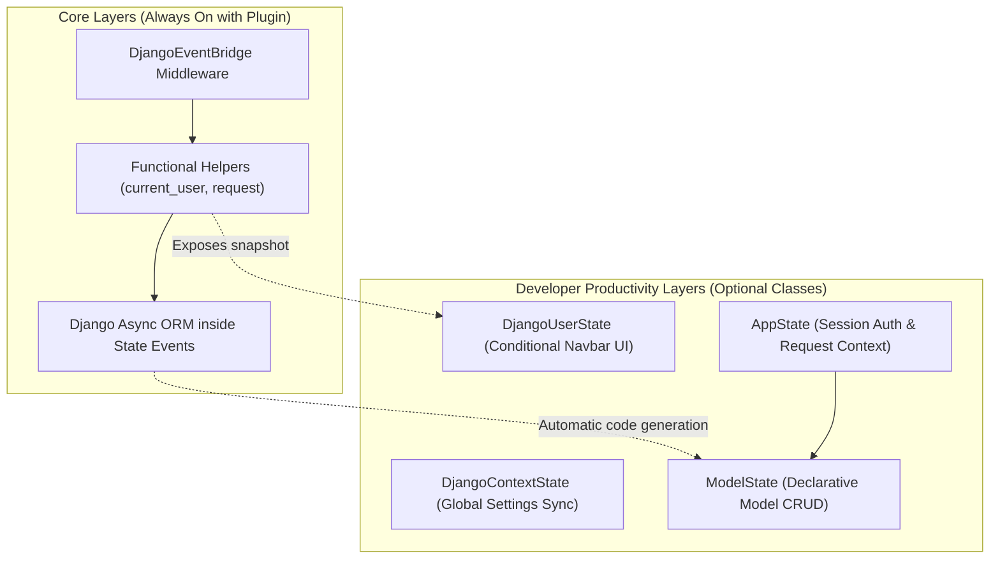

# State Management

In a **reflex-django** application, data is synchronized dynamically between the client browser and your Django backend. While the plugin runs the frameworks in a unified process, how you structure your reactive states depends on your immediate product goals.

This guide provides a comprehensive overview of how state synchronization works, how to choose between plain Reflex states and custom helper states, and how to write clean asynchronous database interactions.

---

## The Synchronization Ecosystem

When the `ReflexDjangoPlugin` is registered, your application gets access to several state synchronization layers:



* **Core Bridge**: The Event Bridge attaches the session cookie to incoming socket payloads, building a thread-safe `current_request()` context.
* **ORM Operations**: You can query models directly inside standard Reflex `@rx.event` handlers.
* **Helper States**: Classes like `AppState` and `ModelState` are optional extensions that remove repetitive boilerplate for user session management and standard database CRUD operations.

---

## Choosing Your State Approach

You can mix and match different base classes depending on the requirements of each screen or view:

| Strategy | Base Class | Best For | Complexity / Magic |
|:---|:---|:---|:---|
| **A. Pure Reflex + Functional Helpers** | `rx.State` | Custom UI loops (counters, filters), complex interactive flows, or absolute control over variable naming. | **Low**: Standard Reflex behavior. No automated code-generation. |
| **B. Session-Bound States** | `AppState` | Dashboards, profile management, and views requiring user session writes or custom permission guards. | **Medium**: Inherits standard auth snapshots (`is_authenticated`, `username`) and binds `self.request`. |
| **C. Declarative CRUD States** | `ModelState` | Direct CRUD grids and lists for database models (e.g., managing inventory, todos, or user blog posts). | **High**: Automatically registers fields, serializers, and standard event methods (`load`, `save`, `delete`). |

---

## Strategy A: Plain `rx.State` with Functional Helpers

If you prefer to avoid the automated code generation of `ModelState`, you can use plain `rx.State` and query your Django models manually inside event handlers.

Here is a complete, production-grade example of a Task Manager using a plain state, async ORM queries, and model serializers:

### 1. The Database Model
Define the database table in your Django application:

```python
# shop/models.py
from django.conf import settings
from django.db import models

class Task(models.Model):
    title = models.CharField(max_length=200)
    done = models.BooleanField(default=False)
    owner = models.ForeignKey(settings.AUTH_USER_MODEL, on_delete=models.CASCADE)
    created_at = models.DateTimeField(auto_now_add=True)
```

### 2. The Model Serializer
Define a serializer to convert database models into Reflex-safe JSON structures:

```python
# shop/serializers.py
from reflex_django.serializers import ReflexDjangoModelSerializer
from shop.models import Task

class TaskSerializer(ReflexDjangoModelSerializer):
    class Meta:
        model = Task
        fields = ("id", "title", "done", "created_at")
```

### 3. The Custom State Handler
Implement a plain `rx.State` using functional auth helpers to scope queries to the authenticated user:

```python
# frontend/states/tasks.py
import reflex as rx
from reflex_django import current_user, require_login_user
from shop.models import Task
from shop.serializers import TaskSerializer

class TaskState(rx.State):
    tasks: list[dict] = []
    new_title: str = ""
    error_message: str = ""

    @rx.event
    async def refresh_tasks(self):
        """Loads tasks scoped to the authenticated user."""
        self.error_message = ""
        try:
            # Enforce that a user session is active on the socket request
            user = require_login_user()
            
            # Fetch tasks using Django's async ORM capabilities
            queryset = Task.objects.filter(owner=user).order_by("-created_at")
            
            # Convert model results to JSON-safe dictionary structures
            self.tasks = await TaskSerializer(queryset, many=True).adata()
        except Exception as e:
            self.error_message = "Please sign in to view your tasks."
            self.tasks = []

    @rx.event
    async def add_task(self):
        """Creates a new task and reloads the active list."""
        self.error_message = ""
        title = self.new_title.strip()
        
        if not title:
            self.error_message = "Task title cannot be blank."
            return
            
        try:
            user = require_login_user()
            
            # Create a database record asynchronously
            await Task.objects.acreate(owner=user, title=title, done=False)
            
            self.new_title = ""
            await self.refresh_tasks()
        except Exception as e:
            self.error_message = f"Failed to save task: {str(e)}"

    @rx.event
    async def toggle_task(self, task_id: int):
        """Toggles the completion status of a task."""
        try:
            user = require_login_user()
            
            # Retrieve instance asynchronously
            task = await Task.objects.aget(pk=task_id, owner=user)
            task.done = not task.done
            
            # Save updates asynchronously
            await task.asave()
            await self.refresh_tasks()
        except Exception as e:
            self.error_message = f"Failed to update task: {str(e)}"

    @rx.event
    async def delete_task(self, task_id: int):
        """Deletes a task record."""
        try:
            user = require_login_user()
            task = await Task.objects.aget(pk=task_id, owner=user)
            
            # Delete record asynchronously
            await task.adelete()
            await self.refresh_tasks()
        except Exception as e:
            self.error_message = f"Failed to delete task: {str(e)}"
```

---

## Strategy B: Built-in State Helpers

For faster boilerplate setup, you can inherit from the pre-built state helpers included with the plugin:

### `DjangoUserState`
Use this class when you need a lightweight state to control layout elements, such as showing or hiding a logout button in your navbar. It exposes fields that reflect the authenticated user:

```python
# frontend/states/navbar.py
import reflex as rx
from reflex_django import DjangoUserState

class NavbarState(DjangoUserState):
    """Exposes: is_authenticated, username, email, group_names, etc."""
    pass
```

Bind these reactive variables directly to your page layouts:

```python
def navbar() -> rx.Component:
    return rx.hstack(
        rx.text("My Shop", size="5", weight="bold"),
        rx.spacer(),
        rx.cond(
            NavbarState.is_authenticated,
            rx.hstack(
                rx.text(f"Logged in as: {NavbarState.username}"),
                rx.button("Log out", variant="outline"),
            ),
            rx.button("Sign in"),
        ),
        width="100%",
        padding="1em",
    )
```

### `AppState`
For views that manage interactive database tables, auth operations, or session writes, we recommend using **`AppState`** as your base class. It extends `DjangoUserState` and binds a live request object:

```python
# frontend/states/dashboard.py
import reflex as rx
from reflex_django.state import AppState

class DashboardState(AppState):
    @rx.event
    async def toggle_theme(self):
        # Read or write directly to Django's session store
        current_theme = self.session.get("theme", "light")
        self.session["theme"] = "dark" if current_theme == "light" else "light"
        
        # Access the raw user model for authorization
        if self.user.is_staff:
            rx.toast.info(f"Theme updated. User is staff.")
```

---

## State Synchronization Model & Guidelines

```text
 Client Browser UI                 Reflex Server Event Handler
+───────────────────+             +────────────────────────────+
|   Page Component  |             |  1. Intercepts WS Packet   |
|   (Binds UI vars) |             |  2. Builds synthetic Req   |
|         │         |             |  3. Runs request.user      |
|         │         |             |  4. Runs async DB Query    |
|         ▼         |             |  5. Updates local vars     |
| Triggers Event  ──┼────────────►|  6. Serializes mutations   |
|                   |             |                            |
| Renders Changes ◄─┼─────────────┼────────────────────────────┘
+───────────────────+             
```

When building state logic, keep these guidelines in mind:

1. **Avoid Storing Model Instances in State Variables**: Reflex state fields are serialized to JSON before being sent to the browser. Database models, `Decimal` types, and `datetime` objects cannot be natively serialized. Always pass query results through a serializer or serialize them to standard python dictionaries before assigning them to state fields.
2. **Prefer Asynchronous Handlers (`async def`)**: The unified ASGI server runs asynchronously. When performing database transactions inside event handlers, always use `async def` and await standard Django asynchronous database APIs (like `acreate`, `adelete`, `asave`, `adata`, or `anearby`) to prevent blocking the event loop.

---

**Navigation:** [← API & HTTP Integration](api_integration.md) | [Next: Django Context in Reflex →](django_context_to_reflex.md)
