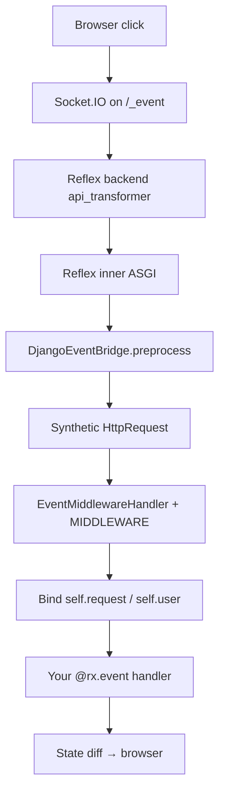

# The WebSocket event pipeline

!!! note "v3 routing update"
    Outer dispatchers (`DjangoOuterDispatcher`, `ReflexOuterDispatcher`) were removed in v3. In dev, `/_event` is handled by the Reflex backend; Django middleware still runs via `DjangoEventBridge` below. See [Architecture](architecture.md).

**What you'll learn:** The exact path from a button click in the browser to your `@rx.event` handler, including the synthetic `HttpRequest` and middleware chain.

**When you need this:**

- Reflex events fire in the browser but your handler never runs (or runs with the wrong user).
- You need to debug middleware short-circuits, redirects, or missing session data on WebSocket traffic.

---

When a user clicks a button in your Reflex app, a lot happens before your Python runs. This page is the end-to-end trace.

You do not need this page to build features. You need it when something goes wrong on `/_event` and you have to debug it.

---

## The 30,000-foot view

```text
1. Browser: user clicks a button
2. Browser: send Socket.IO event over WebSocket → /_event
3. Reflex backend: reserved path → Reflex inner ASGI (not Django HTTP)
4. Reflex: receives event, calls registered preprocess middleware
5. Bridge: builds synthetic HttpRequest from event.router_data
6. Bridge: runs settings.MIDDLEWARE on it (minus skip list)
7. Bridge: eagerly resolves request.user
8. Bridge: binds context (request, user, session, csrf, messages, language)
9. Reflex: calls your @rx.event handler
10. Handler: mutates state, returns events/redirects
11. Reflex: ships state diff back over WebSocket
12. Browser: re-renders
```

Steps 5 through 8 are what reflex-django adds. The rest is normal Reflex plus ASGI.



---

## Step 1–3: from click to Reflex inner ASGI

The Reflex SPA opens a single WebSocket to `/_event` when the page loads. Every UI action is sent as a Socket.IO event over that connection.

In default dev, Vite on `:3000` proxies WebSocket and HTTP to the Reflex backend (`config.api_url`, typically `:8000`). The backend's `api_transformer` (`make_dispatcher`) routes [reserved Reflex prefixes](routing.md#reserved-reflex-prefixes) such as `/_event` straight to Reflex's inner ASGI app (`rx_app._api`). Django HTTP middleware does **not** run on this ASGI hop. There is no Django view to dispatch yet.

In production, your edge proxy forwards `/_event` to the Reflex backend the same way. Django ASGI never sees the WebSocket scope unless you add Channels separately.

| File | Role |
|:---|:---|
| `reflex_django/asgi/app.py` | `make_dispatcher()` path-prefix transformer |
| `reflex_django/runtime/app_factory.py` | Attaches dispatcher when the Reflex app is created |
| `reflex_django/bootstrap/app_setup.py` | Installs `DjangoEventBridge` and dispatcher hooks |

---

## Step 4: Reflex preprocess and the event bridge

Reflex supports preprocess middleware: callables that run **before** the event handler. During bootstrap, `apply_reflex_plugins_to_app()` installs `DjangoEventBridge` on the Reflex app:

```python
# reflex_django/bootstrap/app_setup.py (simplified)
from reflex_django.bridge.django_event import DjangoEventBridge

app.add_middleware(DjangoEventBridge())
```

When Reflex receives a `/_event` payload, it walks registered preprocess middleware in order. The `DjangoEventBridge.preprocess` call is where everything below happens.

!!! tip "No plugin required in v1"
    You do not add `ReflexDjangoPlugin` or wire the bridge manually. `install_reflex_django_integration()` registers it when the app is built.

---

## Step 5: building the synthetic `HttpRequest`

Reflex events carry a `router_data` dict that describes the page the event came from. The bridge unpacks it:

| Field in `router_data` | What it becomes |
|:---|:---|
| `pathname` | `request.path` |
| `query` | `request.GET` (a `QueryDict`) |
| `headers` | `request.META["HTTP_*"]` entries |
| `cookies` | `request.COOKIES` (from the WebSocket handshake `Cookie` header) |
| Connection metadata | `request.META["REMOTE_ADDR"]`, etc. |

It then constructs a real `django.http.HttpRequest` with those fields filled in. From this point on, the request looks like a normal Django GET to middleware. The body is empty (events have no HTTP bodies) and the method is `GET` by default.

Source: `reflex_django/bridge/django_event.py` (`bridge_request_for_state`, `_build_request_from_event`).

---

## Step 6: running `settings.MIDDLEWARE`

The bridge passes the request through `EventMiddlewareHandler`, a subclass of Django's `BaseHandler` that exposes the middleware chain without dispatching to a view.

```python
# Effectively:
from reflex_django.bridge.event_handler import run_middleware_chain

response = await run_middleware_chain(request)
```

Every middleware in `settings.MIDDLEWARE` runs in order (except the skip list). `SessionMiddleware` loads the session row. `AuthenticationMiddleware` resolves `request.user`. Your custom middleware runs too.

### What is skipped

| Middleware | Why |
|:---|:---|
| `django.middleware.csrf.CsrfViewMiddleware` | CSRF protects cross-origin HTML form posts. Same-origin WebSocket events do not carry CSRF tokens. |
| `reflex_django.bridge.streaming.AsyncStreamingMiddleware` | Adapts streaming HTTP responses. No streaming on WebSocket events. |

Override the skip list with `REFLEX_DJANGO_EVENT_MIDDLEWARE_SKIP`.

Disable the entire chain temporarily with `REFLEX_DJANGO_RUN_MIDDLEWARE_CHAIN = False` (useful when debugging which middleware short-circuits).

### Skipped phases

`process_view` is not called (there is no Django view). `process_request`, `process_response`, and `process_exception` run normally.

Source: `reflex_django/bridge/event_handler.py`.

---

## Step 7: eager `request.user` resolution

Django's `request.user` is normally a `SimpleLazyObject` that triggers a DB query the first time you access it. In an async event handler that can raise `SynchronousOnlyOperation`.

The bridge eagerly resolves the user before your handler runs:

```python
from django.contrib.auth import aget_user

user = await aget_user(request)
request.user = user
```

By the time your handler sees `self.request.user`, it is a real `User` instance, not a lazy proxy.

Source: `reflex_django/bridge/django_event.py` (`_resolve_user_eagerly`).

---

## Step 8: binding context onto the handler

The bridge uses Python `ContextVar` primitives to attach the per-event request to the current async task. Every helper (`self.request`, `self.user`, `current_request()`, `current_user()`) reads from this context.

| Access pattern | Where it reads from |
|:---|:---|
| `self.request` on `AppState` | ContextVar, wrapped in `DjangoStateRequest` |
| `current_request()` / `current_user()` | ContextVar directly |
| `from reflex_django import request; request.user` | `RequestProxy` delegating to the ContextVar |

All three return the **same** request for the current event. Outside an event (import time, background thread), they return `None` or an anonymous default.

Source: `reflex_django/bridge/context.py`, `reflex_django/bridge/request.py`.

---

## Step 9: calling your handler

After the bridge finishes, Reflex calls your handler the normal way:

```python
from reflex_django.states import AppState
import reflex as rx


class CartState(AppState):
    @rx.event
    async def add_item(self, product_id: int):
        user = self.request.user
        session = self.session
        csrf = self.csrf_token
        messages = self.messages

        product = await Product.objects.aget(pk=product_id)
        # self.request.user is the real Django user
        ...
```

---

## Step 10–12: state diff and re-render

The handler mutates `self`-level reactive variables. Reflex computes the diff and ships it back over the same WebSocket. The browser applies the diff to the React store and re-renders affected components.

You wrote step 9. Steps 1–8 and 10–12 are framework work.

---

## What happens on middleware redirects

If any middleware short-circuits with a 3xx (for example `LoginRequiredMiddleware` returning `HttpResponseRedirect("/login")`), the bridge catches it.

By default (`REFLEX_DJANGO_AUTO_REDIRECT_FROM_MIDDLEWARE = True`), the bridge converts that 3xx into a Reflex `rx.redirect(location)` event. Your handler is **not** called. The SPA navigates to the new URL.

If you set the flag to `False`, the redirect response is exposed on `self.response` instead and your handler runs normally.

---

## What happens on middleware exceptions

If a middleware raises:

1. The bridge catches the exception.
2. Your handler is **not** called.
3. By default, an `rx.toast.error(...)` is emitted to the user.
4. The exception is logged.

Example middleware that blocks events:

```python
from django.core.exceptions import PermissionDenied


class BannedUserMiddleware:
    async def __call__(self, request):
        if request.user.is_authenticated and request.user.is_banned:
            raise PermissionDenied("Account suspended.")
        return await self.get_response(request)
```

See [Custom middleware in events](django_middleware_to_reflex.md) for more patterns.

---

## Other reserved Reflex endpoints

`/_event` is the main channel, but Reflex's inner ASGI also handles:

| Endpoint | Purpose |
|:---|:---|
| `/_upload` | Multipart file uploads from `rx.upload()` |
| `/_health`, `/ping` | Liveness probes |
| `/_all_routes` | Internal route enumeration |
| `/auth-codespace` | Reflex dev tooling |

`/_upload` receives a full HTTP request with a body. reflex-django patches the upload handler to inject `router_data` (cookies, session) so file uploads carry auth context.

Source: `reflex_django/bridge/upload.py`.

---

## Other WebSocket scopes (besides `/_event`)

| Situation | Behavior |
|:---|:---|
| `/_event`, `/_upload` | Always forwarded to Reflex inner ASGI |
| Vite HMR WebSocket | Handled by the Vite dev server on `:3000`, not by `make_dispatcher` |
| Any other path on the Reflex backend | Routed by prefix: Django urlpatterns or Reflex SPA |

Django itself never sees these scopes unless you add Channels separately.

---

## Lifespan handling

ASGI servers send a `"lifespan"` scope at startup and shutdown. `make_dispatcher` always forwards lifespan to Reflex's inner ASGI, which uses it to:

- Start Reflex's event processor.
- Start background tasks (`@rx.background`).
- Tear them down on shutdown.

---

## State serialization between events

Between events, Reflex pickles `BaseState` instances to its state manager (memory by default, Redis if configured). Django's `HttpRequest` and `ResolverMatch` are not picklable, so reflex-django patches `BaseState.__getstate__` to strip `_django_led_request_wrapper` and `_django_led_response` before serialization.

The next event rebuilds them from incoming `router_data`. You keep `self.request` semantics between events without shipping a synthetic request across processes.

Source: `reflex_django/runtime/integration.py` (state patch).

---

## Tracing a real event

If something feels off, try this order:

1. **Check the browser console.** Reflex logs WebSocket events. You should see one event per click.
2. **Print in your handler.** Add `print(self.request.user, self.request.path)` at the top. If it does not print, the bridge or middleware short-circuited before your handler.
3. **Check server logs.** Middleware exceptions and bridge warnings appear near the event timestamp.
4. **Set `REFLEX_DJANGO_RUN_MIDDLEWARE_CHAIN = False` temporarily.** If your handler runs now but did not before, a custom middleware is short-circuiting. Bisect your `MIDDLEWARE` list.

---

## Source map

| File | What it does |
|:---|:---|
| `reflex_django/asgi/app.py` | `make_dispatcher()` path-prefix ASGI transformer |
| `reflex_django/runtime/app_factory.py` | Wires dispatcher on `get_or_create_app()` |
| `reflex_django/bootstrap/app_setup.py` | Installs `DjangoEventBridge` on the Reflex app |
| `reflex_django/bridge/django_event.py` | `DjangoEventBridge` preprocess hook |
| `reflex_django/bridge/event_handler.py` | `EventMiddlewareHandler`, skip list |
| `reflex_django/bridge/context.py` | ContextVars |
| `reflex_django/bridge/request.py` | `RequestProxy` for non-AppState access |
| `reflex_django/bridge/upload.py` | Injects router_data into uploads |

---

## What just happened?

You traced a Reflex event from the browser through the Reflex backend, `DjangoEventBridge`, the full middleware chain, and back to the UI update.

**Next up:** [AsyncStreamingMiddleware explained →](async_streaming_middleware.md)
